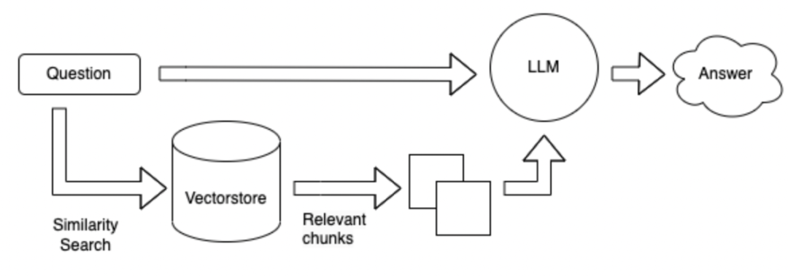

# langchain-learning
langchain的学习笔记。依赖：

```python
openai==0.27.8
langchian==0.0.225
```

和langchain相类似的一些工具：

- [danswer-ai/danswer: Ask Questions in natural language and get Answers backed by private sources. Connects to tools like Slack, GitHub, Confluence, etc.](https://github.com/danswer-ai/danswer)

## **文章**

**注意：由于langchain或langchain-ChatGLM的更新，可能导致部分源码和讲解的有所差异。**

有的一些文章直接放的是一些链接，从网上收集整理而来。

****

- langchain组件-数据连接(data connection)
- langchain组件-模型IO(model IO)
- langchain组件-链(chains)
- langchain组件-代理(agents)
- langchain组件-内存(memory)
- langchain组件-回调(callbacks)
- langchain中ChatOpenAI背后做了什么.md
- langchain.load.serializable.py.md
- langchain中的一些schema.md
- langchain中是怎么调用chatgpt的接口的.md
- langchain结构化输出背后的原理,md
- langchain中memory的工作原理.md
- langchain怎么确保输出符合道德期望.md
- langchain中路由链LLMRouterChain的原理.md
- langchain中的EmbeddingRouterChain原理.md
- langchain集成GPTCache.md
- langchain集成Mivus向量数据库.md
- langchain中的StreamingStdOutCallbackHandler原理.md
- pydantic中config的一些配置.md
- pydantic中的Serializable和root_validator.md
- python中常用的一些魔术方法.md
- python的typing常用的类型.md
- python中functools的partial的用法.md
- python中inspect的signature用法.md
- python中args和kwargs.md

目前基于langchain的中文项目有两个：

- https://github.com/yanqiangmiffy/Chinese-LangChain
- https://github.com/imClumsyPanda/langchain-ChatGLM

我们从中可以学到不少。

#### langchain-ChatGLM

- 使用api部署langchain-chatglm的基本原理.md
- 上传文档时发生了什么.md
- 关于HuggingFaceEmbeddings.md
- 关于InMemoryDocstore.md
- 关于CharacterTextSplitter.md
- 关于TextLoader.md
- 关于怎么调用bing的搜索接口.md
- 根据query得到相关的doc的原理.md
- 根据查询出的docs和query生成prompt.md
- 根据prompt用模型生成结果.md
- [我为什么放弃了 LangChain？ - 知乎 (zhihu.com)](https://zhuanlan.zhihu.com/p/645358531)

## **中文例子**

- 定制中文LLM模型
- 定制中文聊天模型
- 使用中文splitter.md
- 根据query查询docs.md
- mini-langchain-ChatGLM.md
- 打造简易版类小爱同学助手.md
- chatglm实现agent控制.md
- [向量检索增强chatglm生成-结合ES](https://zhuanlan.zhihu.com/p/644619003)
- [知识图谱抽取LLM - 知乎 (zhihu.com)](https://zhuanlan.zhihu.com/p/645509983)

## **英文例子**

- langchain使用openai例子.md（文本翻译）
- openai调用chatgpt例子.md
- langchain解析结果并格式化输出.md
- langchain带有记忆的对话.md
- langchain中使用不同链.md
- langchain基于文档的问答md
- [使用GGML和LangChain在CPU上运行量化的llama2](https://zhuanlan.zhihu.com/p/644701608)

## prompt工程.md

一个优化的prompt对结果至关重要，感兴趣的可以去看看这个，

## **langchain可能存在一些问题**

虽然langchain给我们提供了一些便利，但是也存在一些问题：

- **无法解决大模型基础技术问题，主要是prompt重用问题**：首先很多大模型应用的问题都是大模型基础技术的缺陷，并不是LangChain能够解决的。其中核心的问题是大模型的开发主要工作是prompt工程。而这一点的重用性很低。但是，这些功能都**需要非常定制的手写prompt**。链中的每一步都需要手写prompt。输入数据必须以非常特定的方式格式化，以生成该功能/链步骤的良好输出。设置DAG编排来运行这些链的部分只占工作的5%，95%的工作实际上只是在提示调整和数据序列化格式上。这些东西都是**不可重用**的。

- **LangChain糟糕的抽象与隐藏的垃圾prompt造成开发的困难**：简单说，就是LangChain的抽象工作不够好，所以很多步骤需要自己构建。而且LangChain内置的很多prompt都很差，不如自己构造，但是它们又隐藏了这些默认prompt。
- **LangChain框架很难debug**：**尽管LangChain很多方法提供打印详细信息的参数，但是实际上它们并没有很多有价值的信息**。例如，如果你想看到实际的prompt或者LLM查询等，都是十分困难的。原因和刚才一样，LangChain大多数时候都是隐藏了自己内部的prompt。所以如果你使用LangChain开发效果不好，你想去调试代码看看哪些prompt有问题，那就很难。
- **LangChain鼓励工具锁定**：LangChain鼓励用户在其平台上进行开发和操作，但是如果用户需要进行一些LangChain文档中没有涵盖的工作流程，即使有自定义代理，也很难进行修改。这就意味着，一旦用户开始使用LangChain，他们可能会发现自己被限制在LangChain的特定工具和功能中，而无法轻易地切换到其他可能更适合他们需求的工具或平台。

以上内容来自：

- [Langchain Is Pointless | Hacker News (ycombinator.com)](https://news.ycombinator.com/item?id=36645575)
- [使用LangChain做大模型开发的一些问题：来自Hacker News的激烈讨论~](https://zhuanlan.zhihu.com/p/642498874)

有时候一些简单的任务，我们完全可以自己去实现相关的流程，这样**每一部分都由我们自己把控**，更易于修改。

# 使用langchain解决复杂任务

## 方法一：领域微调LLM

使用领域数据对LLM进行微调，受限于计算资源和模型参数的大小，而且模型会存在胡言乱语的情况。这里面涉及到一系列的问题：

- 数据怎么获取，怎么进行数据清理。
- 分词使用什么方式。
- 模型采用什么架构，怎么训练，怎么评估模型。
- 模型怎么进行有效推理，怎么进行部署。
- 领域预训练、领域指令微调、奖励模型、结果对齐。

## 方法二：langchain + LLM + tools

基本思路：

1、用户提问：请对比下商品雅诗兰黛特润修护肌活精华露和SK-II护肤精华？

2、RouterChain问题路由，即使用哪种方式回答问题：（调用一次LLM）

- RouterChain可以是一个LLM，也可以是一个embedding，去匹配到合适的解决方案，如果没有匹配到任何解决方案，则使用模型内部知识进行回答。
- 这里匹配到**商品对比**这一问题，得到解决方案：（1）调用商品搜索工具得到每一个商品的介绍。（2）通过搜索结果对比这些商品。

3、使用Planner生成step：（调用一次LLM）

- 根据解决方案生成合适的steps，比如：（1）搜索雅诗兰黛特润修护肌活精华露。（2）搜索SK-II护肤精华。（3）对比上述商品。

4、执行者Executer执行上述步骤：（调用steps次LLM，n是超参数表明调用的最大次数）

- 需要提供工具，每个step的问题，需要调用llm生成每个工具的调用参数。
- 调用工具获取结果。

5、对所有的结果进行汇总。（调用一次LLM）

## 方法三：langchain + LLM + 检索

相比于方案1，不使用工具，直接根据问题进行对数据库进行检索，然后对检索到的结果进行回答。

检索的方式可以是基于给定问题的关键字，使用ES工具从海量数据库中检索到可能存在答案的topk段落。把这topk个段落连同问题一起发送给LLM，进行回答。

检索的方式改成向量的形式，先对所有已知资料按照300个字切分成小的段落，然后对这些段落进行编码成向量，当用户提问时，把用户问题同样编码成向量，然后对这些段落进行检索，得到topk最相关的段落，把这topk个段落连同问题一起发送给LLM，进行回答。



**上述方法的优缺点：**

**领域微调LLM**：需要耗费很多的人力收集领域内数据和问答对，需要耗费很多算力进行微调。

**langchain + LLM + tools**：是把LLM作为一个子的服务，LangChain作为计划者和执行者的大脑，合适的时机调用LLM，优点是解决复杂问题，缺点是不可靠。LLM生成根据问题和工具调用工具获取数据时不可靠。可以不能很好的利用工具。可能不能按照指令调用合适的工具，还可能设定计划差，难以控制。优点是：用于解决复杂的问题。

**langchain + LLM + 检索**：优点是现在的领域内主流问答结构，缺点：是根据问题对可能包含答案的段落检索时可能检索不准。不适用于复杂问答

**总结：最大的问题还是LLM本身：**

- LLM输出的不可控性，会导致后续步骤出现偏差。
- LLM的输入的context的长度问题：目前已经可以把长度推广到10亿以上了。
- 训练一个LLM需要的成本：对于数据而言，除了人工收集整理外，也可以使用大模型进行生成；对于训练而言，目前也有不少基于参数有效微调的例子。
- LLM的部署问题：也已经有不少加速推理的方法，比如量化、压缩、使用分布式进行部署、使用C++进行部署等。

LLM是整个系统的基座，目前还是有不少选择的余地的，网上开源了不少中文大语言模型，但大多都是6B/7B/13B的，要想有一个聪明的大脑，模型的参数量还是需要有保证的。

以上参考：[https://mp.weixin.qq.com/s/FvRchiT0c0xHYscO_D-sdA](https://python.langchain.com.cn/docs/modules/agents/how_to/custom_llm_chat_agent)

# 扩展

留出一些问题以待思考：可能和langchain相关，也可能和大模型相关

- **怎么根据垂直领域的数据选择中文大模型？**1、是否可以商用。2、根据各评测的排行版。3、在自己领域数据上进行评测。4、借鉴现有的垂直领域模型的选择，比如金融大模型、法律大模型、医疗大模型等。

- **数据的一个答案由一系列相连的句子构成，怎么对文本进行切分以获得完整的答案？**比如：
  
    ```python
    怎么能够解决失眠？
    1、保持良好的心情；
    2、进行适当的训练。
    3、可适当使用药物。
    ```
    
    1、尽量将划分的文本的长度设置大一些。2、为了避免答案被分割，可以设置不同段之间可以重复一定的文本。3、检索时可返回前top_k个文档。4、融合查询出的多个文本，利用LLM进行总结。
    
- **怎么构建垂直领域的embedding？**
- **怎么存储获得的embedding？**
- **如何引导LLM更好的思考？** 可使用：**chain of thoughts、self ask、ReAct**，具体介绍可以看这一篇文章：https://zhuanlan.zhihu.com/p/622617292 实际上，langchain中就使用了ReAct这一策略。

# 参考

> [Introduction | 🦜️🔗 Langchain](https://python.langchain.com/docs/get_started/introduction.html)
>
> [API Reference — 🦜🔗 LangChain 0.0.229](https://api.python.langchain.com/en/latest/api_reference.html)
>
> [https://mp.weixin.qq.com/s/FvRchiT0c0xHYscO_D-sdA](https://python.langchain.com.cn/docs/modules/agents/how_to/custom_llm_chat_agent)
>
> https://python.langchain.com.cn/docs/modules/agents/how_to/custom_llm_chat_agent
