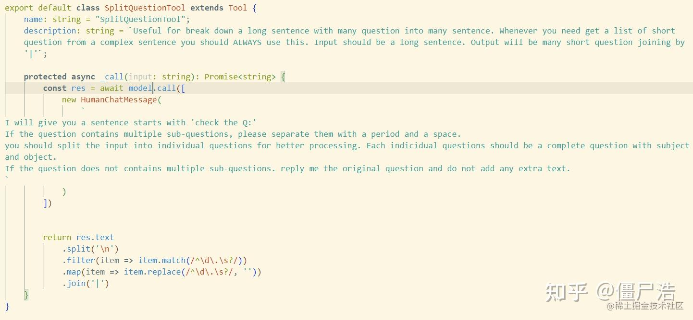
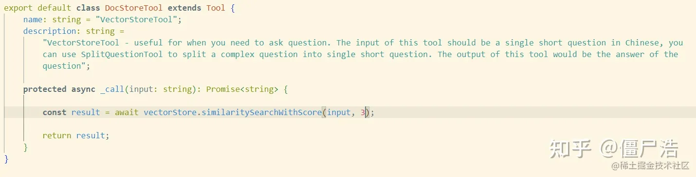

在实际开发的过程中，除了模型自身的能力外，一个好的提示工程对结果有很大的影响，以下整理了一些使用提示工程中可能用到的方法：

### langchain中openai的基本使用

```python
import openai

openai_api_key = ""

# 导入ChatOpenAI，这是LangChain对ChatGPT API访问的抽象
from langchain.chat_models import ChatOpenAI
from langchain.llms import OpenAI
# 要控制 LLM 生成文本的随机性和创造性，请使用 temperature = 0.0
# 用一个比较高的temperature值以获得一些更有意思的结果
llm = OpenAI(model_name="gpt-3.5-turbo",
          openai_api_key=openai_api_key,
          temperature=0.0)

prompt = ""
print(llm(prompt))
```

### prompt的原则

- 要描述清楚自己所需要做的任务。
- 给模型思考的时间。

### 基本模板

一个指令应该有三部分构成：

- 针对该任务的描述。
- 需要处理的文本。
- 完成后应该输出的结果格式。

比如:

```python
你现在是一个翻译专家，你需要把以下内容翻译为中文：i like china。请你只输出翻译后的文本。
```

### 灵活使用一些标点符号或数据结构

比如我们可以在每一部分用'\n'分开：

```python
你现在是一个翻译专家，你需要把以下内容翻译为中文：\ni like china。\n请你只输出翻译后的文本。

你现在是一个翻译专家，你需要把以下内容翻译为中文：```i like china```。请你只输出翻译后的文本。
```

还可以在提示里面加入字典或列表等提供结构化的知识。

### 指定输出格式

```python
你现在是一个翻译专家，你需要把以下内容翻译为中文：我喜欢中国。请你输出一个字典，字典格式为{"source":"要翻译的文本","target":"翻译后的文本"}。

要求生成三个虚构书名及其作者、流派的列表，以 JSON 格式输出，包括以下字段：图书的ID、书名、作者和流派。
```

### 要求模型检查是否满足条件

有时模型不能按我们的要求回答，这是我们要提供一个其他的选择。

### few-shot

提供一个或几个样例给模型。

```python
Pompt示例：你的任务是按照下面的风格回答问题。

<学生>：什么叫做耐心

<老师>：河水从泉眼流向森林深处，最热烈的奔流来自长期的凝聚力。

<学生>：什么叫做坚韧

Response示例：大树在狂风中摇曳却并不会折断，每次暴风中愈加强壮。
```

### 把一些复杂的任务分解为小任务

如果给模型复杂的任务，应该把任务拆解成若干个小的任务（一般是推理任务）+最后的任务（一般是执行）

Prompt示例：请完成以下的任务：1-总结 2-翻译 3-输出JSON

**指示ChatGPT拆解问题并逐步推理得到答案，而不是直接输出答案（这个技巧会有意想不到的神奇～）**

这个例子非常有意思，示例中让模型去判断学生做数学题的答案（包括推导和结论）是否是对的。如果直接问ChatGPT，学生的答案是否正确，ChatGPT会说学生的答案是对的:(

但是！如果修改Prompt为：请判断答案是否是对的。请按照下面的步骤判断 1-理解题目并得出自己的推导过程 2-比较你的推导过程和学生的，你需要自己按照学生的推导过程计算并比较结果。

然后ChatGPT就会发现学生的过程是错的！只是结果蒙对了！（此处需要一个捂脸的表情包）

再比如：

我们描述了 Jack 和 Jill 的故事。然后，我将复制一份提示。在这个提示中，说明执行以下操作：

- 首先，用一句话总结由三个反引号```分隔的以下文本。
- 其次，将摘要翻译成法语。
- 第三，在法语摘要中列出每个名字。
- 第四，输出一个 JSON 对象，包括以下字段：法语摘要和名字的数量。

#### 在模型得出结果之前，我们自己解决任务

有时候我们的任务过程没有那么详细的步骤，只有一个最终结果。这时我们可以思考，**我们自己是怎么解决这个任务的**。比如，上述的数学题中，我们也是通过先进行计算，再和题目结果进行比较，最终得到结果**。因此，让模型思考它是怎么得出这个结果的，可以有效的避免其没有事实依据而随便作答。**

再举个例子：比如放一首孤勇者。想一下我们是怎么操作的：

- 打开音乐播放类app，也可以是其他的一些平台。
- 搜索得到孤勇者歌曲。
- 播放该歌曲。

因此我们要按照上述的操作让模型一步步进行。

### 处理模型幻觉

将预先得到的知识添加到prompt里面。

### 迭代式的开发流程

从椅子的详细的技术规格说明书，来生成电商网站的描述信息。

1. 指示模型生产电商网站的描述的草稿。
2. 发现字数太多。修改Prompt，尝试添加字数（句子的个数/字符的个数）限制。
3. 电商网站的客户主要是零售商户，而不是大众消费者。修改Prompt，告诉模型这个描述的受众是谁，倾向是啥。
4. 添加细节。修改Prompt，要求模型输出在结尾处，包含产品ID等。
5. 添加细节。修改Prompt，要求生成表格，指定表格标题。
6. 要求输出结果为HTML。

总而言之，可以分为以下步骤：

- 确定自己要进行的任务。
- 制定初步的草稿。
- 不断加入细节。
- 指定输出格式。
- 把它们组装起来。

### 文字总结式任务

**摘要任务**：首先要告诉模型摘要的任务是什么，即摘要的意图和关注点，比如对于一个新闻的文章，我们关注的是其讲述的一个具体的事件。

**抽取任务**：明确是“抽取/extract”。

### 推断式任务

直接看一些例子：

#### 情感分析

Prompt示例：判断这段用户评价的情感是什么，情感从['正面的', '负面的', '中性的']里选择。

Prompt示例：在这段评价中识别不超过五种不同类型的情感。

Prompt示例：这段评价是表达愤怒吗？

### 实体抽取

Prompt示例：识别以下信息：评论人买了什么产品，产品制造商，产品品牌

#### 话题抽取

Prompt示例：识别文中讨论的五个话题

Prompt示例：topic_list = [‘NASA’，‘工程优化’，‘员工满意度’], 识别文中包含列表中的哪几个话题？

### 转换

#### 翻译、重写

识别是哪种语言、翻译重写**带风格**（文言文、模仿海盗的英语风格、模仿商务语气、按照APA格式等）

#### 格式转换

JSON转HTML等

#### 拼写检查、语法检查

### 扩写

这里注意一个参数：Temperature

Tempeature越低（等于或接近0），ChatGPT越保守、更靠谱
Tempeature越高（等于或接近2），ChatGPT越具有创造力、更天马行空

### 聊天机器人

区分不同消息源，比如：

- 系统：最开始对任务的介绍。
- 人类：我们输入的消息。
- AI：模型返回给我们的结果。

一般的，我们每次都会将人类和AI的消息不断的加入的整个消息列表中，从而进行多轮的对话。

### 问题拆分

如果你想要用向量数据库实现GPT机器人，你可能会遇到这样的问题：如果用户在一句话里提出了几个问题，比如：`上一届世界杯是在哪年进行的？中国足球夺冠了吗？`

如果你直接用向量搜索这个问题，数据库会优先匹配**既包含世界杯举办年，又包含中国足球夺冠信息**的内容。这时候很容易就会得到匹配度较低的参考资料，GPT也无法回答出正确的答案。

但实际上，我们的预期其实是将它作为两个独立的问题进行。先匹配世界杯举办年，回答第一个问题，再匹配国足夺冠，回答第二个问题。这种需求，我将其称之为**问题拆分**，就很适合通过自己编写的Agent完成。

我们需要编写三个Tool，第一个，用于问题的拆分。



第二个Tool，则是负责向量搜索（向量搜索的代码简化了）



再按照类似方式写一个Tool，负责得出最后的答案就可以了

将这几个Tool结合起来，创建一个Agent，就得到了一个有问题拆分能力的聊天机器人。

注意上述示例的代码不是python版本的，可以参考我们讲解的其它的一些示例进行修改。

> [实现你自己的AutoGPT —— Langchain Agent - 知乎 (zhihu.com)](https://zhuanlan.zhihu.com/p/634649618)

### 实例

以下收集整理一些prompt相关的一些经验文章：

- [如何写一个小红书的爆款标题和短评](https://zhuanlan.zhihu.com/p/644419485)

### 参考

> https://zhuanlan.zhihu.com/p/625973388：上述部分内容摘自这
>
> **【开发者的提示工程】PDF版本**：https://github.com/youcans/GPT-Prompt-Tutorial
>
> [【ChatGPT Prompt Engineering for Developers】https://www.deeplearning.ai/short-courses/chatgpt-prompt-engineering-for-developers/](https://link.zhihu.com/?target=https%3A//www.deeplearning.ai/short-courses/chatgpt-prompt-engineering-for-developers/)
>
> https://zhuanlan.zhihu.com/p/626966526