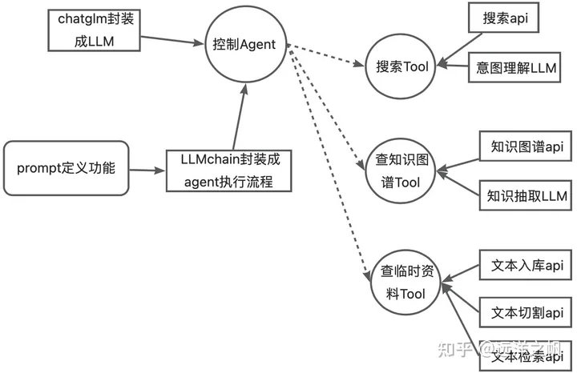

以下代码来自于知乎文章：

https://zhuanlan.zhihu.com/p/644167758

https://github.com/liangwq/Chatglm_lora_multi-gpu/blob/main/APP_example/chatglm_agent/intent_agent.py

发表人：[远洋之帆](https://www.zhihu.com/people/hai-dao-chuan-chuan-fu-5989)

这里只是将其进行实践一遍然后对一些原理进行讲解。

整体流程：



# LLM的模型实现

这里我们之前已经讲过了其原理，可参考：定制中文LLM.md

简单说明下，就是继承LLM，然后实现_call方法、_identifying_params方法。这里的话额外加了一个load_model方法，用于加载模型。

```python
### define llm ###

from typing import List, Optional, Mapping, Any
from functools import partial

from langchain.llms.base import LLM
from langchain.callbacks.manager import CallbackManagerForLLMRun
from langchain.callbacks.streaming_stdout import StreamingStdOutCallbackHandler

from transformers import AutoModel, AutoTokenizer


### chatglm-6B llm ###
class ChatGLM(LLM):

    model_path: str
    max_length: int = 2048
    temperature: float = 0.1
    top_p: float = 0.7
    history: List = []
    streaming: bool = True
    model: object = None
    tokenizer: object = None

    @property
    def _llm_type(self) -> str:
        return "chatglm-6B"

    @property
    def _identifying_params(self) -> Mapping[str, Any]:
        """Get the identifying parameters."""
        return {
            "model_path": self.model_path,
            "max_length": self.max_length,
            "temperature": self.temperature,
            "top_p": self.top_p,
            "history": [],
            "streaming": self.streaming
        }

    def _call(
        self,
        prompt: str,
        stop: Optional[List[str]] = None,
        run_manager: Optional[CallbackManagerForLLMRun] = None,
        add_history: bool = False
    ) -> str:
        if self.model is None or self.tokenizer is None:
            raise RuntimeError("Must call `load_model()` to load model and tokenizer!")

        if self.streaming:
            text_callback = partial(StreamingStdOutCallbackHandler().on_llm_new_token, verbose=True)
            resp = self.generate_resp(prompt, text_callback, add_history=add_history)
        else:
            resp = self.generate_resp(self, prompt, add_history=add_history)

        return resp

    def generate_resp(self, prompt, text_callback=None, add_history=True):
        resp = ""
        index = 0
        if text_callback:
            for i, (resp, _) in enumerate(self.model.stream_chat(
                self.tokenizer,
                prompt,
                self.history,
                max_length=self.max_length,
                top_p=self.top_p,
                temperature=self.temperature
            )):
                if add_history:
                    if i == 0:
                        self.history += [[prompt, resp]]
                    else:
                        self.history[-1] = [prompt, resp]
                text_callback(resp[index:])
                index = len(resp)
        else:
            resp, _ = self.model.chat(
                self.tokenizer,
                prompt,
                self.history,
                max_length=self.max_length,
                top_p=self.top_p,
                temperature=self.temperature
            )
            if add_history:
                self.history += [[prompt, resp]]
        return resp

    def load_model(self):
        if self.model is not None or self.tokenizer is not None:
            return
        self.tokenizer = AutoTokenizer.from_pretrained(self.model_path, trust_remote_code=True)
        self.model = AutoModel.from_pretrained(self.model_path, trust_remote_code=True).half().cuda().eval()

    def set_params(self, **kwargs):
        for k, v in kwargs.items():
        if k in self._identifying_params:
        self.k = v

llm = ChatGLM(model_path="../ChatGLM2-6B/llm_model/models--THUDM--chatglm2-6b/snapshots/8eb45c842594b8473f291d0f94e7bbe86ffc67d8")
llm.load_model()
```

注意的是chatglm-6b模型里面给我们提供了两个方法：stream_chat用于流式输出。chat用于完整输出。我们可以先去看一下这两个的不同：

```python
from transformers import AutoTokenizer, AutoModel
tokenizer = AutoTokenizer.from_pretrained("THUDM/chatglm-6b-int4", trust_remote_code=True)
model = AutoModel.from_pretrained("THUDM/chatglm-6b-int4", trust_remote_code=True).half().cuda()
history = []
query = "你好，请问你是谁？"
response, history = model.chat(tokenizer, query, history=history)
print(response)
# 你好，我是 ChatGLM-6B，是清华大学KEG实验室和智谱AI公司共同训练的语言模型。我的目标是通过回答用户提出的问题来帮助他们解决问题。

add_history = True
for i, (resp, _) in enumerate(model.stream_chat(tokenizer, query, history=history)):
  if add_history:
    if i == 0:
      history = [[query, resp]]
    else:
      history[-1] = [query, resp]
  print(i, resp)

"""
0 
1 你好
2 你好，
3 你好，我是
4 你好，我是 Chat
5 你好，我是 ChatGL
6 你好，我是 ChatGLM
7 你好，我是 ChatGLM-
8 你好，我是 ChatGLM-6
9 你好，我是 ChatGLM-6B
10 你好，我是 ChatGLM-6B,
11 你好，我是 ChatGLM-6B，是
12 你好，我是 ChatGLM-6B，是清华大学
13 你好，我是 ChatGLM-6B，是清华大学K
14 你好，我是 ChatGLM-6B，是清华大学KEG
15 你好，我是 ChatGLM-6B，是清华大学KEG实验室
16 你好，我是 ChatGLM-6B，是清华大学KEG实验室和
17 你好，我是 ChatGLM-6B，是清华大学KEG实验室和智
18 你好，我是 ChatGLM-6B，是清华大学KEG实验室和智谱
19 你好，我是 ChatGLM-6B，是清华大学KEG实验室和智谱AI
20 你好，我是 ChatGLM-6B，是清华大学KEG实验室和智谱AI公司
21 你好，我是 ChatGLM-6B，是清华大学KEG实验室和智谱AI公司共同
22 你好，我是 ChatGLM-6B，是清华大学KEG实验室和智谱AI公司共同训练
23 你好，我是 ChatGLM-6B，是清华大学KEG实验室和智谱AI公司共同训练的语言
24 你好，我是 ChatGLM-6B，是清华大学KEG实验室和智谱AI公司共同训练的语言模型
25 你好，我是 ChatGLM-6B，是清华大学KEG实验室和智谱AI公司共同训练的语言模型。
26 你好，我是 ChatGLM-6B，是清华大学KEG实验室和智谱AI公司共同训练的语言模型。我
27 你好，我是 ChatGLM-6B，是清华大学KEG实验室和智谱AI公司共同训练的语言模型。我的任务
28 你好，我是 ChatGLM-6B，是清华大学KEG实验室和智谱AI公司共同训练的语言模型。我的任务是针对
29 你好，我是 ChatGLM-6B，是清华大学KEG实验室和智谱AI公司共同训练的语言模型。我的任务是针对用户
30 你好，我是 ChatGLM-6B，是清华大学KEG实验室和智谱AI公司共同训练的语言模型。我的任务是针对用户的问题
31 你好，我是 ChatGLM-6B，是清华大学KEG实验室和智谱AI公司共同训练的语言模型。我的任务是针对用户的问题和要求
32 你好，我是 ChatGLM-6B，是清华大学KEG实验室和智谱AI公司共同训练的语言模型。我的任务是针对用户的问题和要求提供
33 你好，我是 ChatGLM-6B，是清华大学KEG实验室和智谱AI公司共同训练的语言模型。我的任务是针对用户的问题和要求提供适当的
34 你好，我是 ChatGLM-6B，是清华大学KEG实验室和智谱AI公司共同训练的语言模型。我的任务是针对用户的问题和要求提供适当的答复
35 你好，我是 ChatGLM-6B，是清华大学KEG实验室和智谱AI公司共同训练的语言模型。我的任务是针对用户的问题和要求提供适当的答复和支持
36 你好，我是 ChatGLM-6B，是清华大学KEG实验室和智谱AI公司共同训练的语言模型。我的任务是针对用户的问题和要求提供适当的答复和支持。
"""
```

具体怎么做的可以去看看hugging face上面的代码。

关于functools.partial可以查看已经讲解的：**python中的functools的partial的用法.md**

然后是StreamingStdOutCallbackHandler，可以查看已讲解的：

**langchain中的StreamingStdOutCallbackHandler原理.md**

到这里，模型部分就看完了。

# 构建rapidapi搜索

怎么使用rapidapi，进入到https://rapidapi.com/，首先注册一个账号。

进入https://rapidapi.com/microsoft-azure-org-microsoft-cognitive-services/api/bing-web-search1

然后选择订阅basic版本的。然后就可以使用了：

```python
import requests

#这个RapidAPIKey，各位自己去注册下就有了
RapidAPIKey = ""

class DeepSearch:
    def search(query: str = ""):
        query = query.strip()

        if query == "":
            return ""

        if RapidAPIKey == "":
            return "请配置你的 RapidAPIKey"

        url = "https://bing-web-search1.p.rapidapi.com/search"

        querystring = {"q": query,
                "mkt":"zh-cn","textDecorations":"false","setLang":"CN","safeSearch":"Off","textFormat":"Raw"}

        headers = {
            "Accept": "application/json",
            "X-BingApis-SDK": "true",
            "X-RapidAPI-Key": RapidAPIKey,
            "X-RapidAPI-Host": "bing-web-search1.p.rapidapi.com"
        }

        response = requests.get(url, headers=headers, params=querystring)
        print(response.json())
        data_list = response.json()['value']

        if len(data_list) == 0:
            return ""
        else:
            result_arr = []
            result_str = ""
            count_index = 0
            for i in range(6):
                item = data_list[i]
                title = item["name"]
                description = item["description"]
                item_str = f"{title}: {description}"
                result_arr = result_arr + [item_str]

            result_str = "\n".join(result_arr)
            return result_str

query = "失眠怎么办？"
print(DeepSearch.search(query))

"""
{'_type': 'News', 'readLink': 'https://api.cognitive.microsoft.com/api/v7/news/search?q=%E5%A4%B1%E7%9C%A0%E6%80%8E%E4%B9%88%E5%8A%9E%EF%BC%9F&setLang=CN', 'queryContext': {'_type': 'QueryContext', 'originalQuery': '失眠怎么办？', 'adultIntent': False}, 'totalEstimatedMatches': 39, 'sort': [{'_type': 'SortValue', 'name': '最佳匹配', 'id': 'relevance', 'isSelected': True, 'url': 'https://api.cognitive.microsoft.com/api/v7/news/search?q=%E5%A4%B1%E7%9C%A0%E6%80%8E%E4%B9%88%E5%8A%9E%EF%BC%9F&setLang=CN&setLang=CN'}, {'_type': 'SortValue', 'name': '最新发布', 'id': 'date', 'isSelected': False, 'url': 'https://api.cognitive.microsoft.com/api/v7/news/search?q=%E5%A4%B1%E7%9C%A0%E6%80%8E%E4%B9%88%E5%8A%9E%EF%BC%9F&setLang=CN&sortby=date&setLang=CN'}], 'value': [{'_type': 'NewsArticle', 'name': '睡眠差，失眠怎么办？这6个方法或能帮你缓解，不妨来试试', 'url': 'https://www.163.com/dy/article/I9V1NJCT051496NU.html', 'description': '俗话说“三十年前睡不醒，后三十年后睡不着。”以前没有把这句话当回事，但随着年龄的增长，入睡难、睡眠质量差、睡眠不足等问题逐渐显现。 长期失眠、睡眠不足可能会引起记忆力下降、免疫力下降、心脑血管、情绪焦虑等问题。下面让常德市第四人民医院专家来和大家聊一聊失眠的相关问题。 什么是失眠？ 人的一生有近 1/3 的时间都在睡眠中度过，睡眠对于体力和精力的恢复十分重要。大量研究结果显示，睡眠质量的好坏直接影', 'provider': [{'_type': 'Organization', 'name': '网易', 'image': {'_type': 'ImageObject', 'thumbnail': {'_type': 'ImageObject', 'contentUrl': 'https://www.bing.com/th?id=ODF.pRQjNppdWgLiPgLb5-86wg&pid=news'}}}], 'datePublished': '2023-07-18T11:50:00.0000000Z'}, {'_type': 'NewsArticle', 'name': '熬夜失眠怎么办？康麦斯褪黑素为你改善睡眠~', 'url': 'https://www.163.com/dy/article/I9RSQRH805539VFT.html', 'description': '失眠是对精神和肉体的双重折磨，会让我们神经衰弱、记忆力衰退、焦虑、长白发、脱发……对女生来说，失眠会加速她们的衰老，蜡黄脸、黑眼圈、痘痘、伤肝、掉头发……皮肤状态差，精神状态更差。', 'provider': [{'_type': 'Organization', 'name': '网易', 'image': {'_type': 'ImageObject', 'thumbnail': {'_type': 'ImageObject', 'contentUrl': 'https://www.bing.com/th?id=ODF.pRQjNppdWgLiPgLb5-86wg&pid=news'}}}], 'datePublished': '2023-07-17T06:27:00.0000000Z'}, {'_type': 'NewsArticle', 'name': '你知道怎样缓解失眠吗？ 失眠了该怎么办呢？', 'url': 'http://www.pvnews.cn/qy/2023/0710/072023_161786.html', 'description': '生活当中不少朋友因为这个或者那样的原因，会有失眠的情况，而失眠对于患者的身心健康影响是很大的，那么怎样缓解失眠? 1 每天按时睡觉、准时起床，给大脑定好闹钟，生物钟就会准时地运转，这是提高睡眠质量最关键的一步。 调整心态 2 治疗头痛失眠 ...', 'provider': [{'_type': 'Organization', 'name': '太阳信息网'}], 'datePublished': '2023-07-10T08:27:00.0000000Z'}, {'_type': 'NewsArticle', 'name': '失眠的原因有哪些？失眠了该怎么办？', 'url': 'http://www.pvnews.cn/m/2023/0710/2000161934.html', 'description': '失眠要怎么调节? 1、失眠几乎每个人都体验到，在正常情况下，如果表现出非常坦然的态度，不刻意去要求自己，其实就可以睡着。 2、有些人睡不着就会担心第二天怎么办，这样越紧张越睡不着.睡眠的好坏也和人的性格有关，睡眠不好的人大都存在着心理焦虑 ...', 'provider': [{'_type': 'Organization', 'name': '太阳信息网'}], 'datePublished': '2023-07-10T13:26:00.0000000Z'}, {'_type': 'NewsArticle', 'name': '长期失眠怎么办？遵义医科大学第二附属医院睡眠门诊开诊啦', 'url': 'https://new.qq.com/rain/a/20230701A0799V00', 'description': '近期发布的《健康睡眠新时代：2023中国健康睡眠白皮书》显示，近九成受调者关注睡眠健康，高达80%的受调者存在睡眠时间减少、入睡困难、失眠等睡眠问题。 “在实际门诊过程中，我们也发现不少精神疾病显性时，会伴有不同程度的失眠情况”。遵义医科 ...', 'provider': [{'_type': 'Organization', 'name': '腾讯网'}], 'datePublished': '2023-07-03T11:45:00.0000000Z'}, {'_type': 'NewsArticle', 'name': '失眠的原因有哪些? 失眠了怎么办?', 'url': 'https://henan.china.com/zs/2023/0629/2530579817.html', 'description': '失眠的原因有哪些? 失眠了怎么办呢？ 第一、年龄因素，失眠与年龄有很大的关系，年龄越大失眠的发生率就越高，因为人类睡眠所需要的时间与年龄是成反比的，婴幼儿最长，老人最短，所以老年人特别容易失眠。 第二、躯体因素，睡眠的时候需要人放松 ...', 'provider': [{'_type': 'Organization', 'name': '中华网'}], 'datePublished': '2023-06-29T06:13:00.0000000Z'}, {'_type': 'NewsArticle', 'name': '泉州失眠医院：深夜失眠怎么办？', 'url': 'https://www.sohu.com/a/695005604_121247163', 'description': '还有几个小时就要起床了，你感到焦虑和疲惫，但你的大脑却无法停止思考。这种情况听起来很熟悉吧？深夜失眠是许多人都面临的问题，但你可以采取一些措施来控制它。让我们来看看如何在深夜失眠时止住它。 一、创造一个舒适的睡眠环境 睡眠环境对于 ...', 'provider': [{'_type': 'Organization', 'name': '搜狐'}], 'datePublished': '2023-07-07T22:42:00.0000000Z'}, {'_type': 'NewsArticle', 'name': '喝茶失眠怎么办', 'url': 'https://www.puercn.com/s/hechashimianzenyaoban/', 'description': '喝茶失眠怎么办，喝了浓茶睡不着怎么办?吃浓茶水后无法入睡,可以通过物理治疗和服用药物来改善,茶叶中含有大量的茶多酚,喝了之后很容易引起神经中枢兴奋,所以病人睡觉不着。今天来聊聊都有哪些小办法，让自己睡前喝茶不再失眠呢？', 'provider': [{'_type': 'Organization', 'name': '中国普洱茶网'}], 'datePublished': '2023-07-09T08:33:00.0000000Z'}, {'_type': 'NewsArticle', 'name': '离婚失眠怎么办？治疗离婚引起的失眠，说说离婚后的心情和天天 ...', 'url': 'https://www.nxnews.net/nxrb/hunyin/15702.html', 'description': '这些因离婚而带来的种种影响，都会对离婚者的身心状态造成一定的影响，甚至会造成睡眠障碍，以至于导致失眠。 离婚失眠怎么办？首先我们需要明确的是，失眠并不是一件能够一蹴而就的事情，这需要时间和努力。建立一个稳定的睡眠惯是一个有效的方法。', 'provider': [{'_type': 'Organization', 'name': '宁夏新闻网'}], 'datePublished': '2023-06-28T07:15:00.0000000Z'}, {'_type': 'NewsArticle', 'name': '更年期血压高了怎么办？中医调理有妙招', 'url': 'https://www.sohu.com/a/702366003_121124516', 'description': '更年期高血压归属于中医“眩晕”“风眩”“脏躁”“头痛”等范畴，临床多表现为头晕、头痛、耳鸣、目眩、健忘、乏力、烘热汗出、烦躁易怒、失眠多梦等。 水不涵木是主因 中医认为其病因多为先天因素、饮食失节、情志因素、内伤劳损、环境因素等。', 'provider': [{'_type': 'Organization', 'name': '搜狐'}], 'datePublished': '2023-07-19T03:10:00.0000000Z'}]}
睡眠差，失眠怎么办？这6个方法或能帮你缓解，不妨来试试: 俗话说“三十年前睡不醒，后三十年后睡不着。”以前没有把这句话当回事，但随着年龄的增长，入睡难、睡眠质量差、睡眠不足等问题逐渐显现。 长期失眠、睡眠不足可能会引起记忆力下降、免疫力下降、心脑血管、情绪焦虑等问题。下面让常德市第四人民医院专家来和大家聊一聊失眠的相关问题。 什么是失眠？ 人的一生有近 1/3 的时间都在睡眠中度过，睡眠对于体力和精力的恢复十分重要。大量研究结果显示，睡眠质量的好坏直接影
熬夜失眠怎么办？康麦斯褪黑素为你改善睡眠~: 失眠是对精神和肉体的双重折磨，会让我们神经衰弱、记忆力衰退、焦虑、长白发、脱发……对女生来说，失眠会加速她们的衰老，蜡黄脸、黑眼圈、痘痘、伤肝、掉头发……皮肤状态差，精神状态更差。
你知道怎样缓解失眠吗？ 失眠了该怎么办呢？: 生活当中不少朋友因为这个或者那样的原因，会有失眠的情况，而失眠对于患者的身心健康影响是很大的，那么怎样缓解失眠? 1 每天按时睡觉、准时起床，给大脑定好闹钟，生物钟就会准时地运转，这是提高睡眠质量最关键的一步。 调整心态 2 治疗头痛失眠 ...
失眠的原因有哪些？失眠了该怎么办？: 失眠要怎么调节? 1、失眠几乎每个人都体验到，在正常情况下，如果表现出非常坦然的态度，不刻意去要求自己，其实就可以睡着。 2、有些人睡不着就会担心第二天怎么办，这样越紧张越睡不着.睡眠的好坏也和人的性格有关，睡眠不好的人大都存在着心理焦虑 ...
长期失眠怎么办？遵义医科大学第二附属医院睡眠门诊开诊啦: 近期发布的《健康睡眠新时代：2023中国健康睡眠白皮书》显示，近九成受调者关注睡眠健康，高达80%的受调者存在睡眠时间减少、入睡困难、失眠等睡眠问题。 “在实际门诊过程中，我们也发现不少精神疾病显性时，会伴有不同程度的失眠情况”。遵义医科 ...
失眠的原因有哪些? 失眠了怎么办?: 失眠的原因有哪些? 失眠了怎么办呢？ 第一、年龄因素，失眠与年龄有很大的关系，年龄越大失眠的发生率就越高，因为人类睡眠所需要的时间与年龄是成反比的，婴幼儿最长，老人最短，所以老年人特别容易失眠。 第二、躯体因素，睡眠的时候需要人放松 ...
"""
```

# 定制化工具背后的原理

## BaseTool

要定定制一个工具，我们要继承BaseTool类，from langchain.tools import BaseTool

class BaseTool(ABC, BaseModel, metaclass=ToolMetaclass):

- ABC：用于定义抽象类
- BaseModel：pydantic 里面的数据模型类
- ToolMetaclass：ToolMetaclass(ModelMetaclass)
    - ModelMetaclass：from pydantic.main import ModelMetaclass
    - ModelMetaclass(ABCMeta)：from abc import ABCMeta
    - 什么是ABCMeta？`ABCMeta`是一个元类（metaclass），用于定义抽象基类的元信息。`ABCMeta`是一个元类（metaclass），用于定义抽象基类的元信息。
- 这一部分太难度了，我们还是直接跳过了。

要设置两个属性：name和descrition，name是工具的描述，descrition是工具的用途描述。

核心是两个抽象方法：

```python
class BaseTool(ABC, BaseModel, metaclass=ToolMetaclass):
    """Interface LangChain tools must implement."""

    name: str
    """The unique name of the tool that clearly communicates its purpose."""
    description: str
    """Used to tell the model how/when/why to use the tool.

    You can provide few-shot examples as a part of the description.
    """
    args_schema: Optional[Type[BaseModel]] = None
    """Pydantic model class to validate and parse the tool's input arguments."""
    return_direct: bool = False
    """Whether to return the tool's output directly. Setting this to True means

    that after the tool is called, the AgentExecutor will stop looping.
    """
    verbose: bool = False
    """Whether to log the tool's progress."""

    callbacks: Callbacks = Field(default=None, exclude=True)
    """Callbacks to be called during tool execution."""
    callback_manager: Optional[BaseCallbackManager] = Field(default=None, exclude=True)
    """Deprecated. Please use callbacks instead."""
    tags: Optional[List[str]] = None
    """Optional list of tags associated with the tool. Defaults to None
    These tags will be associated with each call to this tool,
    and passed as arguments to the handlers defined in `callbacks`.
    You can use these to eg identify a specific instance of a tool with its use case.
    """
    metadata: Optional[Dict[str, Any]] = None
    """Optional metadata associated with the tool. Defaults to None
    This metadata will be associated with each call to this tool,
    and passed as arguments to the handlers defined in `callbacks`.
    You can use these to eg identify a specific instance of a tool with its use case.
    """

    @abstractmethod
    def _run(
        self,
        *args: Any,
        **kwargs: Any,
    ) -> Any:
        """Use the tool.

        Add run_manager: Optional[CallbackManagerForToolRun] = None
        to child implementations to enable tracing,
        """

    @abstractmethod
    async def _arun(
        self,
        *args: Any,
        **kwargs: Any,
    ) -> Any:
        """Use the tool asynchronously.

        Add run_manager: Optional[AsyncCallbackManagerForToolRun] = None
        to child implementations to enable tracing,
        """
```

实际上self._run是在self.run中被调用。

## CallbackManager

在self.run中使用了个这么个东西。在callbacks下的manage.py中：

class CallbackManager(BaseCallbackManager): 

而BaseCallbackManager：class BaseCallbackManager(CallbackManagerMixin): 

而CallbackManagerMixin：

```python
class CallbackManagerMixin:
    """Mixin for callback manager."""

    def on_llm_start(
        self,
        serialized: Dict[str, Any],
        prompts: List[str],
        *,
        run_id: UUID,
        parent_run_id: Optional[UUID] = None,
        tags: Optional[List[str]] = None,
        metadata: Optional[Dict[str, Any]] = None,
        **kwargs: Any,
    ) -> Any:
        """Run when LLM starts running."""

    def on_chat_model_start(
        self,
        serialized: Dict[str, Any],
        messages: List[List[BaseMessage]],
        *,
        run_id: UUID,
        parent_run_id: Optional[UUID] = None,
        tags: Optional[List[str]] = None,
        metadata: Optional[Dict[str, Any]] = None,
        **kwargs: Any,
    ) -> Any:
        """Run when a chat model starts running."""
        raise NotImplementedError(
            f"{self.__class__.__name__} does not implement `on_chat_model_start`"
        )

    def on_retriever_start(
        self,
        serialized: Dict[str, Any],
        query: str,
        *,
        run_id: UUID,
        parent_run_id: Optional[UUID] = None,
        tags: Optional[List[str]] = None,
        metadata: Optional[Dict[str, Any]] = None,
        **kwargs: Any,
    ) -> Any:
        """Run when Retriever starts running."""

    def on_chain_start(
        self,
        serialized: Dict[str, Any],
        inputs: Dict[str, Any],
        *,
        run_id: UUID,
        parent_run_id: Optional[UUID] = None,
        tags: Optional[List[str]] = None,
        metadata: Optional[Dict[str, Any]] = None,
        **kwargs: Any,
    ) -> Any:
        """Run when chain starts running."""

    def on_tool_start(
        self,
        serialized: Dict[str, Any],
        input_str: str,
        *,
        run_id: UUID,
        parent_run_id: Optional[UUID] = None,
        tags: Optional[List[str]] = None,
        metadata: Optional[Dict[str, Any]] = None,
        **kwargs: Any,
    ) -> Any:
        """Run when tool starts running."""
```

定义了一些初始化输入的方法。

BaseCallbackManager：

```python
class BaseCallbackManager(CallbackManagerMixin):
    """Base callback manager that can be used to handle callbacks from LangChain."""

    def __init__(
        self,
        handlers: List[BaseCallbackHandler],
        inheritable_handlers: Optional[List[BaseCallbackHandler]] = None,
        parent_run_id: Optional[UUID] = None,
        *,
        tags: Optional[List[str]] = None,
        inheritable_tags: Optional[List[str]] = None,
        metadata: Optional[Dict[str, Any]] = None,
        inheritable_metadata: Optional[Dict[str, Any]] = None,
    ) -> None:
        """Initialize callback manager."""
        self.handlers: List[BaseCallbackHandler] = handlers
        self.inheritable_handlers: List[BaseCallbackHandler] = (
            inheritable_handlers or []
        )
        self.parent_run_id: Optional[UUID] = parent_run_id
        self.tags = tags or []
        self.inheritable_tags = inheritable_tags or []
        self.metadata = metadata or {}
        self.inheritable_metadata = inheritable_metadata or {}

    @property
    def is_async(self) -> bool:
        """Whether the callback manager is async."""
        return False

    def add_handler(self, handler: BaseCallbackHandler, inherit: bool = True) -> None:
        """Add a handler to the callback manager."""
        if handler not in self.handlers:
            self.handlers.append(handler)
        if inherit and handler not in self.inheritable_handlers:
            self.inheritable_handlers.append(handler)

    def remove_handler(self, handler: BaseCallbackHandler) -> None:
        """Remove a handler from the callback manager."""
        self.handlers.remove(handler)
        self.inheritable_handlers.remove(handler)

    def set_handlers(
        self, handlers: List[BaseCallbackHandler], inherit: bool = True
    ) -> None:
        """Set handlers as the only handlers on the callback manager."""
        self.handlers = []
        self.inheritable_handlers = []
        for handler in handlers:
            self.add_handler(handler, inherit=inherit)

    def set_handler(self, handler: BaseCallbackHandler, inherit: bool = True) -> None:
        """Set handler as the only handler on the callback manager."""
        self.set_handlers([handler], inherit=inherit)

    def add_tags(self, tags: List[str], inherit: bool = True) -> None:
        for tag in tags:
            if tag in self.tags:
                self.remove_tags([tag])
        self.tags.extend(tags)
        if inherit:
            self.inheritable_tags.extend(tags)

    def remove_tags(self, tags: List[str]) -> None:
        for tag in tags:
            self.tags.remove(tag)
            self.inheritable_tags.remove(tag)

    def add_metadata(self, metadata: Dict[str, Any], inherit: bool = True) -> None:
        self.metadata.update(metadata)
        if inherit:
            self.inheritable_metadata.update(metadata)

    def remove_metadata(self, keys: List[str]) -> None:
        for key in keys:
            self.metadata.pop(key)
            self.inheritable_metadata.pop(key)
```

对一些属性的添加或者删除，BaseCallbackManager有一个属性List[BaseCallbackHandler]

```python
class BaseCallbackHandler(
    LLMManagerMixin,
    ChainManagerMixin,
    ToolManagerMixin,
    RetrieverManagerMixin,
    CallbackManagerMixin,
    RunManagerMixin,
):
```

里面不同的xxxMixin内容可能不太一样，对于ToolManagerMixin而言，里面包含两个方法，一个on_tool_end和一个on_tool_error。

CallbackManager：

```python
class CallbackManager(BaseCallbackManager):
    """Callback manager that can be used to handle callbacks from langchain."""

    def on_llm_start(
        self,
        serialized: Dict[str, Any],
        prompts: List[str],
        **kwargs: Any,
    ) -> List[CallbackManagerForLLMRun]:
        """Run when LLM starts running.

        Args:
            serialized (Dict[str, Any]): The serialized LLM.
            prompts (List[str]): The list of prompts.
            run_id (UUID, optional): The ID of the run. Defaults to None.

        Returns:
            List[CallbackManagerForLLMRun]: A callback manager for each
                prompt as an LLM run.
        """
        managers = []
        for prompt in prompts:
            run_id_ = uuid4()
            _handle_event(
                self.handlers,
                "on_llm_start",
                "ignore_llm",
                serialized,
                [prompt],
                run_id=run_id_,
                parent_run_id=self.parent_run_id,
                tags=self.tags,
                metadata=self.metadata,
                **kwargs,
            )

            managers.append(
                CallbackManagerForLLMRun(
                    run_id=run_id_,
                    handlers=self.handlers,
                    inheritable_handlers=self.inheritable_handlers,
                    parent_run_id=self.parent_run_id,
                    tags=self.tags,
                    inheritable_tags=self.inheritable_tags,
                    metadata=self.metadata,
                    inheritable_metadata=self.inheritable_metadata,
                )
            )

        return managers

    def on_chat_model_start(
        self,
        serialized: Dict[str, Any],
        messages: List[List[BaseMessage]],
        **kwargs: Any,
    ) -> List[CallbackManagerForLLMRun]:
        """Run when LLM starts running.

        Args:
            serialized (Dict[str, Any]): The serialized LLM.
            messages (List[List[BaseMessage]]): The list of messages.
            run_id (UUID, optional): The ID of the run. Defaults to None.

        Returns:
            List[CallbackManagerForLLMRun]: A callback manager for each
                list of messages as an LLM run.
        """

        managers = []
        for message_list in messages:
            run_id_ = uuid4()
            _handle_event(
                self.handlers,
                "on_chat_model_start",
                "ignore_chat_model",
                serialized,
                [message_list],
                run_id=run_id_,
                parent_run_id=self.parent_run_id,
                tags=self.tags,
                metadata=self.metadata,
                **kwargs,
            )

            managers.append(
                CallbackManagerForLLMRun(
                    run_id=run_id_,
                    handlers=self.handlers,
                    inheritable_handlers=self.inheritable_handlers,
                    parent_run_id=self.parent_run_id,
                    tags=self.tags,
                    inheritable_tags=self.inheritable_tags,
                    metadata=self.metadata,
                    inheritable_metadata=self.inheritable_metadata,
                )
            )

        return managers

    def on_chain_start(
        self,
        serialized: Dict[str, Any],
        inputs: Dict[str, Any],
        run_id: Optional[UUID] = None,
        **kwargs: Any,
    ) -> CallbackManagerForChainRun:
        """Run when chain starts running.

        Args:
            serialized (Dict[str, Any]): The serialized chain.
            inputs (Dict[str, Any]): The inputs to the chain.
            run_id (UUID, optional): The ID of the run. Defaults to None.

        Returns:
            CallbackManagerForChainRun: The callback manager for the chain run.
        """
        if run_id is None:
            run_id = uuid4()

        _handle_event(
            self.handlers,
            "on_chain_start",
            "ignore_chain",
            serialized,
            inputs,
            run_id=run_id,
            parent_run_id=self.parent_run_id,
            tags=self.tags,
            metadata=self.metadata,
            **kwargs,
        )

        return CallbackManagerForChainRun(
            run_id=run_id,
            handlers=self.handlers,
            inheritable_handlers=self.inheritable_handlers,
            parent_run_id=self.parent_run_id,
            tags=self.tags,
            inheritable_tags=self.inheritable_tags,
            metadata=self.metadata,
            inheritable_metadata=self.inheritable_metadata,
        )

    def on_tool_start(
        self,
        serialized: Dict[str, Any],
        input_str: str,
        run_id: Optional[UUID] = None,
        parent_run_id: Optional[UUID] = None,
        **kwargs: Any,
    ) -> CallbackManagerForToolRun:
        """Run when tool starts running.

        Args:
            serialized (Dict[str, Any]): The serialized tool.
            input_str (str): The input to the tool.
            run_id (UUID, optional): The ID of the run. Defaults to None.
            parent_run_id (UUID, optional): The ID of the parent run. Defaults to None.

        Returns:
            CallbackManagerForToolRun: The callback manager for the tool run.
        """
        if run_id is None:
            run_id = uuid4()

        _handle_event(
            self.handlers,
            "on_tool_start",
            "ignore_agent",
            serialized,
            input_str,
            run_id=run_id,
            parent_run_id=self.parent_run_id,
            tags=self.tags,
            metadata=self.metadata,
            **kwargs,
        )

        return CallbackManagerForToolRun(
            run_id=run_id,
            handlers=self.handlers,
            inheritable_handlers=self.inheritable_handlers,
            parent_run_id=self.parent_run_id,
            tags=self.tags,
            inheritable_tags=self.inheritable_tags,
            metadata=self.metadata,
            inheritable_metadata=self.inheritable_metadata,
        )

    def on_retriever_start(
        self,
        serialized: Dict[str, Any],
        query: str,
        run_id: Optional[UUID] = None,
        parent_run_id: Optional[UUID] = None,
        **kwargs: Any,
    ) -> CallbackManagerForRetrieverRun:
        """Run when retriever starts running."""
        if run_id is None:
            run_id = uuid4()

        _handle_event(
            self.handlers,
            "on_retriever_start",
            "ignore_retriever",
            serialized,
            query,
            run_id=run_id,
            parent_run_id=self.parent_run_id,
            tags=self.tags,
            metadata=self.metadata,
            **kwargs,
        )

        return CallbackManagerForRetrieverRun(
            run_id=run_id,
            handlers=self.handlers,
            inheritable_handlers=self.inheritable_handlers,
            parent_run_id=self.parent_run_id,
            tags=self.tags,
            inheritable_tags=self.inheritable_tags,
            metadata=self.metadata,
            inheritable_metadata=self.inheritable_metadata,
        )

    @classmethod
    def configure(
        cls,
        inheritable_callbacks: Callbacks = None,
        local_callbacks: Callbacks = None,
        verbose: bool = False,
        inheritable_tags: Optional[List[str]] = None,
        local_tags: Optional[List[str]] = None,
        inheritable_metadata: Optional[Dict[str, Any]] = None,
        local_metadata: Optional[Dict[str, Any]] = None,
    ) -> CallbackManager:
        """Configure the callback manager.

        Args:
            inheritable_callbacks (Optional[Callbacks], optional): The inheritable
                callbacks. Defaults to None.
            local_callbacks (Optional[Callbacks], optional): The local callbacks.
                Defaults to None.
            verbose (bool, optional): Whether to enable verbose mode. Defaults to False.
            inheritable_tags (Optional[List[str]], optional): The inheritable tags.
                Defaults to None.
            local_tags (Optional[List[str]], optional): The local tags.
                Defaults to None.
            inheritable_metadata (Optional[Dict[str, Any]], optional): The inheritable
                metadata. Defaults to None.
            local_metadata (Optional[Dict[str, Any]], optional): The local metadata.
                Defaults to None.

        Returns:
            CallbackManager: The configured callback manager.
        """
        return _configure(
            cls,
            inheritable_callbacks,
            local_callbacks,
            verbose,
            inheritable_tags,
            local_tags,
            inheritable_metadata,
            local_metadata,
        )

```

在调用configure类方法的时候，调用了一个_configure函数：

```python
def _configure(
    callback_manager_cls: Type[T],
    inheritable_callbacks: Callbacks = None,
    local_callbacks: Callbacks = None,
    verbose: bool = False,
    inheritable_tags: Optional[List[str]] = None,
    local_tags: Optional[List[str]] = None,
    inheritable_metadata: Optional[Dict[str, Any]] = None,
    local_metadata: Optional[Dict[str, Any]] = None,
) -> T:
    """Configure the callback manager.

    Args:
        callback_manager_cls (Type[T]): The callback manager class.
        inheritable_callbacks (Optional[Callbacks], optional): The inheritable
            callbacks. Defaults to None.
        local_callbacks (Optional[Callbacks], optional): The local callbacks.
            Defaults to None.
        verbose (bool, optional): Whether to enable verbose mode. Defaults to False.
        inheritable_tags (Optional[List[str]], optional): The inheritable tags.
            Defaults to None.
        local_tags (Optional[List[str]], optional): The local tags. Defaults to None.
        inheritable_metadata (Optional[Dict[str, Any]], optional): The inheritable
            metadata. Defaults to None.
        local_metadata (Optional[Dict[str, Any]], optional): The local metadata.
            Defaults to None.

    Returns:
        T: The configured callback manager.
    """
    callback_manager = callback_manager_cls(handlers=[])
    if inheritable_callbacks or local_callbacks:
        if isinstance(inheritable_callbacks, list) or inheritable_callbacks is None:
            inheritable_callbacks_ = inheritable_callbacks or []
            callback_manager = callback_manager_cls(
                handlers=inheritable_callbacks_.copy(),
                inheritable_handlers=inheritable_callbacks_.copy(),
            )
        else:
            callback_manager = callback_manager_cls(
                handlers=inheritable_callbacks.handlers,
                inheritable_handlers=inheritable_callbacks.inheritable_handlers,
                parent_run_id=inheritable_callbacks.parent_run_id,
                tags=inheritable_callbacks.tags,
                inheritable_tags=inheritable_callbacks.inheritable_tags,
                metadata=inheritable_callbacks.metadata,
                inheritable_metadata=inheritable_callbacks.inheritable_metadata,
            )
        local_handlers_ = (
            local_callbacks
            if isinstance(local_callbacks, list)
            else (local_callbacks.handlers if local_callbacks else [])
        )
        for handler in local_handlers_:
            callback_manager.add_handler(handler, False)
    if inheritable_tags or local_tags:
        callback_manager.add_tags(inheritable_tags or [])
        callback_manager.add_tags(local_tags or [], False)
    if inheritable_metadata or local_metadata:
        callback_manager.add_metadata(inheritable_metadata or {})
        callback_manager.add_metadata(local_metadata or {}, False)

    tracer = tracing_callback_var.get()
    wandb_tracer = wandb_tracing_callback_var.get()
    open_ai = openai_callback_var.get()
    tracing_enabled_ = (
        env_var_is_set("LANGCHAIN_TRACING")
        or tracer is not None
        or env_var_is_set("LANGCHAIN_HANDLER")
    )
    wandb_tracing_enabled_ = (
        env_var_is_set("LANGCHAIN_WANDB_TRACING") or wandb_tracer is not None
    )

    tracer_v2 = tracing_v2_callback_var.get()
    tracing_v2_enabled_ = (
        env_var_is_set("LANGCHAIN_TRACING_V2") or tracer_v2 is not None
    )
    tracer_project = os.environ.get(
        "LANGCHAIN_PROJECT", os.environ.get("LANGCHAIN_SESSION", "default")
    )
    debug = _get_debug()
    if (
        verbose
        or debug
        or tracing_enabled_
        or tracing_v2_enabled_
        or wandb_tracing_enabled_
        or open_ai is not None
    ):
        if verbose and not any(
            isinstance(handler, StdOutCallbackHandler)
            for handler in callback_manager.handlers
        ):
            if debug:
                pass
            else:
                callback_manager.add_handler(StdOutCallbackHandler(), False)
        if debug and not any(
            isinstance(handler, ConsoleCallbackHandler)
            for handler in callback_manager.handlers
        ):
            callback_manager.add_handler(ConsoleCallbackHandler(), True)
        if tracing_enabled_ and not any(
            isinstance(handler, LangChainTracerV1)
            for handler in callback_manager.handlers
        ):
            if tracer:
                callback_manager.add_handler(tracer, True)
            else:
                handler = LangChainTracerV1()
                handler.load_session(tracer_project)
                callback_manager.add_handler(handler, True)
        if wandb_tracing_enabled_ and not any(
            isinstance(handler, WandbTracer) for handler in callback_manager.handlers
        ):
            if wandb_tracer:
                callback_manager.add_handler(wandb_tracer, True)
            else:
                handler = WandbTracer()
                callback_manager.add_handler(handler, True)
        if tracing_v2_enabled_ and not any(
            isinstance(handler, LangChainTracer)
            for handler in callback_manager.handlers
        ):
            if tracer_v2:
                callback_manager.add_handler(tracer_v2, True)
            else:
                try:
                    handler = LangChainTracer(project_name=tracer_project)
                    callback_manager.add_handler(handler, True)
                except Exception as e:
                    logger.warning(
                        "Unable to load requested LangChainTracer."
                        " To disable this warning,"
                        " unset the  LANGCHAIN_TRACING_V2 environment variables.",
                        e,
                    )
        if open_ai is not None and not any(
            isinstance(handler, OpenAICallbackHandler)
            for handler in callback_manager.handlers
        ):
            callback_manager.add_handler(open_ai, True)
    return callback_manager
```

这里面就是callback_manager添加一些handler，添加和删除使用的是BaseCallbackManager里面的方法。常用的就是设置verbose为True，然后使用StdOutCallbackHandler()，StdOutCallbackHandler我们之前已经介绍过，就是将输出写入的系统的标准输出流中。最后返回的是一个callback_manager。

接着看BaseTool里面的流程：

```python
callback_manager = CallbackManager.configure(
            callbacks,
            self.callbacks,
            verbose_,
            tags,
            self.tags,
            metadata,
            self.metadata,
        )
# TODO: maybe also pass through run_manager is _run supports kwargs
new_arg_supported = signature(self._run).parameters.get("run_manager")
run_manager = callback_manager.on_tool_start(
    {"name": self.name, "description": self.description},
    tool_input if isinstance(tool_input, str) else str(tool_input),
    color=start_color,
    **kwargs,
)
```

signature我们也讲过，其就是返回某个函数的参数。

这里就是获取self._run的run_manager参数。

调用callback_manager.on_tool_start方法，

```python
def on_tool_start(
        self,
        serialized: Dict[str, Any],
        input_str: str,
        run_id: Optional[UUID] = None,
        parent_run_id: Optional[UUID] = None,
        **kwargs: Any,
    ) -> CallbackManagerForToolRun:
        """Run when tool starts running.

        Args:
            serialized (Dict[str, Any]): The serialized tool.
            input_str (str): The input to the tool.
            run_id (UUID, optional): The ID of the run. Defaults to None.
            parent_run_id (UUID, optional): The ID of the parent run. Defaults to None.

        Returns:
            CallbackManagerForToolRun: The callback manager for the tool run.
        """
        if run_id is None:
            run_id = uuid4()

        _handle_event(
            self.handlers,
            "on_tool_start",
            "ignore_agent",
            serialized,
            input_str,
            run_id=run_id,
            parent_run_id=self.parent_run_id,
            tags=self.tags,
            metadata=self.metadata,
            **kwargs,
        )

        return CallbackManagerForToolRun(
            run_id=run_id,
            handlers=self.handlers,
            inheritable_handlers=self.inheritable_handlers,
            parent_run_id=self.parent_run_id,
            tags=self.tags,
            inheritable_tags=self.inheritable_tags,
            metadata=self.metadata,
            inheritable_metadata=self.inheritable_metadata,
        )
```

serialized是一个字典，格式为{"name":"","descrition":""}

看一下：_handle_event

```python
def _handle_event(
    handlers: List[BaseCallbackHandler],
    event_name: str,
    ignore_condition_name: Optional[str],
    *args: Any,
    **kwargs: Any,
) -> None:
    """Generic event handler for CallbackManager."""
    message_strings: Optional[List[str]] = None
    for handler in handlers:
        try:
            if ignore_condition_name is None or not getattr(
                handler, ignore_condition_name
            ):
                getattr(handler, event_name)(*args, **kwargs)
        except NotImplementedError as e:
            if event_name == "on_chat_model_start":
                if message_strings is None:
                    message_strings = [get_buffer_string(m) for m in args[1]]
                _handle_event(
                    [handler],
                    "on_llm_start",
                    "ignore_llm",
                    args[0],
                    message_strings,
                    *args[2:],
                    **kwargs,
                )
            else:
                logger.warning(
                    f"Error in {handler.__class__.__name__}.{event_name} callback: {e}"
                )
        except Exception as e:
            logger.warning(
                f"Error in {handler.__class__.__name__}.{event_name} callback: {e}"
            )
            if handler.raise_error:
                raise e
```

核心是：

```python
if ignore_condition_name is None or not getattr(
                handler, ignore_condition_name
            ):
    # getattr用于从handler获取属性，如果属性是一个函数名，那么可以传入参数直接使用
    getattr(handler, event_name)(*args, **kwargs)
```

遍历从self.hanlders，从handler里面找到event_name类，比如最开始的是`on_tool_start`，然后传入相关的参数进行调用(*args, **kwargs)。这里注意参数：

```python
handlers: List[BaseCallbackHandler],
event_name: str,
ignore_condition_name: Optional[str],
分别是：
self.handlers,
"on_tool_start",
"ignore_agent",
然后*args是：
( serialized, input_str)
最后**kwargs是：
{run_id=run_id,
parent_run_id=self.parent_run_id,
tags=self.tags,
metadata=self.metadata}
```

## CallbackManagerForToolRun

```python
from langchain.callbacks.manager import (
    AsyncCallbackManagerForToolRun,
    CallbackManagerForToolRun,
)
```

class CallbackManagerForToolRun(ParentRunManager, ToolManagerMixin):

ParentRunManager：class ParentRunManager(RunManager):

ToolManagerMixin：

```python
class ToolManagerMixin:
    """Mixin for tool callbacks."""

    def on_tool_end(
        self,
        output: str,
        *,
        run_id: UUID,
        parent_run_id: Optional[UUID] = None,
        **kwargs: Any,
    ) -> Any:
        """Run when tool ends running."""

    def on_tool_error(
        self,
        error: Union[Exception, KeyboardInterrupt],
        *,
        run_id: UUID,
        parent_run_id: Optional[UUID] = None,
        **kwargs: Any,
    ) -> Any:
        """Run when tool errors."""
```

RunManager:

```python
class RunManager(BaseRunManager):
    """Sync Run Manager."""

    def on_text(
        self,
        text: str,
        **kwargs: Any,
    ) -> Any:
        """Run when text is received.

        Args:
            text (str): The received text.

        Returns:
            Any: The result of the callback.
        """
        _handle_event(
            self.handlers,
            "on_text",
            None,
            text,
            run_id=self.run_id,
            parent_run_id=self.parent_run_id,
            tags=self.tags,
            **kwargs,
        )
```

BaseRunManager：

```python
class BaseRunManager(RunManagerMixin):
    """Base class for run manager (a bound callback manager)."""

    def __init__(
        self,
        *,
        run_id: UUID,
        handlers: List[BaseCallbackHandler],
        inheritable_handlers: List[BaseCallbackHandler],
        parent_run_id: Optional[UUID] = None,
        tags: Optional[List[str]] = None,
        inheritable_tags: Optional[List[str]] = None,
        metadata: Optional[Dict[str, Any]] = None,
        inheritable_metadata: Optional[Dict[str, Any]] = None,
    ) -> None:
        """Initialize the run manager.

        Args:
            run_id (UUID): The ID of the run.
            handlers (List[BaseCallbackHandler]): The list of handlers.
            inheritable_handlers (List[BaseCallbackHandler]):
                The list of inheritable handlers.
            parent_run_id (UUID, optional): The ID of the parent run.
                Defaults to None.
            tags (Optional[List[str]]): The list of tags.
            inheritable_tags (Optional[List[str]]): The list of inheritable tags.
            metadata (Optional[Dict[str, Any]]): The metadata.
            inheritable_metadata (Optional[Dict[str, Any]]): The inheritable metadata.
        """
        self.run_id = run_id
        self.handlers = handlers
        self.inheritable_handlers = inheritable_handlers
        self.parent_run_id = parent_run_id
        self.tags = tags or []
        self.inheritable_tags = inheritable_tags or []
        self.metadata = metadata or {}
        self.inheritable_metadata = inheritable_metadata or {}

    @classmethod
    def get_noop_manager(cls: Type[BRM]) -> BRM:
        """Return a manager that doesn't perform any operations.

        Returns:
            BaseRunManager: The noop manager.
        """
        return cls(
            run_id=uuid4(),
            handlers=[],
            inheritable_handlers=[],
            tags=[],
            inheritable_tags=[],
            metadata={},
            inheritable_metadata={},
        )
```

RunManagerMixin:

```python
class RunManagerMixin:
    """Mixin for run manager."""

    def on_text(
        self,
        text: str,
        *,
        run_id: UUID,
        parent_run_id: Optional[UUID] = None,
        **kwargs: Any,
    ) -> Any:
        """Run on arbitrary text."""
```

来看一下步骤：

- RunManagerMixin：有一个on_text方法

- BaseRunManager继承RunManagerMixin，初始化传入了一些参数，类方法get_noop_manager用于返回所有属性都为空的一个对象。

- RunManager继承BaseRunManager，重写了on_text方法。在on_text里面调用_handle_event函数。_handle_event里面调用每一个handler的on_text方法。

- ParentRunManager继承了RunManager
    ```python
    class ParentRunManager(RunManager):
        """Sync Parent Run Manager."""
    
        def get_child(self, tag: Optional[str] = None) -> CallbackManager:
            """Get a child callback manager.
    
            Args:
                tag (str, optional): The tag for the child callback manager.
                    Defaults to None.
    
            Returns:
                CallbackManager: The child callback manager.
            """
            manager = CallbackManager(handlers=[], parent_run_id=self.run_id)
            manager.set_handlers(self.inheritable_handlers)
            manager.add_tags(self.inheritable_tags)
            manager.add_metadata(self.inheritable_metadata)
            if tag is not None:
                manager.add_tags([tag], False)
            return manager
    ```

    定义了一个CallbackManager，定义一个child CallbackManager。

- CallbackManagerForToolRun继承了ParentRunManager和ToolManagerMixin：
    ```python
    class CallbackManagerForToolRun(ParentRunManager, ToolManagerMixin):
        """Callback manager for tool run."""
    
        def on_tool_end(
            self,
            output: str,
            **kwargs: Any,
        ) -> None:
            """Run when tool ends running.
    
            Args:
                output (str): The output of the tool.
            """
            _handle_event(
                self.handlers,
                "on_tool_end",
                "ignore_agent",
                output,
                run_id=self.run_id,
                parent_run_id=self.parent_run_id,
                tags=self.tags,
                **kwargs,
            )
    
        def on_tool_error(
            self,
            error: Union[Exception, KeyboardInterrupt],
            **kwargs: Any,
        ) -> None:
            """Run when tool errors.
    
            Args:
                error (Exception or KeyboardInterrupt): The error.
            """
            _handle_event(
                self.handlers,
                "on_tool_error",
                "ignore_agent",
                error,
                run_id=self.run_id,
                parent_run_id=self.parent_run_id,
                tags=self.tags,
                **kwargs,
            )
    ```

    重写了ToolManagerMixin里面的两个方法。分别用于调用每一个handler的on_tool_end和on_tool_error。

在BaseTool中实例化之后作为函数调用，使用的是`__call__`魔术方法：

```python
def __call__(self, tool_input: str, callbacks: Callbacks = None) -> str:
        """Make tool callable."""
        return self.run(tool_input, callbacks=callbacks)
    
# 这里我们就传入了tool_input和callbacks
# 对应self.run里面的tool_input和callbacks
```

重新回到BaseTool的self.run的方法中：

```python
def run(
        self,
        tool_input: Union[str, Dict],
        verbose: Optional[bool] = None,
        start_color: Optional[str] = "green",
        color: Optional[str] = "green",
        callbacks: Callbacks = None,
        *,
        tags: Optional[List[str]] = None,
        metadata: Optional[Dict[str, Any]] = None,
        **kwargs: Any,
    ) -> Any:
        """Run the tool."""
        parsed_input = self._parse_input(tool_input)
        if not self.verbose and verbose is not None:
            verbose_ = verbose
        else:
            verbose_ = self.verbose
        callback_manager = CallbackManager.configure(
            callbacks,
            self.callbacks,
            verbose_,
            tags,
            self.tags,
            metadata,
            self.metadata,
        )
        # TODO: maybe also pass through run_manager is _run supports kwargs
            new_arg_supported = signature(self._run).parameters.get("run_manager")
        run_manager = callback_manager.on_tool_start(
            {"name": self.name, "description": self.description},
            tool_input if isinstance(tool_input, str) else str(tool_input),
            color=start_color,
            **kwargs,
        )
        try:
            tool_args, tool_kwargs = self._to_args_and_kwargs(parsed_input)
            observation = (
                self._run(*tool_args, run_manager=run_manager, **tool_kwargs)
                if new_arg_supported
                else self._run(*tool_args, **tool_kwargs)
            )
        except ToolException as e:
            if not self.handle_tool_error:
                run_manager.on_tool_error(e)
                raise e
            elif isinstance(self.handle_tool_error, bool):
                if e.args:
                    observation = e.args[0]
                else:
                    observation = "Tool execution error"
            elif isinstance(self.handle_tool_error, str):
                observation = self.handle_tool_error
            elif callable(self.handle_tool_error):
                observation = self.handle_tool_error(e)
            else:
                raise ValueError(
                    f"Got unexpected type of `handle_tool_error`. Expected bool, str "
                    f"or callable. Received: {self.handle_tool_error}"
                )
            run_manager.on_tool_end(
                str(observation), color="red", name=self.name, **kwargs
            )
            return observation
        except (Exception, KeyboardInterrupt) as e:
            run_manager.on_tool_error(e)
            raise e
        else:
            run_manager.on_tool_end(
                str(observation), color=color, name=self.name, **kwargs
            )
            return observation
```

我们已经知道：

```python
 callback_manager = CallbackManager.configure(
            callbacks, # 是self.run传入的
            self.callbacks, # 是本身BaseTool的一个属性
            verbose_,
            tags,
            self.tags,
            metadata,
            self.metadata,
        )
# 在初始化的时候两个个入参：
inheritable_callbacks: Callbacks = None,
local_callbacks: Callbacks = None,
# 对应着
callbacks,  
self.callbacks,

# _configure传入的第一个参数callback_manager_cls: Type[T]实际上就是一个CallbackManager类。
# 然后返回的callback_manager = callback_manager_cls(handlers=[])
# 实际上就是一个CallbackManager对象
# CallbackManager其继承了CallbackManagerMixin，所以有on_tool_start
```

而在使用的时候：

```python
run_manager = callback_manager.on_tool_start(
            {"name": self.name, "description": self.description},
            tool_input if isinstance(tool_input, str) else str(tool_input),
            color=start_color,
            **kwargs,
        )
# 传入的前两个参数对应
serialized: Dict[str, Any]：{"name": self.name, "description": self.description},
input_str: str：tool_input if isinstance(tool_input, str) else str(tool_input),

# 在on_tool_start里面使用的self.hanlders对应的是callbacks，是由self.run传入的。
# 然后遍历这个handlers，分别执行里面每个handler的on_tool_start
# handlers是Optional[Union[List[BaseCallbackHandler], BaseCallbackManager]]
"""
from langchain.callbacks.manager import Callbacks 我们看看这个Callbacks是什么。
Callbacks = Optional[Union[List[BaseCallbackHandler], BaseCallbackManager]]
- Optional：可选，这里可以是Union[List[BaseCallbackHandler], BaseCallbackManager]，也可以是None
- Union：可以是List[BaseCallbackHandler]或者BaseCallbackManager中的任意一个。
"""
# BaseCallbackHandler，实际上就是包含所有组件的一个输入方法
# BaseCallbackManager包含的是CallbackManagerMixin的输入方法
_handle_event(
            self.handlers,
            "on_tool_start",
            "ignore_agent",
            serialized,
            input_str,
            run_id=run_id,
            parent_run_id=self.parent_run_id,
            tags=self.tags,
            metadata=self.metadata,
            **kwargs,
        )
# 最终返回的run_manager是一个CallbackManagerForToolRun
```

接着卡输入：

```python
 def _parse_input(
        self,
        tool_input: Union[str, Dict],
    ) -> Union[str, Dict[str, Any]]:
        """Convert tool input to pydantic model."""
        input_args = self.args_schema
        if isinstance(tool_input, str):
            if input_args is not None:
                key_ = next(iter(input_args.__fields__.keys()))
                input_args.validate({key_: tool_input})
            return tool_input
        else:
            if input_args is not None:
                result = input_args.parse_obj(tool_input)
                return {k: v for k, v in result.dict().items() if k in tool_input}
        return tool_input

parsed_input = self._parse_input(tool_input)

def _to_args_and_kwargs(self, tool_input: Union[str, Dict]) -> Tuple[Tuple, Dict]:
        # For backwards compatibility, if run_input is a string,
        # pass as a positional argument.
        if isinstance(tool_input, str):
            return (tool_input,), {}
        else:
            return (), tool_input

tool_args, tool_kwargs = self._to_args_and_kwargs(parsed_input)
```

以下便是主要的运行了：

```python
 observation = (
                self._run(*tool_args, run_manager=run_manager, **tool_kwargs)
                if new_arg_supported
                else self._run(*tool_args, **tool_kwargs)
            )
```

这里面就得看后面不同工具里面self._run的实现了。

接着会对一些异常进行判断，如果没有发生异常，则使用：

```python
run_manager.on_tool_end(
                str(observation), color="red", name=self.name, **kwargs
            )
            return observation
```

最终返回observation就是。最后看看这个run_manager.on_tool_end：

```python
# 遍历self.handlers，调用里面的每一个on_tool_end方法， self.handlers它实际上就是List[BaseCallbackHandler]，BaseCallbackHandler实际上就是管理所有组件的一个BaseCallbackHandler里面的on_tool_end，看一下其继承的ToolManagerMixin，里面实际上就两个方法：on_tool_end和on_tool_error。
_handle_event(
            self.handlers,
            "on_tool_end",
            "ignore_agent",
            output,
            run_id=self.run_id,
            parent_run_id=self.parent_run_id,
            tags=self.tags,
            **kwargs,
        )
```

到这里总体流程就完成了。

# 定制化工具

首先定义一个工具的基类：

```python
from langchain.tools import BaseTool
from langchain.callbacks.manager import (
    AsyncCallbackManagerForToolRun,
    CallbackManagerForToolRun,
)

class functional_Tool(BaseTool):
    name: str = ""
    description: str = ""
    url: str = ""

    def _call_func(self, query):
        raise NotImplementedError("subclass needs to overwrite this method")

    def _run(
            self,
            query: str,
            run_manager: Optional[CallbackManagerForToolRun] = None,
    ) -> str:
        return self._call_func(query)

    async def _arun(
            self,
            query: str,
            run_manager: Optional[AsyncCallbackManagerForToolRun] = None,
    ) -> str:
        raise NotImplementedError("APITool does not support async")
```

以我们之前的搜索接口构建一个搜索工具：

```python
class Search_www_Tool(functional_Tool):
    # 我们新加的一个llm属性
    llm: BaseLanguageModel

    # tool description
    name = "互联网检索查询"
    description = "用户输入的问题是一些常识，实事问题，无法直接给出答案，可以用互联网检索查询来获取相关信息"
    
    # QA params
    
    qa_template = """
    请根据下面信息```{text}```，回答问题：{query}
    """
    # 我们新加的一个prompt属性
    prompt = PromptTemplate.from_template(qa_template)
    # 我们新加的一个llm_chain属性
    llm_chain: LLMChain = None
    '''
    def _run(self, query: str, run_manager: Optional[CallbackManagerForToolRun] = None):
        self.get_llm_chain()
        context = DeepSearch.search(query = query)
        resp = self.llm_chain.predict(text=context, query=query)
        return resp
    '''
    # 我们只需要实现这个，这个在self.run里面被调用
    def _call_func(self, query) -> str:
        # 先构建一个LLMChain
        self.get_llm_chain()
        # 调用我们之前封装好的类查询得到结果
        context = DeepSearch.search(query = query)
        # 根据llm_chain进行预测
        resp = self.llm_chain.predict(text=context, query=query)
        return resp
    

    def get_llm_chain(self):
        if not self.llm_chain:
            self.llm_chain = LLMChain(llm=self.llm, prompt=self.prompt)
```

同理我们可以得到以下的一些工具：

生成文案，产品卖点查询工具

```python
class Product_knowledge_Tool(functional_Tool):
    llm: BaseLanguageModel

    # tool description
    name = "生成文案,产品卖点查询"
    description = "用户输入的是生成内容问题，并且没有描述产品具体卖点无法给出答案，可以用互联网检索查询来获取相关信息"
    
    # QA params
    qa_template = """
    请根据下面信息```{text}```，回答问题：{query}
    """
    prompt = PromptTemplate.from_template(qa_template)
    llm_chain: LLMChain = None
    '''
    def _run(self, query: str, run_manager: Optional[CallbackManagerForToolRun] = None):
        self.get_llm_chain()
        context = DeepSearch.search(query = query)
        resp = self.llm_chain.predict(text=context, query=query)
        return resp
    '''
    
    def _call_func(self, query) -> str:
        self.get_llm_chain()
        context = DeepSearch.search(query = query)
        resp = self.llm_chain.predict(text=context, query=query)
        return resp
    

    def get_llm_chain(self):
        if not self.llm_chain:
            self.llm_chain = LLMChain(llm=self.llm, prompt=self.prompt)
```

生成文案,人群画像查询

```python
class Actor_knowledge_Tool(functional_Tool):
    llm: BaseLanguageModel

    # tool description
    name = "生成文案,人群画像查询"
    description = "用户输入的是内容生成问题，并且没有描述人群画像和人群的喜好无法给出答案，可以用互联网检索查询来获取相关信息"
    
    # QA params
    qa_template = """
    请根据下面信息```{text}```，回答问题：{query}
    """
    prompt = PromptTemplate.from_template(qa_template)
    llm_chain: LLMChain = None
    '''
    def _run(self, query: str, run_manager: Optional[CallbackManagerForToolRun] = None):
        self.get_llm_chain()
        context = DeepSearch.search(query = query)
        resp = self.llm_chain.predict(text=context, query=query)
        return resp
    '''
    
    def _call_func(self, query) -> str:
        self.get_llm_chain()
        context = DeepSearch.search(query = query)
        resp = self.llm_chain.predict(text=context, query=query)
        return resp
    

    def get_llm_chain(self):
        if not self.llm_chain:
            self.llm_chain = LLMChain(llm=self.llm, prompt=self.prompt)
```

实际上下面两个工具只是模拟。

# 意图识别

```python
from langchain import LLMChain, PromptTemplate
intent_template: str = """
    现在有一些意图，类别为{intents}，你的任务是根据用户的query内容找到最匹配的意图类；回复的意图类别必须在提供的类别中，并且必须按格式回复：“意图类别：<>”。
    
    举例：
    问题：请给年轻用户生成10条金融产品营销文案？
    意图类别：产品卖点查询
    
    问题：世界最高峰？
    意图类别：互联网检索查询

    问题：“{query}”
    """
prompt = PromptTemplate.from_template(intent_template)
llm_chain = LLMChain(llm=llm, prompt=prompt)
tools = tools = [Search_www_Tool(llm = llm), Actor_knowledge_Tool(llm=llm),Search_www_Tool(llm = llm),Product_knowledge_Tool(llm=llm)]
tool_names = [tool.name for tool in tools]
tool_descr = [tool.name + ":" + tool.description for tool in tools]
# 这里填充了tool_names和query
resp = llm_chain.predict(intents=tool_names, query=query)
print(resp)

"""
意图类别：互联网检索查询
"""
```

# 构建代理

```python
from typing import List, Tuple, Any, Union
from langchain.schema import AgentAction, AgentFinish
from langchain.agents import BaseSingleActionAgent
from langchain import LLMChain, PromptTemplate
from langchain.base_language import BaseLanguageModel


class IntentAgent(BaseSingleActionAgent):
    tools: List
    llm: BaseLanguageModel
    intent_template: str = """
    现在有一些意图，类别为{intents}，你的任务是根据用户的query内容找到最匹配的意图类；回复的意图类别必须在提供的类别中，并且必须按格式回复：“意图类别：<>”。
    
    举例：
    问题：请给年轻用户生成10条金融产品营销文案？
    意图类别：产品卖点查询
    
    问题：世界最高峰？
    意图类别：互联网检索查询

    问题：“{query}”
    """
    prompt = PromptTemplate.from_template(intent_template)
    llm_chain: LLMChain = None

    def get_llm_chain(self):
        if not self.llm_chain:
            self.llm_chain = LLMChain(llm=self.llm, prompt=self.prompt)

    def choose_tools(self, query) -> List[str]:
        self.get_llm_chain()
        tool_names = [tool.name for tool in self.tools]
        tool_descr = [tool.name + ":" + tool.description for tool in self.tools]
        # 这里填充了tool_names和query
        resp = self.llm_chain.predict(intents=tool_names, query=query)
        # 这个resp是什么呢
        select_tools = [(name, resp.index(name)) for name in tool_names if name in resp]
        select_tools.sort(key=lambda x:x[1])
        return [x[0] for x in select_tools]

    @property
    def input_keys(self):
        return ["input"]

    def plan(
            self, intermediate_steps: List[Tuple[AgentAction, str]], **kwargs: Any
    ) -> Union[AgentAction, AgentFinish]:
        # only for single tool
        # 这里的input是怎么来的？
        # 得到要使用的工具名
        tool_name = self.choose_tools(kwargs["input"])[0]
        return AgentAction(tool=tool_name, tool_input=kwargs["input"], log="")
        
    async def aplan(
            self, intermediate_steps: List[Tuple[AgentAction, str]], **kwargs: Any
    ) -> Union[List[AgentAction], AgentFinish]:
        raise NotImplementedError("IntentAgent does not support async")
```

agent这部分的代码逻辑就是：

- 把封装好的chatglm的llm控制引擎即成进来作为控制和管理核心
- 把toolset融合进来，根据llm控制引擎需要扩展能力，plan方法的AgentAction实现
- 根据业务需来设计引擎控制逻辑，这部分在下面代码对应的就是通过intent_template来写策略，通过choose_tools来实现根据用户输入选择调用tool

好吧，我们又要来看看源码了：

## BaseSingleActionAgent

from langchain.agents import BaseSingleActionAgent

```python
class BaseSingleActionAgent(BaseModel):
    """Base Single Action Agent class."""

    @property
    def return_values(self) -> List[str]:
        """Return values of the agent."""
        return ["output"]

    def get_allowed_tools(self) -> Optional[List[str]]:
        return None

    @abstractmethod
    def plan(
        self,
        intermediate_steps: List[Tuple[AgentAction, str]],
        callbacks: Callbacks = None,
        **kwargs: Any,
    ) -> Union[AgentAction, AgentFinish]:
        """Given input, decided what to do.

        Args:
            intermediate_steps: Steps the LLM has taken to date,
                along with observations
            callbacks: Callbacks to run.
            **kwargs: User inputs.

        Returns:
            Action specifying what tool to use.
        """

    @abstractmethod
    async def aplan(
        self,
        intermediate_steps: List[Tuple[AgentAction, str]],
        callbacks: Callbacks = None,
        **kwargs: Any,
    ) -> Union[AgentAction, AgentFinish]:
        """Given input, decided what to do.

        Args:
            intermediate_steps: Steps the LLM has taken to date,
                along with observations
            callbacks: Callbacks to run.
            **kwargs: User inputs.

        Returns:
            Action specifying what tool to use.
        """

    @property
    @abstractmethod
    def input_keys(self) -> List[str]:
        """Return the input keys.

        :meta private:
        """

    def return_stopped_response(
        self,
        early_stopping_method: str,
        intermediate_steps: List[Tuple[AgentAction, str]],
        **kwargs: Any,
    ) -> AgentFinish:
        """Return response when agent has been stopped due to max iterations."""
        if early_stopping_method == "force":
            # `force` just returns a constant string
            return AgentFinish(
                {"output": "Agent stopped due to iteration limit or time limit."}, ""
            )
        else:
            raise ValueError(
                f"Got unsupported early_stopping_method `{early_stopping_method}`"
            )

    @classmethod
    def from_llm_and_tools(
        cls,
        llm: BaseLanguageModel,
        tools: Sequence[BaseTool],
        callback_manager: Optional[BaseCallbackManager] = None,
        **kwargs: Any,
    ) -> BaseSingleActionAgent:
        raise NotImplementedError

    @property
    def _agent_type(self) -> str:
        """Return Identifier of agent type."""
        raise NotImplementedError

    def dict(self, **kwargs: Any) -> Dict:
        """Return dictionary representation of agent."""
        _dict = super().dict()
        _type = self._agent_type
        if isinstance(_type, AgentType):
            _dict["_type"] = str(_type.value)
        else:
            _dict["_type"] = _type
        return _dict

    def save(self, file_path: Union[Path, str]) -> None:
        """Save the agent.

        Args:
            file_path: Path to file to save the agent to.

        Example:
        .. code-block:: python

            # If working with agent executor
            agent.agent.save(file_path="path/agent.yaml")
        """
        # Convert file to Path object.
        if isinstance(file_path, str):
            save_path = Path(file_path)
        else:
            save_path = file_path

        directory_path = save_path.parent
        directory_path.mkdir(parents=True, exist_ok=True)

        # Fetch dictionary to save
        agent_dict = self.dict()

        if save_path.suffix == ".json":
            with open(file_path, "w") as f:
                json.dump(agent_dict, f, indent=4)
        elif save_path.suffix == ".yaml":
            with open(file_path, "w") as f:
                yaml.dump(agent_dict, f, default_flow_style=False)
        else:
            raise ValueError(f"{save_path} must be json or yaml")

    def tool_run_logging_kwargs(self) -> Dict:
        return {}
```

里面的抽象方法就是我们实现的哪些。看一下返回的结果AgentAction, AgentFinish

```python
@dataclass
class AgentAction:
    """A full description of an action for an ActionAgent to execute."""

    tool: str
    """The name of the Tool to execute."""
    tool_input: Union[str, dict]
    """The input to pass in to the Tool."""
    log: str
    """Additional information to log about the action."""
    
class AgentFinish(NamedTuple):
    """The final return value of an ActionAgent."""

    return_values: dict
    """Dictionary of return values."""
    log: str
    """Additional information to log about the return value"""
```

## AgentExecutor

class AgentExecutor(Chain): 其实际上继承了Chain。

这部分可以查看**langchain中initialize_agent的原理.md**里面讲解的。

## 使用

最后看看是怎么使用的：

```python
from langchain.agents import AgentExecutor
from custom_search import DeepSearch

# 初始化工具
tools = [Search_www_Tool(llm = llm), Actor_knowledge_Tool(llm=llm),Search_www_Tool(llm = llm),Product_knowledge_Tool(llm=llm)]

# 传入工具和llm
agent = IntentAgent(tools=tools, llm=llm)

# from_agent_and_tools实际上就是对一些属性进行初始化
agent_exec = AgentExecutor.from_agent_and_tools(agent=agent, tools=tools, verbose=True, max_iterations=1)
# 这里的run实际上使用的是Chain类里面的run，Chain里面的run，使用的self带哦用，也就是_-call__，而__call__中调用的是self._call，self._call是一个抽象方法
agent_exec.run("生成10条描述金融产品卖点的营销文案")
agent_exec.run("四川高考分数线？")
```

AgentExecutor继承了Chain，里面的run方法来自于Chain。run里面调用了self()，实际上使用的是`__call__`魔术方法。`__call__`里面使用了 `self._call()`得到结果，在Chain里面`self._call()`是一个抽象方法，里面没有实现的逻辑，AgentExecutor里面实现了这个_`_call`。

```python
def _call(
        self,
        inputs: Dict[str, str],
        run_manager: Optional[CallbackManagerForChainRun] = None,
    ) -> Dict[str, Any]:
        """Run text through and get agent response."""
        # Construct a mapping of tool name to tool for easy lookup
        name_to_tool_map = {tool.name: tool for tool in self.tools}
        # We construct a mapping from each tool to a color, used for logging.
        color_mapping = get_color_mapping(
            [tool.name for tool in self.tools], excluded_colors=["green", "red"]
        )
        intermediate_steps: List[Tuple[AgentAction, str]] = []
        # Let's start tracking the number of iterations and time elapsed
        iterations = 0
        time_elapsed = 0.0
        start_time = time.time()
        # We now enter the agent loop (until it returns something).
        while self._should_continue(iterations, time_elapsed):
            next_step_output = self._take_next_step(
                name_to_tool_map,
                color_mapping,
                inputs,
                intermediate_steps,
                run_manager=run_manager,
            )
            # 如果返回的是AgentFinish
            # 则直接返回结果
            if isinstance(next_step_output, AgentFinish):
                return self._return(
                    next_step_output, intermediate_steps, run_manager=run_manager
                )

            intermediate_steps.extend(next_step_output)
            # 如果只有一个返回结果
            if len(next_step_output) == 1:
                next_step_action = next_step_output[0]
                # See if tool should return directly
                # 得到工具的返回结果
                tool_return = self._get_tool_return(next_step_action)
                if tool_return is not None:
                    return self._return(
                        tool_return, intermediate_steps, run_manager=run_manager
                    )
            iterations += 1
            time_elapsed = time.time() - start_time
        output = self.agent.return_stopped_response(
            self.early_stopping_method, intermediate_steps, **inputs
        )
        return self._return(output, intermediate_steps, run_manager=run_manager)

```

里面的一些方法：

- self._should_continue：
    ```python
    def _should_continue(self, iterations: int, time_elapsed: float) -> bool:
            if self.max_iterations is not None and iterations >= self.max_iterations:
                return False
            if (
                self.max_execution_time is not None
                and time_elapsed >= self.max_execution_time
            ):
                return False
    
            return True
    ```

    直接返回True继续了。

- self._take_next_step
    ```python
     def _take_next_step(
            self,
            name_to_tool_map: Dict[str, BaseTool],  # 名字对应的工具
            color_mapping: Dict[str, str],  # 打印的颜色
            inputs: Dict[str, str],  # 输入是一个字典
            intermediate_steps: List[Tuple[AgentAction, str]],
            run_manager: Optional[CallbackManagerForChainRun] = None,
        ) -> Union[AgentFinish, List[Tuple[AgentAction, str]]]:
            """Take a single step in the thought-action-observation loop.
    
            Override this to take control of how the agent makes and acts on choices.
            """
            try:
                intermediate_steps = self._prepare_intermediate_steps(intermediate_steps)
    
                # Call the LLM to see what to do.
                # 这里调用了self.agent.plan方法，得到要使用的工具名
                output = self.agent.plan(
                    intermediate_steps,
                    callbacks=run_manager.get_child() if run_manager else None,
                    **inputs,
                )
            except OutputParserException as e:
                if isinstance(self.handle_parsing_errors, bool):
                    raise_error = not self.handle_parsing_errors
                else:
                    raise_error = False
                if raise_error:
                    raise e
                text = str(e)
                if isinstance(self.handle_parsing_errors, bool):
                    if e.send_to_llm:
                        observation = str(e.observation)
                        text = str(e.llm_output)
                    else:
                        observation = "Invalid or incomplete response"
                elif isinstance(self.handle_parsing_errors, str):
                    observation = self.handle_parsing_errors
                elif callable(self.handle_parsing_errors):
                    observation = self.handle_parsing_errors(e)
                else:
                    raise ValueError("Got unexpected type of `handle_parsing_errors`")
                output = AgentAction("_Exception", observation, text)
                if run_manager:
                    run_manager.on_agent_action(output, color="green")
                tool_run_kwargs = self.agent.tool_run_logging_kwargs()
                observation = ExceptionTool().run(
                    output.tool_input,
                    verbose=self.verbose,
                    color=None,
                    callbacks=run_manager.get_child() if run_manager else None,
                    **tool_run_kwargs,
                )
                return [(output, observation)]
            # If the tool chosen is the finishing tool, then we end and return.
            if isinstance(output, AgentFinish):
                return output
            actions: List[AgentAction]
            if isinstance(output, AgentAction):
                actions = [output]
            else:
                actions = output
            result = []
            for agent_action in actions:
                if run_manager:
                    run_manager.on_agent_action(agent_action, color="green")
                # Otherwise we lookup the tool
                if agent_action.tool in name_to_tool_map:
                    tool = name_to_tool_map[agent_action.tool]
                    return_direct = tool.return_direct
                    color = color_mapping[agent_action.tool]
                    tool_run_kwargs = self.agent.tool_run_logging_kwargs()
                    if return_direct:
                        tool_run_kwargs["llm_prefix"] = ""
                    # We then call the tool on the tool input to get an observation
                    # 调用工具类里面的run，最终调用的是_call_func方法
                    observation = tool.run(
                        agent_action.tool_input,
                        verbose=self.verbose,
                        color=color,
                        callbacks=run_manager.get_child() if run_manager else None,
                        **tool_run_kwargs,
                    )
                else:
                    tool_run_kwargs = self.agent.tool_run_logging_kwargs()
                    observation = InvalidTool().run(
                        agent_action.tool,
                        verbose=self.verbose,
                        color=None,
                        callbacks=run_manager.get_child() if run_manager else None,
                        **tool_run_kwargs,
                    )
                result.append((agent_action, observation))
            # 把agent_action和observation封装成元组返回
            return result
    ```

- self._get_tool_return
    ```python
    def _get_tool_return(
            self, next_step_output: Tuple[AgentAction, str]
        ) -> Optional[AgentFinish]:
            """Check if the tool is a returning tool."""
            agent_action, observation = next_step_output
            name_to_tool_map = {tool.name: tool for tool in self.tools}
            # Invalid tools won't be in the map, so we return False.
            if agent_action.tool in name_to_tool_map:
                if name_to_tool_map[agent_action.tool].return_direct:
                    return AgentFinish(
                        {self.agent.return_values[0]: observation},
                        "",
                    )
            return None
    ```

    return_direct用于判断是否直接返回，是的话则返回AgentFinish对象。否则更新：
    ```python
    iterations += 1
    time_elapsed = time.time() - start_time
    ```

    然后继续循环。

- self.agent.return_stopped_response:

    ```python
    def return_stopped_response(
            self,
            early_stopping_method: str,
            intermediate_steps: List[Tuple[AgentAction, str]],
            **kwargs: Any,
        ) -> AgentFinish:
            """Return response when agent has been stopped due to max iterations."""
            if early_stopping_method == "force":
                # `force` just returns a constant string
                return AgentFinish(
                    {"output": "Agent stopped due to iteration limit or time limit."}, ""
                )
            elif early_stopping_method == "generate":
                # Generate does one final forward pass
                thoughts = ""
                for action, observation in intermediate_steps:
                    thoughts += action.log
                    thoughts += (
                        f"\n{self.observation_prefix}{observation}\n{self.llm_prefix}"
                    )
                # Adding to the previous steps, we now tell the LLM to make a final pred
                thoughts += (
                    "\n\nI now need to return a final answer based on the previous steps:"
                )
                new_inputs = {"agent_scratchpad": thoughts, "stop": self._stop}
                full_inputs = {**kwargs, **new_inputs}
                full_output = self.llm_chain.predict(**full_inputs)
                # We try to extract a final answer
                parsed_output = self.output_parser.parse(full_output)
                if isinstance(parsed_output, AgentFinish):
                    # If we can extract, we send the correct stuff
                    return parsed_output
                else:
                    # If we can extract, but the tool is not the final tool,
                    # we just return the full output
                    return AgentFinish({"output": full_output}, full_output)
            else:
                raise ValueError(
                    "early_stopping_method should be one of `force` or `generate`, "
                    f"got {early_stopping_method}"
                )
    ```

- self._return:

    ```python
     def _return(
            self,
            output: AgentFinish,
            intermediate_steps: list,
            run_manager: Optional[CallbackManagerForChainRun] = None,
        ) -> Dict[str, Any]:
            if run_manager:
                run_manager.on_agent_finish(output, color="green", verbose=self.verbose)
            final_output = output.return_values
            if self.return_intermediate_steps:
                final_output["intermediate_steps"] = intermediate_steps
            return final_output
    ```

# 完整实例

还是以openai为例，替换掉openai模型即可。

```python
import openai

openai_api_key = "sk-"

# 导入ChatOpenAI，这是LangChain对ChatGPT API访问的抽象
from langchain.chat_models import ChatOpenAI
from langchain.llms import OpenAI
# 要控制 LLM 生成文本的随机性和创造性，请使用 temperature = 0.0
# 用一个比较高的temperature值以获得一些更有意思的结果
llm = OpenAI(model_name="gpt-3.5-turbo",
          openai_api_key=openai_api_key,
          temperature=0.0)

print(llm("失眠怎么办？"))

import requests

#这个RapidAPIKey，各位自己去注册下就有了
RapidAPIKey = "51b4b350d7msh7bce45650950ba4p12d77ejsnaa7a84d9a710"

class DeepSearch:
    def search(query: str = ""):
        query = query.strip()

        if query == "":
            return ""

        if RapidAPIKey == "":
            return "请配置你的 RapidAPIKey"

        url = "https://bing-web-search1.p.rapidapi.com/search"

        querystring = {"q": query,
                "mkt":"zh-cn","textDecorations":"false","setLang":"CN","safeSearch":"Off","textFormat":"Raw"}

        headers = {
            "Accept": "application/json",
            "X-BingApis-SDK": "true",
            "X-RapidAPI-Key": RapidAPIKey,
            "X-RapidAPI-Host": "bing-web-search1.p.rapidapi.com"
        }

        response = requests.get(url, headers=headers, params=querystring)
        print(response.json())
        data_list = response.json()['value']

        if len(data_list) == 0:
            return ""
        else:
            result_arr = []
            result_str = ""
            count_index = 0
            for i in range(6):
                item = data_list[i]
                title = item["name"]
                description = item["description"]
                item_str = f"{title}: {description}"
                result_arr = result_arr + [item_str]

            result_str = "\n".join(result_arr)
            return result_str

query = "失眠怎么办？"
print(DeepSearch.search(query))

from langchain.tools import BaseTool
from langchain.callbacks.manager import (
    AsyncCallbackManagerForToolRun,
    CallbackManagerForToolRun,
)

class functional_Tool(BaseTool):
    name: str = ""
    description: str = ""
    url: str = ""

    def _call_func(self, query):
        raise NotImplementedError("subclass needs to overwrite this method")

    def _run(
            self,
            query: str,
            run_manager: Optional[CallbackManagerForToolRun] = None,
    ) -> str:
        return self._call_func(query)

    async def _arun(
            self,
            query: str,
            run_manager: Optional[AsyncCallbackManagerForToolRun] = None,
    ) -> str:
        raise NotImplementedError("APITool does not support async")

class Search_www_Tool(functional_Tool):
    # 我们新加的一个llm属性
    llm: BaseLanguageModel

    # tool description
    name = "互联网检索查询"
    description = "用户输入的问题是一些常识，实事问题，无法直接给出答案，可以用互联网检索查询来获取相关信息"

    # QA params

    qa_template = """
    请根据下面信息```{text}```，回答问题：{query}
    """
    # 我们新加的一个prompt属性
    prompt = PromptTemplate.from_template(qa_template)
    # 我们新加的一个llm_chain属性
    llm_chain: LLMChain = None
    '''
    def _run(self, query: str, run_manager: Optional[CallbackManagerForToolRun] = None):
        self.get_llm_chain()
        context = DeepSearch.search(query = query)
        resp = self.llm_chain.predict(text=context, query=query)
        return resp
    '''
    # 我们只需要实现这个，这个在self.run里面被调用
    def _call_func(self, query) -> str:
        # 先构建一个LLMChain
        self.get_llm_chain()
        # 调用我们之前封装好的类查询得到结果
        context = DeepSearch.search(query = query)
        # 根据llm_chain进行预测
        resp = self.llm_chain.predict(text=context, query=query)
        return resp


    def get_llm_chain(self):
        if not self.llm_chain:
            self.llm_chain = LLMChain(llm=self.llm, prompt=self.prompt)

class Product_knowledge_Tool(functional_Tool):
    llm: BaseLanguageModel

    # tool description
    name = "生成文案,产品卖点查询"
    description = "用户输入的是生成内容问题，并且没有描述产品具体卖点无法给出答案，可以用互联网检索查询来获取相关信息"

    # QA params
    qa_template = """
    请根据下面信息```{text}```，回答问题：{query}
    """
    prompt = PromptTemplate.from_template(qa_template)
    llm_chain: LLMChain = None
    '''
    def _run(self, query: str, run_manager: Optional[CallbackManagerForToolRun] = None):
        self.get_llm_chain()
        context = DeepSearch.search(query = query)
        resp = self.llm_chain.predict(text=context, query=query)
        return resp
    '''

    def _call_func(self, query) -> str:
        self.get_llm_chain()
        context = DeepSearch.search(query = query)
        resp = self.llm_chain.predict(text=context, query=query)
        return resp


    def get_llm_chain(self):
        if not self.llm_chain:
            self.llm_chain = LLMChain(llm=self.llm, prompt=self.prompt)


class Actor_knowledge_Tool(functional_Tool):
    llm: BaseLanguageModel

    # tool description
    name = "生成文案,人群画像查询"
    description = "用户输入的是内容生成问题，并且没有描述人群画像和人群的喜好无法给出答案，可以用互联网检索查询来获取相关信息"

    # QA params
    qa_template = """
    请根据下面信息```{text}```，回答问题：{query}
    """
    prompt = PromptTemplate.from_template(qa_template)
    llm_chain: LLMChain = None
    '''
    def _run(self, query: str, run_manager: Optional[CallbackManagerForToolRun] = None):
        self.get_llm_chain()
        context = DeepSearch.search(query = query)
        resp = self.llm_chain.predict(text=context, query=query)
        return resp
    '''

    def _call_func(self, query) -> str:
        self.get_llm_chain()
        context = DeepSearch.search(query = query)
        resp = self.llm_chain.predict(text=context, query=query)
        return resp


    def get_llm_chain(self):
        if not self.llm_chain:
            self.llm_chain = LLMChain(llm=self.llm, prompt=self.prompt)
            
from typing import List, Tuple, Any, Union
from typing import List, Optional, Mapping, Any
from functools import partial
from langchain.schema import AgentAction, AgentFinish
from langchain.agents import BaseSingleActionAgent
from langchain import LLMChain, PromptTemplate
from langchain.base_language import BaseLanguageModel
from pydantic import BaseModel


class IntentAgent(BaseSingleActionAgent):
    tools: List
    llm: BaseLanguageModel
    intent_template: str = """
    现在有一些意图，类别为{intents}，你的任务是根据用户的query内容找到最匹配的意图类；回复的意图类别必须在提供的类别中，并且必须按格式回复：“意图类别：<>”。

    举例：
    问题：请给年轻用户生成10条金融产品营销文案？
    意图类别：产品卖点查询

    问题：世界最高峰？
    意图类别：互联网检索查询

    问题：“{query}”
    """
    prompt = PromptTemplate.from_template(intent_template)
    llm_chain: LLMChain = None

    def get_llm_chain(self):
        if not self.llm_chain:
            self.llm_chain = LLMChain(llm=self.llm, prompt=self.prompt)

    def choose_tools(self, query) -> List[str]:
        self.get_llm_chain()
        tool_names = [tool.name for tool in self.tools]
        tool_descr = [tool.name + ":" + tool.description for tool in self.tools]
        resp = self.llm_chain.predict(intents=tool_names, query=query)
        select_tools = [(name, resp.index(name)) for name in tool_names if name in resp]
        select_tools.sort(key=lambda x:x[1])
        return [x[0] for x in select_tools]

    @property
    def input_keys(self):
        return ["input"]

    def plan(
            self, intermediate_steps: List[Tuple[AgentAction, str]], **kwargs: Any
    ) -> Union[AgentAction, AgentFinish]:
        # only for single tool
        # 这里的input是怎么来的？
        tool_name = self.choose_tools(kwargs["input"])[0]
        return AgentAction(tool=tool_name, tool_input=kwargs["input"], log="")

    async def aplan(
            self, intermediate_steps: List[Tuple[AgentAction, str]], **kwargs: Any
    ) -> Union[List[AgentAction], AgentFinish]:
        raise NotImplementedError("IntentAgent does not support async")


from langchain.agents import AgentExecutor

# 初始化工具
tools = [Search_www_Tool(llm = llm), Actor_knowledge_Tool(llm=llm),Search_www_Tool(llm = llm),Product_knowledge_Tool(llm=llm)]

# 传入工具和llm
agent = IntentAgent(tools=tools, llm=llm)

# from_agent_and_tools实际上就是对一些属性进行初始化
agent_exec = AgentExecutor.from_agent_and_tools(agent=agent, tools=tools, verbose=True, max_iterations=1)
# 这里的run实际上使用的是Chain类里面的run，Chain里面的run，使用的self带哦用，也就是_-call__，而__call__中调用的是self._call，self._call是一个抽象方法
print(agent_exec.run("生成10条描述金融产品卖点的营销文案"))
print(agent_exec.run("四川高考分数线？"))

"""

> Entering new AgentExecutor chain...
{'_type': 'News', 'readLink': 'https://api.cognitive.microsoft.com/api/v7/news/search?q=%E7%94%9F%E6%88%9010%E6%9D%A1%E6%8F%8F%E8%BF%B0%E9%87%91%E8%9E%8D%E4%BA%A7%E5%93%81%E5%8D%96%E7%82%B9%E7%9A%84%E8%90%A5%E9%94%80%E6%96%87%E6%A1%88&setLang=CN', 'queryContext': {'_type': 'QueryContext', 'originalQuery': '生成10条描述金融产品卖点的营销文案', 'adultIntent': False}, 'totalEstimatedMatches': 30, 'sort': [{'_type': 'SortValue', 'name': '最佳匹配', 'id': 'relevance', 'isSelected': True, 'url': 'https://api.cognitive.microsoft.com/api/v7/news/search?q=%E7%94%9F%E6%88%9010%E6%9D%A1%E6%8F%8F%E8%BF%B0%E9%87%91%E8%9E%8D%E4%BA%A7%E5%93%81%E5%8D%96%E7%82%B9%E7%9A%84%E8%90%A5%E9%94%80%E6%96%87%E6%A1%88&setLang=CN&setLang=CN'}, {'_type': 'SortValue', 'name': '最新发布', 'id': 'date', 'isSelected': False, 'url': 'https://api.cognitive.microsoft.com/api/v7/news/search?q=%E7%94%9F%E6%88%9010%E6%9D%A1%E6%8F%8F%E8%BF%B0%E9%87%91%E8%9E%8D%E4%BA%A7%E5%93%81%E5%8D%96%E7%82%B9%E7%9A%84%E8%90%A5%E9%94%80%E6%96%87%E6%A1%88&setLang=CN&sortby=date&setLang=CN'}], 'value': [{'_type': 'NewsArticle', 'name': '文案ai自动生成（智能文案工具一键生成）', 'url': 'https://www.sohu.com/a/696199658_121709098', 'description': '在当今数字化时代，文案创作已经成为了各行各业不可或缺的一部分。无论是产品推广、品牌宣传还是内容营销，优秀的文案都能够起到事半功倍的效果。然而，如何写出有吸引力、具有经验分享风格的文案呢？下面将分享10个 ... 的独特卖点。通过准确描述产品 ...', 'provider': [{'_type': 'Organization', 'name': '搜狐'}], 'datePublished': '2023-07-10T07:14:00.0000000Z', 'category': 'ScienceAndTechnology'}, {'_type': 'NewsArticle', 'name': '生成式AI能力：营销行业变革的“核武器”', 'url': 'https://www.sohu.com/a/690435722_99937286', 'description': '以贵州大国古将酒业为例，该品牌此前因无专业团队进行投放视频生产，总投放视频数量不足10 ... 化的创意内容，提升品牌生产效率，激发品牌商业潜能。 在擎舵后台，输入产品名称、产品描述和卖点，系统可以在不到2分钟时间内快速生成100条创意广告文案 ...', 'provider': [{'_type': 'Organization', 'name': '搜狐'}], 'datePublished': '2023-06-25T17:50:00.0000000Z'}, {'_type': 'NewsArticle', 'name': '百度推出AIGC营销新创意平台“擎舵” AI数字人平台限时免费', 'url': 'https://www.chinaz.com/2023/0621/1536046.shtml', 'description': '就可以体验分钟级广告视频的制作与投放。 同时，在擎舵后台，输入产品名称、产品描述和卖点，系统可以在不到2分钟时间内快速生成100条创意广告文案，从多个角度阐释产品优势，可以为企业打开思路，提供创意灵感，也可以直接快速生成广告文案，并与 ...', 'provider': [{'_type': 'Organization', 'name': '站长之家'}], 'datePublished': '2023-06-21T08:03:00.0000000Z'}, {'_type': 'NewsArticle', 'name': '玩转“擎舵”，秒变AIGC时代营销创意“掌舵人”', 'url': 'https://www.pingwest.com/a/284808', 'description': '每年端午节，最热闹的仪式当属“赛龙舟”了，这是以水面为战场上演的“速度与激情”。要知道，单人皮划艇的最快时速能 ...', 'provider': [{'_type': 'Organization', 'name': '品玩'}], 'datePublished': '2023-07-04T10:17:00.0000000Z', 'category': 'ScienceAndTechnology'}, {'_type': 'NewsArticle', 'name': '宜家，真是营销人的灵感来源！', 'url': 'https://www.163.com/dy/article/I891B2SE0511DQRH.html', 'description': '文案，是产品卖点的突出，是将自身竞争力进行具象化，让产品的功能、虚幻的卖点变得可感可知，进而达到理想的销售效果。 但是 ... 并相信文案中所描述的场景，购买了宜家的产品后便会实现，这样的效果与宜家文案场景化息息相关。 化解顾虑，让人换 ...', 'provider': [{'_type': 'Organization', 'name': '网易'}], 'datePublished': '2023-06-27T20:23:00.0000000Z'}, {'_type': 'NewsArticle', 'name': '小红书蒲公英：小红书达人营销四步法-放大品牌营销价值', 'url': 'https://www.163.com/dy/article/I9FDHSUC051998SC.html', 'description': '在小红书平台上进行达人营销，能够帮助品牌增强背书、拉近与用户的距离，并扮演产品经理的角色，挖掘和打磨卖点，共同创造内容 ... 增加品牌曝光和传播效果。 AI文案生成、续写；GPT小红书等社媒创作；电商文案广告；AI绘画（Midjourney）.....让文案创作 ...', 'provider': [{'_type': 'Organization', 'name': '网易'}], 'datePublished': '2023-07-12T18:08:00.0000000Z', 'category': 'ScienceAndTechnology'}, {'_type': 'NewsArticle', 'name': '高效率的App广告投放技巧', 'url': 'https://sspai.com/post/57514#!', 'description': '2、从用户的角度出发，构建文案 以前我在刚接触App广告投放的时候，不知道该如何写产品的广告文案，我就把产品的卖点全部写进去，自以为用户会像我一样了解产品，知道产品能够给用户带来什么好处，在假设用户对产品很熟悉的前提下，经常写出一些自嗨 ...', 'provider': [{'_type': 'Organization', 'name': '少数派'}], 'datePublished': '2019-11-22T19:53:00.0000000Z'}, {'_type': 'NewsArticle', 'name': '行业大模型急不得', 'url': 'https://finance.sina.com.cn/jjxw/2023-07-17/doc-imzaxzhx5411097.shtml', 'description': '热潮之下，牌桌上的“玩家”达成共识，大模型在行业应用扎实落地，方能做深、走远。正如华为云的盘古大模型，不作诗，只做事；腾讯云的大模型，要在实际场景中解决具体问题。紧跟风口的投资人朱啸虎，告诫创业者“不要迷信通用大模型”，坦言“场景优先，数据为王”。', 'provider': [{'_type': 'Organization', 'name': '新浪网', 'image': {'_type': 'ImageObject', 'thumbnail': {'_type': 'ImageObject', 'contentUrl': 'https://www.bing.com/th?id=ODF.Zg4miZTZWyD26Ur6jfTwGQ&pid=news'}}}], 'datePublished': '2023-07-17T00:00:00.0000000Z'}, {'_type': 'NewsArticle', 'name': '生成式AI或将彻底改变在线广告行业', 'url': 'https://finance.sina.com.cn/tech/roll/2023-07-10/doc-imzaeitv2053078.shtml', 'description': '他表示，无论是制作Facebook广告标题还是创作广告文案 ... 生成式人工智能，认定它最终将成为其业务核心。这些企业最近都推出了产品，或宣布了 ...', 'provider': [{'_type': 'Organization', 'name': '新浪网'}], 'datePublished': '2023-07-10T03:16:00.0000000Z', 'category': 'ScienceAndTechnology'}, {'_type': 'NewsArticle', 'name': '快手旗下视频剪辑类产品“快影”内测多款 AIGC 创作功能，可一键 ...', 'url': 'https://www.ithome.com/0/700/944.htm', 'description': 'IT之家6 月 20 日消息，短视频行业正迎来 AI 智能创作的新浪潮，AIGC（AI Generated Content）作为 AI 技术在内容创作领域的应用，正在各个方面为创作者和用户带来新的体验和价值。 据 Tech 星球报道，近日，快手旗下的视频剪辑类产品 ... 生成符合内容语境的文案。', 'provider': [{'_type': 'Organization', 'name': 'IThome'}], 'datePublished': '2023-06-20T11:27:00.0000000Z'}]}
1. 金融产品A：稳定收益，让您的资金安心增值！
2. 金融产品B：灵活投资，随时提现，满足您的资金需求！
3. 金融产品C：高回报率，让您的财富快速增长！
4. 金融产品D：多元化投资，降低风险，实现财务自由！
5. 金融产品E：专业团队管理，为您提供个性化的投资方案！
6. 金融产品F：安全可靠，为您的资金保驾护航！
7. 金融产品G：灵活期限，满足您的不同投资需求！
8. 金融产品H：专业理财规划，帮助您实现财富增值！
9. 金融产品I：低风险投资，稳定收益，为您的未来打下坚实基础！
10. 金融产品J：全方位服务，为您提供一站式的财富管理解决方案！

> Finished chain.
Agent stopped due to iteration limit or time limit.


> Entering new AgentExecutor chain...
{'_type': 'News', 'readLink': 'https://api.cognitive.microsoft.com/api/v7/news/search?q=%E5%9B%9B%E5%B7%9D%E9%AB%98%E8%80%83%E5%88%86%E6%95%B0%E7%BA%BF%EF%BC%9F&setLang=CN', 'queryContext': {'_type': 'QueryContext', 'originalQuery': '四川高考分数线？', 'adultIntent': False}, 'totalEstimatedMatches': 26, 'sort': [{'_type': 'SortValue', 'name': '最佳匹配', 'id': 'relevance', 'isSelected': True, 'url': 'https://api.cognitive.microsoft.com/api/v7/news/search?q=%E5%9B%9B%E5%B7%9D%E9%AB%98%E8%80%83%E5%88%86%E6%95%B0%E7%BA%BF%EF%BC%9F&setLang=CN&setLang=CN'}, {'_type': 'SortValue', 'name': '最新发布', 'id': 'date', 'isSelected': False, 'url': 'https://api.cognitive.microsoft.com/api/v7/news/search?q=%E5%9B%9B%E5%B7%9D%E9%AB%98%E8%80%83%E5%88%86%E6%95%B0%E7%BA%BF%EF%BC%9F&setLang=CN&sortby=date&setLang=CN'}], 'value': [{'_type': 'NewsArticle', 'name': '原创 重磅:清华690分，北大680分，四川高考提前分数线出炉！', 'url': 'https://www.sohu.com/a/700275731_121438382', 'image': {'_type': 'ImageObject', 'thumbnail': {'_type': 'ImageObject', 'contentUrl': 'https://www.bing.com/th?id=OVFT.0VLm4KrmlDR9mFBNXIT2hS&pid=News', 'width': 640, 'height': 539}}, 'description': '相比较而言，这些国防大学的分数都比较低。除了战略志愿军的航天工程大学和陆军军事交通学院，女生的分数高达621和606，其他都在500以上。', 'provider': [{'_type': 'Organization', 'name': '搜狐', 'image': {'_type': 'ImageObject', 'thumbnail': {'_type': 'ImageObject', 'contentUrl': 'https://www.bing.com/th?id=ODF.MLMLbDAT__ikPliivM8q5A&pid=news'}}}], 'datePublished': '2023-07-15T02:11:00.0000000Z', 'category': 'Education'}, {'_type': 'NewsArticle', 'name': '2023四川高考分数线公布！一本文科527分，理科520分', 'url': 'https://www.thepaper.cn/newsDetail_forward_23594247', 'description': '经四川省高等教育招生考试委员会审议通过，我省2023年普通高校招生考试普通类各批次录取控制分数线已划定。现公布如下 ... 考生可于6月24日10:00后登录省教育考试院官方网站打印高考成绩单。对成绩有疑问需申请成绩复核的考生，于6月25日12:00前到县 ...', 'provider': [{'_type': 'Organization', 'name': '澎湃新闻'}], 'datePublished': '2023-06-23T18:52:00.0000000Z'}, {'_type': 'NewsArticle', 'name': '四川2023年高考分数线公布！', 'url': 'https://www.thepaper.cn/newsDetail_forward_23601514', 'description': '艺体类录取分数线 此前，四川省2023年普通高等学校艺术体育类招生专业统一考试 ... 提醒：考生可于6月24日10:00后登录省教育考试院官方网站打印高考成绩单。对成绩有疑问需申请成绩复核的考生，于6月25日12:00前到县（市、区）招生考试机构登记；成绩复核 ...', 'provider': [{'_type': 'Organization', 'name': '澎湃新闻'}], 'datePublished': '2023-06-23T21:06:00.0000000Z'}, {'_type': 'NewsArticle', 'name': '四川2020高考怎么样(四川2020高考分数线为什么偏低)', 'url': 'https://dzx.dzxms.com/jy/read-2072646.html', 'description': '2020年四川高考文科上线66316人，理科上线171036人。上线率为百分之十七。 四川2020高考分数线为什么偏低 四川省2020年的高考分数线，理科426分。这个线看起来比过去的有些偏低，甚至少了20~30分左右。但是相对于新高考的全国二届来说，还是简单的多。分数线的 ...', 'provider': [{'_type': 'Organization', 'name': 'dzx.dzxms'}], 'datePublished': '2023-06-27T06:59:00.0000000Z'}, {'_type': 'NewsArticle', 'name': '四川2023提前批：626名录取北大，师范生吃香，航海专业低靡', 'url': 'https://new.qq.com/rain/a/20230712A0568X00', 'image': {'_type': 'ImageObject', 'thumbnail': {'_type': 'ImageObject', 'contentUrl': 'https://www.bing.com/th?id=OVFT.h4qe3vqbynnpm0FYegBgSC&pid=News', 'width': 700, 'height': 459}}, 'description': '据官方公布的数据显示，2023年四川省高考报名总人数超过80万人，比2022年相比增加3万余人，增长率3.90%。其中，高职单招录取人数为19.94万，实际参加高考的人数为60.77万人，比2022年的57.56万人，增加了3.11万人，增长率是5.40%。', 'provider': [{'_type': 'Organization', 'name': '腾讯网', 'image': {'_type': 'ImageObject', 'thumbnail': {'_type': 'ImageObject', 'contentUrl': 'https://www.bing.com/th?id=ODF.z5yLgSgBNRsE9jRkGGoXPg&pid=news'}}}], 'datePublished': '2023-07-12T07:47:00.0000000Z', 'category': 'Education'}, {'_type': 'NewsArticle', 'name': '四川大学风光不再？最低投档线仅550分，网友：或许和张薇有关', 'url': 'https://www.163.com/dy/article/IA1DVCKF0553K45K.html', 'description': '随着高考后的录取工作正式展开，各个高校的投档分数线也选择公开，不再神秘。其中“四川大学在广西公布的最低投档线仅为550分”一事引起无数网友的关注。 作为一所百年985名校，四川大学在各类排行榜上可谓都是名列前茅，在川渝地区更是长久“霸占”第 ...', 'provider': [{'_type': 'Organization', 'name': '网易'}], 'datePublished': '2023-07-19T13:22:00.0000000Z', 'category': 'Education'}, {'_type': 'NewsArticle', 'name': '四川高考分数417怎么样(山西省1986年高考分数线)', 'url': 'https://dzx.dzxms.com/jy/read-2073083.html', 'description': '2020年四川高考本科录取线理科443，文科459，都没有上分数线。我觉得不应该放弃，如果可以的话再复读一年，毕竟专科录取分数线菜150分啊，如果你去读个专科，和你接触的同学就是混青春，你还是安心努力一年，也许可以考上大学，今后的生活遇到的人也许都 ...', 'provider': [{'_type': 'Organization', 'name': 'dzx.dzxms'}], 'datePublished': '2023-06-27T07:01:00.0000000Z', 'category': 'Education'}, {'_type': 'NewsArticle', 'name': '鲁美、湖美、西美、川美等艺术类院校公布2023本科招生录取分数线！', 'url': 'https://www.sohu.com/a/704498665_121692365', 'description': '*被录取的产品设计、环境设计、美术学专业的考生，须在2023年8月24日至2023年8月27日登录鲁迅美术学院官方网站（www.lumei.edu.cn）填报专业方向信息,不填报者视为服从。', 'provider': [{'_type': 'Organization', 'name': '搜狐', 'image': {'_type': 'ImageObject', 'thumbnail': {'_type': 'ImageObject', 'contentUrl': 'https://www.bing.com/th?id=ODF.MLMLbDAT__ikPliivM8q5A&pid=news'}}}], 'datePublished': '2023-07-20T02:30:00.0000000Z', 'category': 'Education'}, {'_type': 'NewsArticle', 'name': '2023年四川高考志愿填报入口官网：四川省教育考试院', 'url': 'https://gaokao.eol.cn/si_chuan/dongtai/202306/t20230625_2446978.shtml?fromcoop=weiruan', 'description': '2023年四川高考分数线已公布，四川高考文科本科一批527分，理科本科一批520分；四川高考文科二批458分，理科本科二批433分；四川高考文科专科批150 ...', 'provider': [{'_type': 'Organization', 'name': '中国教育在线'}], 'datePublished': '2023-06-25T06:09:00.0000000Z'}, {'_type': 'NewsArticle', 'name': '成都成人高考录取分数线是多少？', 'url': 'https://chengkao.eol.cn/chengkaowenda/2023071993859.html', 'description': '下面本小编为大家解答一下关于成人高考相关信息，希望对大家有所帮助! 成都成人高考的录取分数线大概在130-200分左右。四川成人高考每年录取线都不同，根据考试成绩，由四川省教育考试院从高分到低分统一录取，具体分数线还需以实际录取为准。 成考录取 ...', 'provider': [{'_type': 'Organization', 'name': '中国教育在线'}], 'datePublished': '2023-07-19T02:20:00.0000000Z', 'category': 'Education'}]}
根据提供的信息，四川高考分数线为一本文科527分，理科520分。

> Finished chain.
Agent stopped due to iteration limit or time limit.
"""
```


