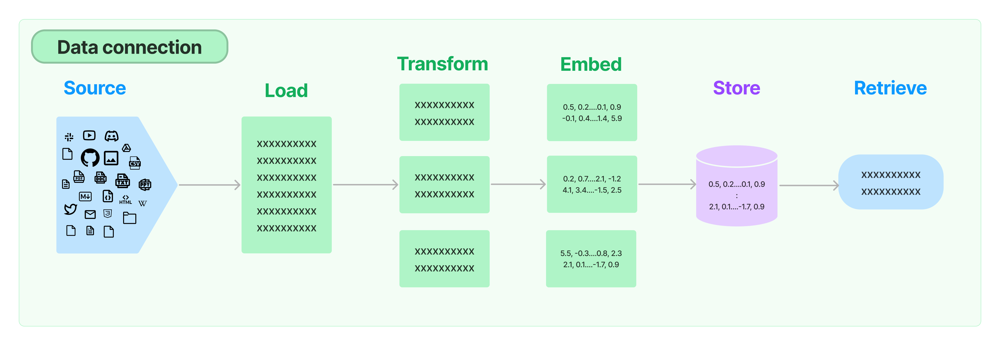
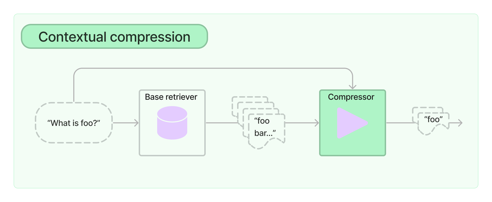
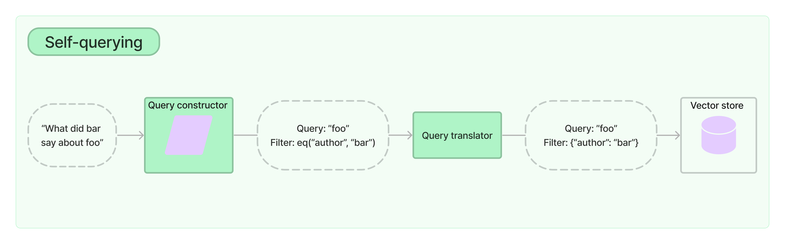

许多LLM应用需要用户特定的数据，这些数据不属于模型的训练集。LangChain通过以下方式为你提供了加载、转换、存储和查询数据的构建模块：
- 文档加载器：从许多不同的来源加载文档 
- 文档转换器：分割文档，删除多余的文档等-
- 文本嵌入模型：采取非结构化文本，并把它变成一个浮点数的列表 矢量存储：存储和
- 搜索嵌入式数据 
- 检索器：查询你的数据

整体流程：


安装：`
```python
pip install langchain
pip install unstructured
pip install jq
```

使用的版本：`0.0.218`

测试：`git clone https://github.com/hwchase17/langchain.git`
# 文档加载器

## 怎么加载
### CSV
基本使用：
```python
import os
from pathlib import Path

from langchain.document_loaders import UnstructuredCSVLoader
from langchain.document_loaders.csv_loader import CSVLoader
EXAMPLE_DIRECTORY = file_path = Path(__file__).parent.parent / "examples"


def test_unstructured_csv_loader() -> None:
    """Test unstructured loader."""
    file_path = os.path.join(EXAMPLE_DIRECTORY, "stanley-cups.csv")
    loader = UnstructuredCSVLoader(str(file_path))
    docs = loader.load()
    print(docs)
    assert len(docs) == 1

def test_csv_loader():
  file_path = os.path.join(EXAMPLE_DIRECTORY, "stanley-cups.csv")
  loader = CSVLoader(file_path)
  docs = loader.load()
  print(docs)

test_unstructured_csv_loader()
test_csv_loader()

```
结果：
```python
[Document(page_content='\n  \n    \n      Team\n      Location\n      Stanley Cups\n    \n    \n      Blues\n      STL\n      1\n    \n    \n      Flyers\n      PHI\n      2\n    \n    \n      Maple Leafs\n      TOR\n      13\n    \n  \n', metadata={'source': '/content/drive/MyDrive/langchain/tests/integration_tests/examples/stanley-cups.csv'})]
[Document(page_content='Stanley Cups: Team\n: Stanley Cups', metadata={'source': '/content/drive/MyDrive/langchain/tests/integration_tests/examples/stanley-cups.csv', 'row': 0}), Document(page_content='Stanley Cups: Blues\n: 1', metadata={'source': '/content/drive/MyDrive/langchain/tests/integration_tests/examples/stanley-cups.csv', 'row': 1}), Document(page_content='Stanley Cups: Flyers\n: 2', metadata={'source': '/content/drive/MyDrive/langchain/tests/integration_tests/examples/stanley-cups.csv', 'row': 2}), Document(page_content='Stanley Cups: Maple Leafs\n: 13', metadata={'source': '/content/drive/MyDrive/langchain/tests/integration_tests/examples/stanley-cups.csv', 'row': 3})]
```
注意其中的区别，一个是把csv当成非结构化文本，一个是当成结构化的文本。

我们在这里还是主要看CSVLoader，有一些另外的参数我们可以使用：
```python
loader = CSVLoader(file_path='./example_data/mlb_teams_2012.csv', csv_args={
    'delimiter': ',', # 分隔符号
    'quotechar': '"', #
    'fieldnames': ['MLB Team', 'Payroll in millions', 'Wins'] # 使用的属性名称
})

data = loader.load()
```
### 文件目录
直接看一个例子：
```python
from langchain.document_loaders import DirectoryLoader, TextLoader

text_loader_kwargs={'autodetect_encoding': True}
loader = DirectoryLoader('../examples/', 
              glob="**/*.txt",  # 遍历txt文件
              show_progress=True,  # 显示进度
              use_multithreading=True,  # 使用多线程
              loader_cls=TextLoader,  # 使用加载数据的方式
              silent_errors=True,  # 遇到错误继续
              loader_kwargs=text_loader_kwargs)  # 可以使用字典传入参数

docs = loader.load()
print("\n")
print(docs[0])
```
### HTML
```python
from langchain.document_loaders import UnstructuredHTMLLoader, BSHTMLLoader
loader = UnstructuredHTMLLoader("../examples/example.html")
docs = loader.load()
print(docs[0])

loader = BSHTMLLoader("../examples/example.html")
docs = loader.load()
print(docs[0])
```
结果：
```python
[nltk_data] Downloading package punkt to /root/nltk_data...
[nltk_data]   Unzipping tokenizers/punkt.zip.
[nltk_data] Downloading package averaged_perceptron_tagger to
[nltk_data]     /root/nltk_data...
[nltk_data]   Unzipping taggers/averaged_perceptron_tagger.zip.
page_content='Instead of drinking water from the cat bowl, make sure to steal water from\n      the toilet\n\nChase the red dot\n\nMunch, munch, chomp, chomp hate dogs. Spill litter box, scratch at owner,\n      destroy all furniture, especially couch get scared by sudden appearance of\n      cucumber cat is love, cat is life fat baby cat best buddy little guy for\n      catch eat throw up catch eat throw up bad birds jump on fridge. Purr like\n      a car engine oh yes, there is my human woman she does best pats ever that\n      all i like about her hiss meow .\n\nDead stare with ears cocked when owners are asleep, cry for no apparent\n      reason meow all night. Plop down in the middle where everybody walks favor\n      packaging over toy. Sit on the laptop kitty pounce, trip, faceplant.' metadata={'source': '../examples/example.html'}
page_content="\n\nChew dad's slippers\n\n\n\n      Instead of drinking water from the cat bowl, make sure to steal water from\n      the toilet\n    \nChase the red dot\n\n      Munch, munch, chomp, chomp hate dogs. Spill litter box, scratch at owner,\n      destroy all furniture, especially couch get scared by sudden appearance of\n      cucumber cat is love, cat is life fat baby cat best buddy little guy for\n      catch eat throw up catch eat throw up bad birds jump on fridge. Purr like\n      a car engine oh yes, there is my human woman she does best pats ever that\n      all i like about her hiss meow .\n    \n\n      Dead stare with ears cocked when owners are asleep, cry for no apparent\n      reason meow all night. Plop down in the middle where everybody walks favor\n      packaging over toy. Sit on the laptop kitty pounce, trip, faceplant.\n    \n\n\n" metadata={'source': '../examples/example.html', 'title': "Chew dad's slippers"}
```
### JSON
先看一下原始的数据：
```python
import json
from pathlib import Path
from pprint import pprint


file_path='../examples/facebook_chat.json'
data = json.loads(Path(file_path).read_text())
pprint(data)

"""
{'image': {'creation_timestamp': 1675549016, 'uri': 'image_of_the_chat.jpg'},
 'is_still_participant': True,
 'joinable_mode': {'link': '', 'mode': 1},
 'magic_words': [],
 'messages': [{'content': 'Bye!',
               'sender_name': 'User 2',
               'timestamp_ms': 1675597571851},
              {'content': 'Oh no worries! Bye',
               'sender_name': 'User 1',
               'timestamp_ms': 1675597435669},
              {'content': 'No Im sorry it was my mistake, the blue one is not '
                          'for sale',
               'sender_name': 'User 2',
               'timestamp_ms': 1675596277579},
              {'content': 'I thought you were selling the blue one!',
               'sender_name': 'User 1',
               'timestamp_ms': 1675595140251},
              {'content': 'Im not interested in this bag. Im interested in the '
                          'blue one!',
               'sender_name': 'User 1',
               'timestamp_ms': 1675595109305},
              {'content': 'Here is $129',
               'sender_name': 'User 2',
               'timestamp_ms': 1675595068468},
              {'photos': [{'creation_timestamp': 1675595059,
                           'uri': 'url_of_some_picture.jpg'}],
               'sender_name': 'User 2',
               'timestamp_ms': 1675595060730},
              {'content': 'Online is at least $100',
               'sender_name': 'User 2',
               'timestamp_ms': 1675595045152},
              {'content': 'How much do you want?',
               'sender_name': 'User 1',
               'timestamp_ms': 1675594799696},
              {'content': 'Goodmorning! $50 is too low.',
               'sender_name': 'User 2',
               'timestamp_ms': 1675577876645},
              {'content': 'Hi! Im interested in your bag. Im offering $50. Let '
                          'me know if you are interested. Thanks!',
               'sender_name': 'User 1',
               'timestamp_ms': 1675549022673}],
 'participants': [{'name': 'User 1'}, {'name': 'User 2'}],
 'thread_path': 'inbox/User 1 and User 2 chat',
 'title': 'User 1 and User 2 chat'}
"""
使用langchain加载数据：
```python
from langchain.document_loaders import JSONLoader
loader = JSONLoader(
    file_path='../examples/facebook_chat.json',
    jq_schema='.messages[].content' # 会报错Expected page_content is string, got <class 'NoneType'> instead.
    page_content=False, # 报错后添加这一行)

data = loader.load()
print(data[0])
```
需要注意的一个地方：jq_schema用于获取指定的数据。比如，.messages[].content就是获取messages数组里面的content字段，注意开头为.。

结果：
```python
page_content='Bye!' metadata={'source': '/content/drive/MyDrive/langchain/tests/integration_tests/examples/facebook_chat.json', 'seq_num': 1, 'content': 'Bye!'}
```
我们也可以在metadata里面添加一些数据：
```python
from langchain.document_loaders import JSONLoader

# Define the metadata extraction function.
def metadata_func(record: dict, metadata: dict) -> dict:

    metadata["sender_name"] = record.get("sender_name")
    metadata["timestamp_ms"] = record.get("timestamp_ms")

    return metadata


loader = JSONLoader(
    file_path='../examples/facebook_chat.json',
    jq_schema='.messages[]',
    content_key="content",
    text_content=False,  # 报错后设置这个为False
    metadata_func=metadata_func
)

data = loader.load()
d = data[0]
print(d)
```
结果：
```python
文件
..
拖放文件即可将其上传到会话存储空间
磁盘
可用存储空间：83.14 GB
[1]
!pip install transformers
!pip install langchain
[23]
!pip install unstructured
!pip install jq
[7]
0 秒
cd /content/drive/MyDrive/langchain/tests/integration_tests/document_loaders/
/content/drive/MyDrive/langchain/tests/integration_tests/document_loaders
[6]
21 秒
!git clone https://github.com/hwchase17/langchain.git
Cloning into 'langchain'...
remote: Enumerating objects: 38279, done.
remote: Counting objects: 100% (117/117), done.
remote: Compressing objects: 100% (90/90), done.
remote: Total 38279 (delta 53), reused 60 (delta 26), pack-reused 38162
Receiving objects: 100% (38279/38279), 42.71 MiB | 13.83 MiB/s, done.
Resolving deltas: 100% (27578/27578), done.
Updating files: 100% (2297/2297), done.
[12]
3 秒
!python test_csv_loader.py
[Document(page_content='\n  \n    \n      Team\n      Location\n      Stanley Cups\n    \n    \n      Blues\n      STL\n      1\n    \n    \n      Flyers\n      PHI\n      2\n    \n    \n      Maple Leafs\n      TOR\n      13\n    \n  \n', metadata={'source': '/content/drive/MyDrive/langchain/tests/integration_tests/examples/stanley-cups.csv'})]
[Document(page_content='Stanley Cups: Team\n: Stanley Cups', metadata={'source': '/content/drive/MyDrive/langchain/tests/integration_tests/examples/stanley-cups.csv', 'row': 0}), Document(page_content='Stanley Cups: Blues\n: 1', metadata={'source': '/content/drive/MyDrive/langchain/tests/integration_tests/examples/stanley-cups.csv', 'row': 1}), Document(page_content='Stanley Cups: Flyers\n: 2', metadata={'source': '/content/drive/MyDrive/langchain/tests/integration_tests/examples/stanley-cups.csv', 'row': 2}), Document(page_content='Stanley Cups: Maple Leafs\n: 13', metadata={'source': '/content/drive/MyDrive/langchain/tests/integration_tests/examples/stanley-cups.csv', 'row': 3})]
[15]
0 秒
from langchain.document_loaders import DirectoryLoader, TextLoader

text_loader_kwargs={'autodetect_encoding': True}
loader = DirectoryLoader('../examples/', 
              glob="**/*.txt",
              show_progress=True,
              use_multithreading=True,
              loader_cls=TextLoader,
              silent_errors=True,
              loader_kwargs=text_loader_kwargs)

docs = loader.load()
print("\n")
print(docs[0])
100%|██████████| 1/1 [00:00<00:00, 168.97it/s]

page_content='[05.05.23, 15:48:11] James: Hi here\n[11/8/21, 9:41:32 AM] User name: Message 123\n1/23/23, 3:19 AM - User 2: Bye!\n1/23/23, 3:22_AM - User 1: And let me know if anything changes\n[1/24/21, 12:41:03 PM] ~ User name 2: Of course!\n[2023/5/4, 16:13:23] ~ User 2: See you!\n7/19/22, 11:32\u202fPM - User 1: Hello\n7/20/22, 11:32\u202fam - User 2: Goodbye\n4/20/23, 9:42\u202fam - User 3: <Media omitted>\n6/29/23, 12:16\u202fam - User 4: This message was deleted\n' metadata={'source': '../examples/whatsapp_chat.txt'}

[16]
3 秒
from langchain.document_loaders import UnstructuredHTMLLoader, BSHTMLLoader
loader = UnstructuredHTMLLoader("../examples/example.html")
docs = loader.load()
print(docs[0])

loader = BSHTMLLoader("../examples/example.html")
docs = loader.load()
print(docs[0])
[nltk_data] Downloading package punkt to /root/nltk_data...
[nltk_data]   Unzipping tokenizers/punkt.zip.
[nltk_data] Downloading package averaged_perceptron_tagger to
[nltk_data]     /root/nltk_data...
[nltk_data]   Unzipping taggers/averaged_perceptron_tagger.zip.
page_content='Instead of drinking water from the cat bowl, make sure to steal water from\n      the toilet\n\nChase the red dot\n\nMunch, munch, chomp, chomp hate dogs. Spill litter box, scratch at owner,\n      destroy all furniture, especially couch get scared by sudden appearance of\n      cucumber cat is love, cat is life fat baby cat best buddy little guy for\n      catch eat throw up catch eat throw up bad birds jump on fridge. Purr like\n      a car engine oh yes, there is my human woman she does best pats ever that\n      all i like about her hiss meow .\n\nDead stare with ears cocked when owners are asleep, cry for no apparent\n      reason meow all night. Plop down in the middle where everybody walks favor\n      packaging over toy. Sit on the laptop kitty pounce, trip, faceplant.' metadata={'source': '../examples/example.html'}
page_content="\n\nChew dad's slippers\n\n\n\n      Instead of drinking water from the cat bowl, make sure to steal water from\n      the toilet\n    \nChase the red dot\n\n      Munch, munch, chomp, chomp hate dogs. Spill litter box, scratch at owner,\n      destroy all furniture, especially couch get scared by sudden appearance of\n      cucumber cat is love, cat is life fat baby cat best buddy little guy for\n      catch eat throw up catch eat throw up bad birds jump on fridge. Purr like\n      a car engine oh yes, there is my human woman she does best pats ever that\n      all i like about her hiss meow .\n    \n\n      Dead stare with ears cocked when owners are asleep, cry for no apparent\n      reason meow all night. Plop down in the middle where everybody walks favor\n      packaging over toy. Sit on the laptop kitty pounce, trip, faceplant.\n    \n\n\n" metadata={'source': '../examples/example.html', 'title': "Chew dad's slippers"}
[20]
0 秒
from langchain.document_loaders import JSONLoader
import json
from pathlib import Path
from pprint import pprint


file_path='../examples/facebook_chat.json'
data = json.loads(Path(file_path).read_text())
pprint(data)
{'image': {'creation_timestamp': 1675549016, 'uri': 'image_of_the_chat.jpg'},
 'is_still_participant': True,
 'joinable_mode': {'link': '', 'mode': 1},
 'magic_words': [],
 'messages': [{'content': 'Bye!',
               'sender_name': 'User 2',
               'timestamp_ms': 1675597571851},
              {'content': 'Oh no worries! Bye',
               'sender_name': 'User 1',
               'timestamp_ms': 1675597435669},
              {'content': 'No Im sorry it was my mistake, the blue one is not '
                          'for sale',
               'sender_name': 'User 2',
               'timestamp_ms': 1675596277579},
              {'content': 'I thought you were selling the blue one!',
               'sender_name': 'User 1',
               'timestamp_ms': 1675595140251},
              {'content': 'Im not interested in this bag. Im interested in the '
                          'blue one!',
               'sender_name': 'User 1',
               'timestamp_ms': 1675595109305},
              {'content': 'Here is $129',
               'sender_name': 'User 2',
               'timestamp_ms': 1675595068468},
              {'photos': [{'creation_timestamp': 1675595059,
                           'uri': 'url_of_some_picture.jpg'}],
               'sender_name': 'User 2',
               'timestamp_ms': 1675595060730},
              {'content': 'Online is at least $100',
               'sender_name': 'User 2',
               'timestamp_ms': 1675595045152},
              {'content': 'How much do you want?',
               'sender_name': 'User 1',
               'timestamp_ms': 1675594799696},
              {'content': 'Goodmorning! $50 is too low.',
               'sender_name': 'User 2',
               'timestamp_ms': 1675577876645},
              {'content': 'Hi! Im interested in your bag. Im offering $50. Let '
                          'me know if you are interested. Thanks!',
               'sender_name': 'User 1',
               'timestamp_ms': 1675549022673}],
 'participants': [{'name': 'User 1'}, {'name': 'User 2'}],
 'thread_path': 'inbox/User 1 and User 2 chat',
 'title': 'User 1 and User 2 chat'}
[42]
2 秒
    text_content=False,
    metadata_func=metadata_func
)

data = loader.load()
d = data[0]
print(d)
"""
page_content='Bye!' metadata={'source': '/content/drive/MyDrive/langchain/tests/integration_tests/examples/facebook_chat.json', 'seq_num': 1, 'sender_name': 'User 2', 'timestamp_ms': 1675597571851}
"""
```
json和jq_schema的一些映射样例：
```json
JSON        -> [{"text": ...}, {"text": ...}, {"text": ...}]
jq_schema   -> ".[].text"

JSON        -> {"key": [{"text": ...}, {"text": ...}, {"text": ...}]}
jq_schema   -> ".key[].text"

JSON        -> ["...", "...", "..."]
jq_schema   -> ".[]"
```
### Markdown
这个暂时不考虑。
### PDF
`pip install pyPDF`

第一种方式：
```python
from langchain.document_loaders import PyPDFLoader

loader = PyPDFLoader("../examples/layout-parser-paper.pdf")
pages = loader.load_and_split()

print(pages[0])
```
第二种方式：
```python
from langchain.document_loaders import MathpixPDFLoader

loader = MathpixPDFLoader("example_data/layout-parser-paper.pdf")

data = loader.load()
print(data[0])
```
这个需要MATHPIX_API_KEY。

第三种方式：
```python
from langchain.document_loaders import UnstructuredPDFLoader

loader = UnstructuredPDFLoader("../examples/layout-parser-paper.pdf")

data = loader.load()
print(data[0])
```
这里是把整个pdf当成一个文本，返回的是一个不同段文本组合的元组：`('LayoutParser: A Unified Toolkit for Deep Learning Based Document Image '
 'Analysis\n' ...)` 会发现标题是分割开的，我们可以设置mode来合并同一类元素。

```python

from langchain.document_loaders import UnstructuredPDFLoader

loader = UnstructuredPDFLoader("../examples/layout-parser-paper.pdf", mode="elements")

data = loader.load()
pprint(data)
```
返回的是一个列表，列表里是一个个Document，这些Document里面的元素都是完整的，比如：`[Document(page_content='LayoutParser: A Unified Toolkit for Deep Learning Based Document Image Analysis', metadata={'source': '../examples/layout-parser-paper.pdf', 'filename': 'layout-parser-paper.pdf', 'file_directory': '../examples', 'filetype': 'application/pdf', 'page_number': 1, 'category': 'Title'}), ...]`

## 集成
还有很多各种各样的Loader，具体有什么可参考：

https://python.langchain.com/docs/modules/data_connection/document_loaders/how_to/pdf#

具体怎么使用的可参考：

https://github.com/hwchase17/langchain/blob/master/tests/integration_tests/document_loaders/

# 文档转换
一旦你加载了文件，你经常会想要转换它们以更好地适应你的应用。最简单的例子是，你可能想把一个长的文档分割成较小的块状，以适应你的模型的上下文窗口。LangChain有许多内置的文档转换工具，可以很容易地对文档进行分割、组合、过滤和其他操作。
## 文本分割
### 通过字符进行分割
```python
state_of_the_union = """
斗之力，三段！”

    望着测验魔石碑上面闪亮得甚至有些刺眼的五个大字，少年面无表情，唇角有着一抹自嘲，紧握的手掌，因为大力，而导致略微尖锐的指甲深深的刺进了掌心之中，带来一阵阵钻心的疼痛…

    “萧炎，斗之力，三段！级别：低级！”测验魔石碑之旁，一位中年男子，看了一眼碑上所显示出来的信息，语气漠然的将之公布了出来…

    中年男子话刚刚脱口，便是不出意外的在人头汹涌的广场上带起了一阵嘲讽的骚动。

    “三段？嘿嘿，果然不出我所料，这个“天才”这一年又是在原地踏步！”

    “哎，这废物真是把家族的脸都给丢光了。”

    “要不是族长是他的父亲，这种废物，早就被驱赶出家族，任其自生自灭了，哪还有机会待在家族中白吃白喝。”

    “唉，昔年那名闻乌坦城的天才少年，如今怎么落魄成这般模样了啊？”
"""

from langchain.text_splitter import CharacterTextSplitter
text_splitter = CharacterTextSplitter(        
    separator = "\n\n",
    chunk_size = 128,  # 分块长度
    chunk_overlap  = 10,  # 重合的文本长度
    length_function = len,
)

texts = text_splitter.create_documents([state_of_the_union])
print(texts[0])

# 这里metadatas用于区分不同的文档
metadatas = [{"document": 1}, {"document": 2}]
documents = text_splitter.create_documents([state_of_the_union, state_of_the_union], metadatas=metadatas)
pprint(documents)

# 获取切割后的文本
print(text_splitter.split_text(state_of_the_union)[0])
```
### 对代码进行分割
比如对python代码进行分割：
```python
from langchain.text_splitter import (
    RecursiveCharacterTextSplitter,
    Language,
)

print([e.value for e in Language])  # 支持语言
print(RecursiveCharacterTextSplitter.get_separators_for_language(Language.PYTHON))  # 分割符号

PYTHON_CODE = """
def hello_world():
    print("Hello, World!")

# Call the function
hello_world()
"""
python_splitter = RecursiveCharacterTextSplitter.from_language(
    language=Language.PYTHON, chunk_size=50, chunk_overlap=0
)
python_docs = python_splitter.create_documents([PYTHON_CODE])
python_docs

"""
[Document(page_content='def hello_world():\n    print("Hello, World!")', metadata={}),
 Document(page_content='# Call the function\nhello_world()', metadata={})]
"""
```
当然还有其它语言的，可参考：

https://python.langchain.com/docs/modules/data_connection/document_transformers/text_splitters/code_splitter

### 通过markdownheader进行分割
举个例子：
`md = # Foo\n\n ## Bar\n\nHi this is Jim  \nHi this is Joe\n\n ## Baz\n\n Hi this is Molly' .`
我们定义分割头：`[("#", "Header 1"),("##", "Header 2")]`文本应该被公共头进行分割，最终得到：`{'content': 'Hi this is Jim  \nHi this is Joe', 'metadata': {'Header 1': 'Foo', 'Header 2': 'Bar'}}
{'content': 'Hi this is Molly', 'metadata': {'Header 1': 'Foo', 'Header 2': 'Baz'}}
```python
from langchain.text_splitter import MarkdownHeaderTextSplitter
markdown_document = "# Foo\n\n    ## Bar\n\nHi this is Jim\n\nHi this is Joe\n\n ### Boo \n\n Hi this is Lance \n\n ## Baz\n\n Hi this is Molly"

headers_to_split_on = [
    ("#", "Header 1"),
    ("##", "Header 2"),
    ("###", "Header 3"),
]

markdown_splitter = MarkdownHeaderTextSplitter(headers_to_split_on=headers_to_split_on)
md_header_splits = markdown_splitter.split_text(markdown_document)
md_header_splits

"""
    [Document(page_content='Hi this is Jim  \nHi this is Joe', metadata={'Header 1': 'Foo', 'Header 2': 'Bar'}),
     Document(page_content='Hi this is Lance', metadata={'Header 1': 'Foo', 'Header 2': 'Bar', 'Header 3': 'Boo'}),
     Document(page_content='Hi this is Molly', metadata={'Header 1': 'Foo', 'Header 2': 'Baz'})]
"""
```
然后针对于每一个markdown组，我们都可以使用文本分割器对其进行分割：
```python
markdown_document = "# Intro \n\n    ## History \n\n Markdown[9] is a lightweight markup language for creating formatted text using a plain-text editor. John Gruber created Markdown in 2004 as a markup language that is appealing to human readers in its source code form.[9] \n\n Markdown is widely used in blogging, instant messaging, online forums, collaborative software, documentation pages, and readme files. \n\n ## Rise and divergence \n\n As Markdown popularity grew rapidly, many Markdown implementations appeared, driven mostly by the need for \n\n additional features such as tables, footnotes, definition lists,[note 1] and Markdown inside HTML blocks. \n\n #### Standardization \n\n From 2012, a group of people, including Jeff Atwood and John MacFarlane, launched what Atwood characterised as a standardisation effort. \n\n ## Implementations \n\n Implementations of Markdown are available for over a dozen programming languages."

headers_to_split_on = [
    ("#", "Header 1"),
    ("##", "Header 2"),
]

# MD splits
markdown_splitter = MarkdownHeaderTextSplitter(headers_to_split_on=headers_to_split_on)
md_header_splits = markdown_splitter.split_text(markdown_document)

# Char-level splits
from langchain.text_splitter import RecursiveCharacterTextSplitter
chunk_size = 250
chunk_overlap = 30
text_splitter = RecursiveCharacterTextSplitter(chunk_size=chunk_size, chunk_overlap=chunk_overlap)

# Split
splits = text_splitter.split_documents(md_header_splits)
splits

"""
[Document(page_content='Markdown[9] is a lightweight markup language for creating formatted text using a plain-text editor. John Gruber created Markdown in 2004 as a markup language that is appealing to human readers in its source code form.[9]', metadata={'Header 1': 'Intro', 'Header 2': 'History'}),
 Document(page_content='Markdown is widely used in blogging, instant messaging, online forums, collaborative software, documentation pages, and readme files.', metadata={'Header 1': 'Intro', 'Header 2': 'History'}),
 Document(page_content='As Markdown popularity grew rapidly, many Markdown implementations appeared, driven mostly by the need for  \nadditional features such as tables, footnotes, definition lists,[note 1] and Markdown inside HTML blocks.  \n#### Standardization', metadata={'Header 1': 'Intro', 'Header 2': 'Rise and divergence'}),
 Document(page_content='#### Standardization  \nFrom 2012, a group of people, including Jeff Atwood and John MacFarlane, launched what Atwood characterised as a standardisation effort.', metadata={'Header 1': 'Intro', 'Header 2': 'Rise and divergence'}),
 Document(page_content='Implementations of Markdown are available for over a dozen programming languages.', metadata={'Header 1': 'Intro', 'Header 2': 'Implementations'})]
"""
```

### 按字符递归分割
默认列表为：`["\n\n", "\n", " ", ""]`
```python
state_of_the_union = """
斗之力，三段！”

望着测验魔石碑上面闪亮得甚至有些刺眼的五个大字，少年面无表情，唇角有着一抹自嘲，紧握的手掌，因为大力，而导致略微尖锐的指甲深深的刺进了掌心之中，带来一阵阵钻心的疼痛…

“萧炎，斗之力，三段！级别：低级！”测验魔石碑之旁，一位中年男子，看了一眼碑上所显示出来的信息，语气漠然的将之公布了出来…

中年男子话刚刚脱口，便是不出意外的在人头汹涌的广场上带起了一阵嘲讽的骚动。

“三段？嘿嘿，果然不出我所料，这个“天才”这一年又是在原地踏步！”

“哎，这废物真是把家族的脸都给丢光了。”

“要不是族长是他的父亲，这种废物，早就被驱赶出家族，任其自生自灭了，哪还有机会待在家族中白吃白喝。”

“唉，昔年那名闻乌坦城的天才少年，如今怎么落魄成这般模样了啊？”
"""

from langchain.text_splitter import CharacterTextSplitter
from pprint import pprint
text_splitter = CharacterTextSplitter(
    chunk_size = 128,
    chunk_overlap  = 10,
    length_function = len,
)

texts = text_splitter.create_documents([state_of_the_union])
pprint(texts[0].page_content)

"""
('斗之力，三段！”\n'
 '\n'
 '望着测验魔石碑上面闪亮得甚至有些刺眼的五个大字，少年面无表情，唇角有着一抹自嘲，紧握的手掌，因为大力，而导致略微尖锐的指甲深深的刺进了掌心之中，带来一阵阵钻心的疼痛…')
 
['斗之力，三段！”\n'
 '\n'
 '望着测验魔石碑上面闪亮得甚至有些刺眼的五个大字，少年面无表情，唇角有着一抹自嘲，紧握的手掌，因为大力，而导致略微尖锐的指甲深深的刺进了掌心之中，带来一阵阵钻心的疼痛…',
 '“萧炎，斗之力，三段！级别：低级！”测验魔石碑之旁，一位中年男子，看了一眼碑上所显示出来的信息，语气漠然的将之公布了出来…\n'
 '\n'
 '中年男子话刚刚脱口，便是不出意外的在人头汹涌的广场上带起了一阵嘲讽的骚动。']
"""
```
### 通过tokens进行分割
语言模型有一个令牌限制。你不应该超过令牌的限制。因此，当你把你的文本分成几块时，计算标记的数量是一个好主意。有许多标记器。当你计算文本中的令牌时，你应该使用与语言模型中使用的相同的令牌器。
#### tiktoken
> tiktoken is a fast BPE tokenizer created by OpenAI.

`pip install tiktoken`
```python
state_of_the_union = """
斗之力，三段！”

望着测验魔石碑上面闪亮得甚至有些刺眼的五个大字，少年面无表情，唇角有着一抹自嘲，紧握的手掌，因为大力，而导致略微尖锐的指甲深深的刺进了掌心之中，带来一阵阵钻心的疼痛…

“萧炎，斗之力，三段！级别：低级！”测验魔石碑之旁，一位中年男子，看了一眼碑上所显示出来的信息，语气漠然的将之公布了出来…

中年男子话刚刚脱口，便是不出意外的在人头汹涌的广场上带起了一阵嘲讽的骚动。

“三段？嘿嘿，果然不出我所料，这个“天才”这一年又是在原地踏步！”

“哎，这废物真是把家族的脸都给丢光了。”

“要不是族长是他的父亲，这种废物，早就被驱赶出家族，任其自生自灭了，哪还有机会待在家族中白吃白喝。”

“唉，昔年那名闻乌坦城的天才少年，如今怎么落魄成这般模样了啊？”
"""

from langchain.text_splitter import CharacterTextSplitter
from pprint import pprint
text_splitter = CharacterTextSplitter.from_tiktoken_encoder(
    chunk_size=128, chunk_overlap=10
)
texts = text_splitter.split_text(state_of_the_union)

pprint(texts)
for text in texts:
  print(len(text))
"""
WARNING:langchain.text_splitter:Created a chunk of size 184, which is longer than the specified 128
['斗之力，三段！”',
 '望着测验魔石碑上面闪亮得甚至有些刺眼的五个大字，少年面无表情，唇角有着一抹自嘲，紧握的手掌，因为大力，而导致略微尖锐的指甲深深的刺进了掌心之中，带来一阵阵钻心的疼痛…',
 '“萧炎，斗之力，三段！级别：低级！”测验魔石碑之旁，一位中年男子，看了一眼碑上所显示出来的信息，语气漠然的将之公布了出来…',
 '中年男子话刚刚脱口，便是不出意外的在人头汹涌的广场上带起了一阵嘲讽的骚动。',
 '“三段？嘿嘿，果然不出我所料，这个“天才”这一年又是在原地踏步！”\n\n“哎，这废物真是把家族的脸都给丢光了。”',
 '“要不是族长是他的父亲，这种废物，早就被驱赶出家族，任其自生自灭了，哪还有机会待在家族中白吃白喝。”',
 '“唉，昔年那名闻乌坦城的天才少年，如今怎么落魄成这般模样了啊？”']
8
83
61
37
55
50
32
"""
```
我们也可以直接加载一个tiktoken分割器:
```python
from langchain.text_splitter import TokenTextSplitter

text_splitter = TokenTextSplitter(chunk_size=128, chunk_overlap=0)

texts = text_splitter.split_text(state_of_the_union)
print(texts[0])
```

#### Spacy
> spaCy is an open-source software library for advanced natural language processing, written in the programming languages Python and Cython. Another alternative to NLTK is to use spaCy tokenizer.

```python
from langchain.text_splitter import SpacyTextSplitter

text_splitter = SpacyTextSplitter(chunk_size=200)

texts = text_splitter.split_text(state_of_the_union)
pprint(texts)

"""
['斗之力，三段！”\n'
 '\n'
 '望着测验魔石碑上面闪亮得甚至有些刺眼的五个大字，少年面无表情，唇角有着一抹自嘲，紧握的手掌，因为大力，而导致略微尖锐的指甲深深的刺进了掌心之中，带来一阵阵钻心的疼痛…\n'
 '\n'
 '“萧炎，斗之力，三段！级别：低级！”测验魔石碑之旁，一位中年男子，看了一眼碑上所显示出来的信息，语气漠然的将之公布了出来…\n'
 '\n'
 '中年男子话刚刚脱口，便是不出意外的在人头汹涌的广场上带起了一阵嘲讽的骚动。\n'
 '\n'
 '“三段？嘿嘿，果然不出我所料，这个“天才”这一年又是在原地踏步！”\n'
 '\n'
 '“哎，这废物真是把家族的脸都给丢光了。”\n'
 '\n'
 '“要不是族长是他的父亲，这种废物，早就被驱赶出家族，任其自生自灭了，哪还有机会待在家族中白吃白喝。”\n'
 '\n'
 '“唉，昔年那名闻乌坦城的天才少年，如今怎么落魄成这般模样了啊？”']
"""
```

#### sentencetransformers
`pip install sentence_transformers`
```python
from langchain.text_splitter import SentenceTransformersTokenTextSplitter

splitter = SentenceTransformersTokenTextSplitter(chunk_overlap=0)
text = """
斗之力，三段！”

望着测验魔石碑上面闪亮得甚至有些刺眼的五个大字，少年面无表情，唇角有着一抹自嘲，紧握的手掌，因为大力，而导致略微尖锐的指甲深深的刺进了掌心之中，带来一阵阵钻心的疼痛…

“萧炎，斗之力，三段！级别：低级！”测验魔石碑之旁，一位中年男子，看了一眼碑上所显示出来的信息，语气漠然的将之公布了出来…

中年男子话刚刚脱口，便是不出意外的在人头汹涌的广场上带起了一阵嘲讽的骚动。

“三段？嘿嘿，果然不出我所料，这个“天才”这一年又是在原地踏步！”

“哎，这废物真是把家族的脸都给丢光了。”

“要不是族长是他的父亲，这种废物，早就被驱赶出家族，任其自生自灭了，哪还有机会待在家族中白吃白喝。”

“唉，昔年那名闻乌坦城的天才少年，如今怎么落魄成这般模样了啊？”
"""

count_start_and_stop_tokens = 2
text_token_count = splitter.count_tokens(text=text) - count_start_and_stop_tokens
print(text_token_count)

token_multiplier = splitter.maximum_tokens_per_chunk // text_token_count + 1

# `text_to_split` does not fit in a single chunk
text_to_split = text * token_multiplier

print(f"tokens in text to split: {splitter.count_tokens(text=text_to_split)}")

text_chunks = splitter.split_text(text=text_to_split)

print(text_chunks)
```
将文本转换为sentence-transformers的输入格式。默认是不支持中文的，可能要在加载的时候指定多语言的模型，这里就不作展开了。当然，也可以自己定义转换函数，不必使用langchain。

#### NLTK
> The Natural Language Toolkit, or more commonly NLTK, is a suite of libraries and programs for symbolic and statistical natural language processing (NLP) for English written in the Python programming language.

```python
import nltk
nltk.download('punkt')
from langchain.text_splitter import NLTKTextSplitter

text_splitter = NLTKTextSplitter(chunk_size=1000)

texts = text_splitter.split_text(state_of_the_union)
pprint(texts[0])

"""
('斗之力，三段！”\n'
 '\n'
 '望着测验魔石碑上面闪亮得甚至有些刺眼的五个大字，少年面无表情，唇角有着一抹自嘲，紧握的手掌，因为大力，而导致略微尖锐的指甲深深的刺进了掌心之中，带来一阵阵钻心的疼痛…\n'
 '\n'
 '“萧炎，斗之力，三段！级别：低级！”测验魔石碑之旁，一位中年男子，看了一眼碑上所显示出来的信息，语气漠然的将之公布了出来…\n'
 '\n'
 '中年男子话刚刚脱口，便是不出意外的在人头汹涌的广场上带起了一阵嘲讽的骚动。\n'
 '\n'
 '“三段？嘿嘿，果然不出我所料，这个“天才”这一年又是在原地踏步！”\n'
 '\n'
 '“哎，这废物真是把家族的脸都给丢光了。”\n'
 '\n'
 '“要不是族长是他的父亲，这种废物，早就被驱赶出家族，任其自生自灭了，哪还有机会待在家族中白吃白喝。”\n'
 '\n'
 '“唉，昔年那名闻乌坦城的天才少年，如今怎么落魄成这般模样了啊？”')
"""
```
#### Hugging Face tokenizer
`pip install transformers`

```python
from transformers import BertTokenizer

tokenizer = BertTokenizer.from_pretrained("hfl/chinese-bert-wwm-ext")

text_splitter = CharacterTextSplitter.from_huggingface_tokenizer(
    tokenizer, chunk_size=100, chunk_overlap=0
)
texts = text_splitter.split_text(state_of_the_union)
for text in texts:
  print(len(text))
  print(text)
  
"""
93
斗之力，三段！”

望着测验魔石碑上面闪亮得甚至有些刺眼的五个大字，少年面无表情，唇角有着一抹自嘲，紧握的手掌，因为大力，而导致略微尖锐的指甲深深的刺进了掌心之中，带来一阵阵钻心的疼痛…
61
“萧炎，斗之力，三段！级别：低级！”测验魔石碑之旁，一位中年男子，看了一眼碑上所显示出来的信息，语气漠然的将之公布了出来…
94
中年男子话刚刚脱口，便是不出意外的在人头汹涌的广场上带起了一阵嘲讽的骚动。

“三段？嘿嘿，果然不出我所料，这个“天才”这一年又是在原地踏步！”

“哎，这废物真是把家族的脸都给丢光了。”
84
“要不是族长是他的父亲，这种废物，早就被驱赶出家族，任其自生自灭了，哪还有机会待在家族中白吃白喝。”

“唉，昔年那名闻乌坦城的天才少年，如今怎么落魄成这般模样了啊？”
"""
```
根据字符来分割。句子最大长度基于tokenizer里的设置。

### 总结
虽然有各种各样的方法对文本进行切割，但是要注意的是不同切割方法之间的区别，以及是否是支持中文。

# 文本嵌入模型
Embeddings类是一个旨在与文本嵌入模型对接的类。有很多嵌入模型提供者（OpenAI、Cohere、Hugging Face等）--这个类被设计用来为所有这些模型提供一个标准接口。

嵌入模型创建了一段文本的矢量表示。这很有用，因为它意味着我们可以在矢量空间中思考文本，并进行语义搜索等工作，即寻找在矢量空间中最相似的文本片段。

LangChain的基础Embeddings类暴露了两个方法：一个用于嵌入文档，一个用于嵌入查询。前者需要输入多个文本，而后者则需要输入单个文本。之所以将这些作为两个独立的方法，是因为一些嵌入供应商对文档（要搜索的）和查询（搜索查询本身）有不同的嵌入方法。

这部分提供的是各种模型的一个使用，这里我们关注hugging face的使用：
```python
from langchain.embeddings import HuggingFaceEmbeddings

embeddings = HuggingFaceEmbeddings()

text = "This is a test document."

query_result = embeddings.embed_query(text)

doc_result = embeddings.embed_documents([text])
```
去接口文档看看：https://api.python.langchain.com/en/latest/_modules/langchain/embeddings/huggingface.html#HuggingFaceEmbeddings

里面是使用sentence-transformers库来加载模型，我们可以在HuggingFaceEmbeddings中使用model_name来指定使用的模型以支持中文。

其余嵌入的使用请参考：https://python.langchain.com/docs/modules/data_connection/text_embedding/
# 向量存储
在非结构化数据上进行存储和搜索的最常见的方法之一是将其嵌入并存储产生的嵌入向量，然后在查询时嵌入非结构化查询并检索与嵌入查询 "最相似 "的嵌入向量。矢量存储器负责存储嵌入数据并为你执行矢量搜索。

同样的，它也提供了很多向量存储的方法，这里我们以faiss为例。
`pip install faiss-cpu`。你也可以去安装GPU版本的faiss。
```python
from langchain.embeddings.openai import OpenAIEmbeddings
from langchain.text_splitter import CharacterTextSplitter
from langchain.vectorstores import FAISS
from langchain.document_loaders import TextLoader

from langchain.document_loaders import TextLoader

loader = TextLoader("../../../state_of_the_union.txt")
documents = loader.load()
text_splitter = CharacterTextSplitter(chunk_size=1000, chunk_overlap=0)
docs = text_splitter.split_documents(documents)

embeddings = OpenAIEmbeddings()
db = FAISS.from_documents(docs, embeddings)

query = "What did the president say about Ketanji Brown Jackson"
docs = db.similarity_search(query)
print(docs[0].page_content)
```
简单说明一下:
- 通过数据加载器获得documents
- 通过数据分割器对documents中的数据进行分割
- 定义文本嵌入器，然后对文本转换为嵌入
- 可以使用similarity_search进行相似度搜索

我们完全可以将上述的一些使用支持中文的容器来进行中文的向量计算。

#### 使用带分数的相似度搜索
有一些FAISS的具体方法。其中一个是similarity_search_with_score，它不仅允许你返回文档，还允许你返回查询与文档的距离分数。返回的距离分数是L2距离。因此，得分越低越好。
```python
docs_and_scores = db.similarity_search_with_score(query)
print(docs_and_scores[0])
```
也可以使用 similarity_search_by_vector 来搜索与给定嵌入向量相似的文档，它接受一个嵌入向量作为参数，而不是一个字符串。
```python
embedding_vector = embeddings.embed_query(query)
docs_and_scores = db.similarity_search_by_vector(embedding_vector)
```
#### 存储和加载
你还可以保存和加载一个FAISS索引。这很有用，这样你就不必在每次使用时都重新创建它。
```python
db.save_local("faiss_index")

new_db = FAISS.load_local("faiss_index", embeddings)

docs = new_db.similarity_search(query)

docs[0]
```

#### 合并
你也可以合并两个FAISS矢量库
```python
db1 = FAISS.from_texts(["foo"], embeddings)
db2 = FAISS.from_texts(["bar"], embeddings)

db1.docstore._dict
db2.docstore._dict
db1.merge_from(db2)

db1.docstore._dict
```

#### 带有过滤功能的相似性搜索
FAISS向量库也可以支持过滤，因为FAISS本身不支持过滤，我们必须手动进行过滤。这是通过首先获取比k更多的结果，然后过滤它们来实现的。你可以根据元数据来过滤文件。你也可以在调用任何搜索方法时设置fetch_k参数，以设定在过滤前要获取多少个文档。下面是一个小例子：
```python
from langchain.schema import Document

list_of_documents = [
    Document(page_content="foo", metadata=dict(page=1)),
    Document(page_content="bar", metadata=dict(page=1)),
    Document(page_content="foo", metadata=dict(page=2)),
    Document(page_content="barbar", metadata=dict(page=2)),
    Document(page_content="foo", metadata=dict(page=3)),
    Document(page_content="bar burr", metadata=dict(page=3)),
    Document(page_content="foo", metadata=dict(page=4)),
    Document(page_content="bar bruh", metadata=dict(page=4)),
]
db = FAISS.from_documents(list_of_documents, embeddings)
results_with_scores = db.similarity_search_with_score("foo")
for doc, score in results_with_scores:
    print(f"Content: {doc.page_content}, Metadata: {doc.metadata}, Score: {score}")
```
现在，我们进行同样的查询调用，但我们只过滤页面=1。也就是metadata中的page=1的数据。**这里也体现了metadata数据的一个作用。**
```python
results_with_scores = db.similarity_search_with_score("foo", filter=dict(page=1))
for doc, score in results_with_scores:
    print(f"Content: {doc.page_content}, Metadata: {doc.metadata}, Score: {score}")
```
同样的事情也可以用max_marginal_relevance_search来做。
```python
results = db.max_marginal_relevance_search("foo", filter=dict(page=1))
for doc in results:
    print(f"Content: {doc.page_content}, Metadata: {doc.metadata}")
```
下面是一个例子，说明在调用 similarity_search 时如何设置 fetch_k 参数。通常你会希望fetch_k参数>>k参数。这是因为fetch_k参数是在过滤之前将被获取的文档的数量。如果你把fetch_k设置得很低，你可能得不到足够的文档来过滤。
```python
results = db.similarity_search("foo", filter=dict(page=1), k=1, fetch_k=4)
for doc, score in results_with_scores:
    print(f"Content: {doc.page_content}, Metadata: {doc.metadata}, Score: {score}")
```

### 总结
不同向量存储的方式可能不太一样，具体使用哪一种还是要靠自己去选择。具体有什么存储向量的方式可参考：https://python.langchain.com/docs/modules/data_connection/vectorstores

# 检索
检索器是一个接口，它可以在给定的非结构化查询中返回文档。它比矢量存储更通用。检索器不需要能够存储文件，只需要返回（或检索）它。矢量存储可以作为检索器的骨干，但也有其他类型的检索器。

### 开始
langchain中检索器的基类是这样的：
```python
from abc import ABC, abstractmethod
from typing import List
from langchain.schema import Document

class BaseRetriever(ABC):
    @abstractmethod
    def get_relevant_documents(self, query: str) -> List[Document]:
        """Get texts relevant for a query.

        Args:
            query: string to find relevant texts for

        Returns:
            List of relevant documents
        """
```
就是这么简单! get_relevant_documents方法可以以你认为合适的方式实现。

当然，我们也帮助构建我们认为有用的检索器。我们关注的检索器的主要类型是Vectorstore检索器。在本指南的其余部分，我们将专注于此。

为了理解什么是Vectorstore检索器，重要的是要理解什么是Vectorstore。所以我们来看看这个。

默认情况下，LangChain使用Chroma作为vectorstore来索引和搜索嵌入物。要走完这个教程，我们首先需要安装chromadb。`pip install chromadb`

这个例子展示了对文档的问题回答。我们选择这个例子作为入门，是因为它很好地结合了很多不同的元素（文本分割器、嵌入、矢量存储），然后还展示了如何在一个链条中使用它们。

对文档的问题回答包括四个步骤：
- 创建一个索引
- 从该索引创建一个检索器
- 创建一个问题回答链
- 提出问题!

首先，让我们导入一些我们无论如何都要使用的常用类。`pip install openai`
```python
from langchain.chains import RetrievalQA
from langchain.llms import OpenAI
```
接下来在通用设置中，让我们指定我们要使用的文件加载器。你可以在这里下载state_of_the_union.txt文件：https://github.com/hwchase17/langchainjs/blob/main/examples/state_of_the_union.txt
```python
from langchain.document_loaders import TextLoader
loader = TextLoader('../state_of_the_union.txt', encoding='utf8')
```

### One Line Index Creation
为了尽快开始，我们可以使用VectorstoreIndexCreator。
```python
from langchain.chains import RetrievalQA
from langchain.llms import OpenAI
from langchain.embeddings.openai import OpenAIEmbeddings


from langchain.document_loaders import TextLoader
loader = TextLoader('state_of_the_union.txt', encoding='utf8')

from langchain.indexes import VectorstoreIndexCreator

index = VectorstoreIndexCreator(
    embedding=OpenAIEmbeddings(openai_api_key="chatgpt的key")).from_loaders([loader])

query = "What did the president say about Ketanji Brown Jackson"
index.query(query)

query = "What did the president say about Ketanji Brown Jackson"
index.query_with_sources(query)
```
从VectorstoreIndexCreator返回的是VectorStoreIndexWrapper，它提供了这些漂亮的查询和query_with_sources功能。如果我们只是想直接访问vectorstore，我们也可以这么做。`index.vectorstore`如果我们随后想访问VectorstoreRetriever，我们可以用：`index.vectorstore.as_retriever()`。

### 演练
把我们之前所学全部结合起来：
```python
documents = loader.load()

from langchain.text_splitter import CharacterTextSplitter
text_splitter = CharacterTextSplitter(chunk_size=1000, chunk_overlap=0)
texts = text_splitter.split_documents(documents)

from langchain.embeddings import OpenAIEmbeddings
embeddings = OpenAIEmbeddings()

from langchain.vectorstores import Chroma
db = Chroma.from_documents(texts, embeddings)

retriever = db.as_retriever()
qa = RetrievalQA.from_chain_type(llm=OpenAI(), chain_type="stuff", retriever=retriever)

query = "What did the president say about Ketanji Brown Jackson"
qa.run(query)
```
需要注意的是VectorstoreIndexCreator是一个护套，什么意思呢？我们可以传入一些不同的类去构造它，这使得我们使用的时候更加方便。
```python
index_creator = VectorstoreIndexCreator(
    vectorstore_cls=Chroma,
    embedding=OpenAIEmbeddings(),
    text_splitter=CharacterTextSplitter(chunk_size=1000, chunk_overlap=0)
)
```

## 具体使用
### MultiQueryRetriever
基于距离的矢量数据库检索将查询嵌入（表示）在高维空间，并根据 "距离 "找到类似的嵌入文件。但是，如果查询措辞有细微的变化，或者如果嵌入不能很好地捕捉数据的语义，检索可能会产生不同的结果。有时会进行及时的工程/调整，以手动解决这些问题，但可能很乏味。

MultiQueryRetriever通过使用LLM为给定的用户输入的查询从不同的角度生成多个查询，使提示调整的过程自动化。对于每个查询，它都会检索一组相关的文档，并在所有的查询中进行唯一的联合，以获得一个更大的潜在相关文档集。通过对同一问题生成多个视角，MultiQueryRetriever可能能够克服基于距离的检索的一些限制，并获得更丰富的结果。

```python
# Build a sample vectorDB
from langchain.vectorstores import Chroma
from langchain.document_loaders import PyPDFLoader
from langchain.embeddings.openai import OpenAIEmbeddings
from langchain.text_splitter import RecursiveCharacterTextSplitter

# Load PDF
path="path-to-files"
loaders = [
    PyPDFLoader(path+"docs/cs229_lectures/MachineLearning-Lecture01.pdf"),
    PyPDFLoader(path+"docs/cs229_lectures/MachineLearning-Lecture02.pdf"),
    PyPDFLoader(path+"docs/cs229_lectures/MachineLearning-Lecture03.pdf")
]
docs = []
for loader in loaders:
    docs.extend(loader.load())
    
# Split
text_splitter = RecursiveCharacterTextSplitter(chunk_size = 1500,chunk_overlap = 150)
splits = text_splitter.split_documents(docs)

# VectorDB
embedding = OpenAIEmbeddings()
vectordb = Chroma.from_documents(documents=splits,embedding=embedding)

from langchain.chat_models import ChatOpenAI
from langchain.retrievers.multi_query import MultiQueryRetriever
question="What does the course say about regression?"
num_queries=3
llm = ChatOpenAI(temperature=0)
retriever_from_llm = MultiQueryRetriever.from_llm(retriever=vectordb.as_retriever(),llm=llm)

unique_docs = retriever_from_llm.get_relevant_documents(question="What does the course say about regression?")
len(unique_docs)

```
使用你自己的prompt。你也可以提供一个提示，同时提供一个输出分析器，将结果分成一个查询列表。
```python
from typing import List
from langchain import LLMChain
from pydantic import BaseModel, Field
from langchain.prompts import PromptTemplate
from langchain.output_parsers import PydanticOutputParser

# Output parser will split the LLM result into a list of queries
class LineList(BaseModel):
    # "lines" is the key (attribute name) of the parsed output
    lines: List[str] = Field(description="Lines of text")

class LineListOutputParser(PydanticOutputParser):
    def __init__(self) -> None:
        super().__init__(pydantic_object=LineList)
    def parse(self, text: str) -> LineList:
        lines = text.strip().split("\n")
        return LineList(lines=lines)

output_parser = LineListOutputParser()
    
QUERY_PROMPT = PromptTemplate(
    input_variables=["question"],
    template="""You are an AI language model assistant. Your task is to generate five 
    different versions of the given user question to retrieve relevant documents from a vector 
    database. By generating multiple perspectives on the user question, your goal is to help
    the user overcome some of the limitations of the distance-based similarity search. 
    Provide these alternative questions seperated by newlines.
    Original question: {question}""",
)
llm = ChatOpenAI(temperature=0)

# Chain
llm_chain = LLMChain(llm=llm,prompt=QUERY_PROMPT,output_parser=output_parser)
 
# Other inputs
question="What does the course say about regression?"

# Run
retriever = MultiQueryRetriever(retriever=vectordb.as_retriever(), 
                                llm_chain=llm_chain,
                                parser_key="lines") # "lines" is the key (attribute name) of the parsed output

# Results
unique_docs = retriever.get_relevant_documents(question="What does the course say about regression?")
len(unique_docs)
```
这里可能需要额外了解一些pydantic是什么。

## 语境压缩
检索的一个挑战是，通常你不知道你的文件存储系统在将数据输入系统时将面临的具体查询。这意味着，与查询最相关的信息可能被埋没在一个有很多不相关文本的文件中。通过你的应用程序传递完整的文档可能导致更昂贵的LLM调用和更差的响应。

上下文压缩就是为了解决这个问题。这个想法很简单：你可以使用给定查询的上下文对其进行压缩，而不是立即按原样返回检索的文档，这样就只返回相关的信息。这里的 "压缩 "指的是压缩单个文件的内容和过滤掉整个文件。

要使用 "上下文压缩检索器"，你需要:
- 一个基础检索器
- 一个文档压缩器

上下文压缩检索器将查询传递给基础检索器，获取初始文档并将其传递给文档压缩器。文档压缩器获取一个文档列表，并通过减少文档内容或完全删除文档来缩短它。



让我们从初始化一个简单的向量存储检索器开始，并存储2023年国情咨文演讲（分块）。我们可以看到，给定一个问题的例子，我们的检索器会返回一到两个相关的文档和一些不相关的文档。而且，即使是相关的文件也有很多不相关的信息。
```python
# Helper function for printing docs

def pretty_print_docs(docs):
    print(f"\n{'-' * 100}\n".join([f"Document {i+1}:\n\n" + d.page_content for i, d in enumerate(docs)]))

from langchain.text_splitter import CharacterTextSplitter
from langchain.embeddings import OpenAIEmbeddings
from langchain.document_loaders import TextLoader
from langchain.vectorstores import FAISS

documents = TextLoader('../../../state_of_the_union.txt').load()
text_splitter = CharacterTextSplitter(chunk_size=1000, chunk_overlap=0)
texts = text_splitter.split_documents(documents)
retriever = FAISS.from_documents(texts, OpenAIEmbeddings()).as_retriever()

docs = retriever.get_relevant_documents("What did the president say about Ketanji Brown Jackson")
pretty_print_docs(docs)

"""
Document 1:
    
    Tonight. I call on the Senate to: Pass the Freedom to Vote Act. Pass the John Lewis Voting Rights Act. And while you’re at it, pass the Disclose Act so Americans can know who is funding our elections. 
    
    Tonight, I’d like to honor someone who has dedicated his life to serve this country: Justice Stephen Breyer—an Army veteran, Constitutional scholar, and retiring Justice of the United States Supreme Court. Justice Breyer, thank you for your service. 
    
    One of the most serious constitutional responsibilities a President has is nominating someone to serve on the United States Supreme Court. 
    
    And I did that 4 days ago, when I nominated Circuit Court of Appeals Judge Ketanji Brown Jackson. One of our nation’s top legal minds, who will continue Justice Breyer’s legacy of excellence.
    ----------------------------------------------------------------------------------------------------
    Document 2:
    
    A former top litigator in private practice. A former federal public defender. And from a family of public school educators and police officers. A consensus builder. Since she’s been nominated, she’s received a broad range of support—from the Fraternal Order of Police to former judges appointed by Democrats and Republicans. 
    
    And if we are to advance liberty and justice, we need to secure the Border and fix the immigration system. 
    
    We can do both. At our border, we’ve installed new technology like cutting-edge scanners to better detect drug smuggling.  
    
    We’ve set up joint patrols with Mexico and Guatemala to catch more human traffickers.  
    
    We’re putting in place dedicated immigration judges so families fleeing persecution and violence can have their cases heard faster. 
    
    We’re securing commitments and supporting partners in South and Central America to host more refugees and secure their own borders.
    ----------------------------------------------------------------------------------------------------
    Document 3:
    
    And for our LGBTQ+ Americans, let’s finally get the bipartisan Equality Act to my desk. The onslaught of state laws targeting transgender Americans and their families is wrong. 
    
    As I said last year, especially to our younger transgender Americans, I will always have your back as your President, so you can be yourself and reach your God-given potential. 
    
    While it often appears that we never agree, that isn’t true. I signed 80 bipartisan bills into law last year. From preventing government shutdowns to protecting Asian-Americans from still-too-common hate crimes to reforming military justice. 
    
    And soon, we’ll strengthen the Violence Against Women Act that I first wrote three decades ago. It is important for us to show the nation that we can come together and do big things. 
    
    So tonight I’m offering a Unity Agenda for the Nation. Four big things we can do together.  
    
    First, beat the opioid epidemic.
    ----------------------------------------------------------------------------------------------------
    Document 4:
    
    Tonight, I’m announcing a crackdown on these companies overcharging American businesses and consumers. 
    
    And as Wall Street firms take over more nursing homes, quality in those homes has gone down and costs have gone up.  
    
    That ends on my watch. 
    
    Medicare is going to set higher standards for nursing homes and make sure your loved ones get the care they deserve and expect. 
    
    We’ll also cut costs and keep the economy going strong by giving workers a fair shot, provide more training and apprenticeships, hire them based on their skills not degrees. 
    
    Let’s pass the Paycheck Fairness Act and paid leave.  
    
    Raise the minimum wage to $15 an hour and extend the Child Tax Credit, so no one has to raise a family in poverty. 
    
    Let’s increase Pell Grants and increase our historic support of HBCUs, and invest in what Jill—our First Lady who teaches full-time—calls America’s best-kept secret: community colleges.
"""
```
### 用LLMChainExtractor添加上下文压缩功能
现在让我们用一个ContextualCompressionRetriever来包装我们的基本检索器。我们将添加一个LLMChainExtractor，它将遍历最初返回的文档，并从每个文档中只提取与查询相关的内容。
```python
from langchain.llms import OpenAI
from langchain.retrievers import ContextualCompressionRetriever
from langchain.retrievers.document_compressors import LLMChainExtractor

llm = OpenAI(temperature=0)
compressor = LLMChainExtractor.from_llm(llm)
compression_retriever = ContextualCompressionRetriever(base_compressor=compressor, base_retriever=retriever)

compressed_docs = compression_retriever.get_relevant_documents("What did the president say about Ketanji Jackson Brown")
pretty_print_docs(compressed_docs)

"""
    Document 1:
    
    "One of the most serious constitutional responsibilities a President has is nominating someone to serve on the United States Supreme Court. 
    
    And I did that 4 days ago, when I nominated Circuit Court of Appeals Judge Ketanji Brown Jackson. One of our nation’s top legal minds, who will continue Justice Breyer’s legacy of excellence."
    ----------------------------------------------------------------------------------------------------
    Document 2:
    
    "A former top litigator in private practice. A former federal public defender. And from a family of public school educators and police officers. A consensus builder. Since she’s been nominated, she’s received a broad range of support—from the Fraternal Order of Police to former judges appointed by Democrats and Republicans."
"""
```
### 更多内置压缩器：过滤器
LLMChainFilter是一个稍微简单但更强大的压缩器，它使用LLM链来决定在最初检索到的文档中，哪些要过滤掉，哪些要返回，而不对文档内容进行操作。
```python
from langchain.retrievers.document_compressors import LLMChainFilter

_filter = LLMChainFilter.from_llm(llm)
compression_retriever = ContextualCompressionRetriever(base_compressor=_filter, base_retriever=retriever)

compressed_docs = compression_retriever.get_relevant_documents("What did the president say about Ketanji Jackson Brown")
pretty_print_docs(compressed_docs)
```
对每个检索到的文档进行额外的LLM调用是昂贵而缓慢的。EmbeddingsFilter提供了一个更便宜、更快速的选择，它嵌入了文档和查询，只返回那些与查询有足够相似嵌入的文档。
```python
from langchain.embeddings import OpenAIEmbeddings
from langchain.retrievers.document_compressors import EmbeddingsFilter

embeddings = OpenAIEmbeddings()
embeddings_filter = EmbeddingsFilter(embeddings=embeddings, similarity_threshold=0.76)
compression_retriever = ContextualCompressionRetriever(base_compressor=embeddings_filter, base_retriever=retriever)

compressed_docs = compression_retriever.get_relevant_documents("What did the president say about Ketanji Jackson Brown")
pretty_print_docs(compressed_docs)
```
### 将压缩器和文档转换器串在一起
使用DocumentCompressorPipeline，我们也可以很容易地将多个压缩器按顺序组合起来。除了压缩器，我们还可以将BaseDocumentTransformers添加到我们的管道中，它们不执行任何上下文压缩，而只是对一组文档执行一些转换。例如，TextSplitters可以作为文档变换器，将文档分割成更小的片段，而EmbeddingsRedundantFilter可以用来根据文档之间的嵌入相似性过滤掉多余的文档。

下面我们创建一个压缩管道，首先将我们的文档分割成更小的块，然后去除冗余的文档，再根据与查询的相关性进行过滤。
```python
from langchain.document_transformers import EmbeddingsRedundantFilter
from langchain.retrievers.document_compressors import DocumentCompressorPipeline
from langchain.text_splitter import CharacterTextSplitter

splitter = CharacterTextSplitter(chunk_size=300, chunk_overlap=0, separator=". ")
redundant_filter = EmbeddingsRedundantFilter(embeddings=embeddings)
relevant_filter = EmbeddingsFilter(embeddings=embeddings, similarity_threshold=0.76)
pipeline_compressor = DocumentCompressorPipeline(
    transformers=[splitter, redundant_filter, relevant_filter]
)
```

## 自查询检索器
自查询检索器，顾名思义，就是具有自我查询能力的检索器。具体来说，给定任何自然语言查询，检索器使用查询构建的LLM链来编写结构化查询，然后将该结构化查询应用于它的底层VectorStore。这使得检索器不仅可以使用用户输入的查询与存储文件的内容进行语义相似性比较，而且还可以从用户查询中提取关于存储文件元数据的过滤器并执行这些过滤器。



### 开始
在这个例子中，我们将使用一个Pinecone矢量存储。

首先，我们要创建一个Pinecone VectorStore，并用一些数据作为种子。我们已经创建了一个包含电影摘要的小型演示文件集。

要使用Pinecone，你必须安装Pinecone包，你必须有一个API密钥和一个环境。以下是安装说明。

注意：自查询检索器需要你安装lark包。`pip install lark pinecone-client`

```python
import os

import pinecone


pinecone.init(api_key=os.environ["PINECONE_API_KEY"], environment=os.environ["PINECONE_ENV"])

from langchain.schema import Document
from langchain.embeddings.openai import OpenAIEmbeddings
from langchain.vectorstores import Pinecone

embeddings = OpenAIEmbeddings()
# create new index
pinecone.create_index("langchain-self-retriever-demo", dimension=1536)
```
### 创建自查询检索器
现在我们可以实例化我们的检索器了。要做到这一点，我们需要预先提供一些关于我们的文档所支持的元数据字段的信息以及对文档内容的简短描述。
```python
from langchain.llms import OpenAI
from langchain.retrievers.self_query.base import SelfQueryRetriever
from langchain.chains.query_constructor.base import AttributeInfo

metadata_field_info=[
    AttributeInfo(
        name="genre",
        description="The genre of the movie", 
        type="string or list[string]", 
    ),
    AttributeInfo(
        name="year",
        description="The year the movie was released", 
        type="integer", 
    ),
    AttributeInfo(
        name="director",
        description="The name of the movie director", 
        type="string", 
    ),
    AttributeInfo(
        name="rating",
        description="A 1-10 rating for the movie",
        type="float"
    ),
]
document_content_description = "Brief summary of a movie"
llm = OpenAI(temperature=0)
retriever = SelfQueryRetriever.from_llm(llm, vectorstore, document_content_description, metadata_field_info, verbose=True)
```

### 测试它
```python
# This example only specifies a relevant query
retriever.get_relevant_documents("What are some movies about dinosaurs")

# This example only specifies a filter
retriever.get_relevant_documents("I want to watch a movie rated higher than 8.5")

# This example specifies a query and a filter
retriever.get_relevant_documents("Has Greta Gerwig directed any movies about women")

# This example specifies a query and composite filter
retriever.get_relevant_documents("What's a movie after 1990 but before 2005 that's all about toys, and preferably is animated")
```
也就是我们在查询的，自查询检索器会根据查询自己构建一些过滤器。

### 过滤K
我们还可以使用自我查询检索器来指定k：要获取的文档数量。

我们可以通过向构造函数传递enable_limit=True来做到这一点。
```python
retriever = SelfQueryRetriever.from_llm(
    llm, 
    vectorstore, 
    document_content_description, 
    metadata_field_info, 
    enable_limit=True,
    verbose=True
)

# This example only specifies a relevant query
retriever.get_relevant_documents("What are two movies about dinosaurs")
```

### Qdrant的自我查询功能
> Qdrant（读作：quadrant ）是一个矢量相似性搜索引擎。它提供了一个生产就绪的服务，有一个方便的API来存储、搜索和管理点--带有额外有效载荷的向量。Qdrant是为扩展过滤支持而定制的。

接下来的例子我们将使其和自查询检索器进行结合。

#### 创建一个Qdrant存储器
`pip install lark qdrant-client`
```python
# import os
# import getpass

# os.environ['OPENAI_API_KEY'] = getpass.getpass('OpenAI API Key:')

from langchain.schema import Document
from langchain.embeddings.openai import OpenAIEmbeddings
from langchain.vectorstores import Qdrant

embeddings = OpenAIEmbeddings()

docs = [
    Document(
        page_content="A bunch of scientists bring back dinosaurs and mayhem breaks loose",
        metadata={"year": 1993, "rating": 7.7, "genre": "science fiction"},
    ),
    Document(
        page_content="Leo DiCaprio gets lost in a dream within a dream within a dream within a ...",
        metadata={"year": 2010, "director": "Christopher Nolan", "rating": 8.2},
    ),
    Document(
        page_content="A psychologist / detective gets lost in a series of dreams within dreams within dreams and Inception reused the idea",
        metadata={"year": 2006, "director": "Satoshi Kon", "rating": 8.6},
    ),
    Document(
        page_content="A bunch of normal-sized women are supremely wholesome and some men pine after them",
        metadata={"year": 2019, "director": "Greta Gerwig", "rating": 8.3},
    ),
    Document(
        page_content="Toys come alive and have a blast doing so",
        metadata={"year": 1995, "genre": "animated"},
    ),
    Document(
        page_content="Three men walk into the Zone, three men walk out of the Zone",
        metadata={
            "year": 1979,
            "rating": 9.9,
            "director": "Andrei Tarkovsky",
            "genre": "science fiction",
            "rating": 9.9,
        },
    ),
]
vectorstore = Qdrant.from_documents(
    docs,
    embeddings,
    location=":memory:",  # Local mode with in-memory storage only
    collection_name="my_documents",
)
```
#### 创建自查询处理器
现在我们可以实例化我们的检索器了。要做到这一点，我们需要预先提供一些关于我们的文档所支持的元数据字段的信息以及对文档内容的简短描述。
```python
from langchain.llms import OpenAI
from langchain.retrievers.self_query.base import SelfQueryRetriever
from langchain.chains.query_constructor.base import AttributeInfo

metadata_field_info = [
    AttributeInfo(
        name="genre",
        description="The genre of the movie",
        type="string or list[string]",
    ),
    AttributeInfo(
        name="year",
        description="The year the movie was released",
        type="integer",
    ),
    AttributeInfo(
        name="director",
        description="The name of the movie director",
        type="string",
    ),
    AttributeInfo(
        name="rating", description="A 1-10 rating for the movie", type="float"
    ),
]
document_content_description = "Brief summary of a movie"
llm = OpenAI(temperature=0)
retriever = SelfQueryRetriever.from_llm(
    llm, vectorstore, document_content_description, metadata_field_info, verbose=True
)
```
#### 测试它
```python
# This example only specifies a relevant query
retriever.get_relevant_documents("What are some movies about dinosaurs")

# This example only specifies a filter
retriever.get_relevant_documents("I want to watch a movie rated higher than 8.5")

# This example specifies a query and a filter
retriever.get_relevant_documents("Has Greta Gerwig directed any movies about women")

# This example specifies a composite filter
retriever.get_relevant_documents(
    "What's a highly rated (above 8.5) science fiction film?"
)

# This example specifies a query and composite filter
retriever.get_relevant_documents(
    "What's a movie after 1990 but before 2005 that's all about toys, and preferably is animated"
)
```
#### 过滤K
```python
retriever = SelfQueryRetriever.from_llm(
    llm,
    vectorstore,
    document_content_description,
    metadata_field_info,
    enable_limit=True,
    verbose=True,
)
# This example only specifies a relevant query
retriever.get_relevant_documents("what are two movies about dinosaurs")
```
### Weaviate自查询
略过，具体流程差不多

## 时间加权的矢量存储检索器
这个检索器使用了语义相似性和时间衰减的组合。

对其进行评分的算法是

语义相似度 + (1.0 - 衰减率) ^ hours_passed

值得注意的是，hours_passed指的是检索器中的对象最后一次被访问后的时间，而不是它被创建后的时间。这意味着频繁访问的对象保持 "新鲜"。
```python
import faiss

from datetime import datetime, timedelta
from langchain.docstore import InMemoryDocstore
from langchain.embeddings import OpenAIEmbeddings
from langchain.retrievers import TimeWeightedVectorStoreRetriever
from langchain.schema import Document
from langchain.vectorstores import FAISS
```
### 低衰减率
一个低的衰减率（在此，为了极端，我们将设置为接近0）意味着记忆将被 "记住 "更长时间。衰减率为0意味着记忆永远不会被遗忘，使这个检索器等同于矢量查找。
```python
# Define your embedding model
embeddings_model = OpenAIEmbeddings()
# Initialize the vectorstore as empty
embedding_size = 1536
index = faiss.IndexFlatL2(embedding_size)
vectorstore = FAISS(embeddings_model.embed_query, index, InMemoryDocstore({}), {})
retriever = TimeWeightedVectorStoreRetriever(vectorstore=vectorstore, decay_rate=.0000000000000000000000001, k=1)

yesterday = datetime.now() - timedelta(days=1)
retriever.add_documents([Document(page_content="hello world", metadata={"last_accessed_at": yesterday})])
retriever.add_documents([Document(page_content="hello foo")])

# "Hello World" is returned first because it is most salient, and the decay rate is close to 0., meaning it's still recent enough
retriever.get_relevant_documents("hello world")
```
### 高衰减率
在高衰减率的情况下，近似度分数很快就会变成0！如果你把它全部设置为1，那么所有对象的近似度都是0，这又一次使它等同于一个矢量查找。
```python
# Define your embedding model
embeddings_model = OpenAIEmbeddings()
# Initialize the vectorstore as empty
embedding_size = 1536
index = faiss.IndexFlatL2(embedding_size)
vectorstore = FAISS(embeddings_model.embed_query, index, InMemoryDocstore({}), {})
retriever = TimeWeightedVectorStoreRetriever(vectorstore=vectorstore, decay_rate=.999, k=1)

yesterday = datetime.now() - timedelta(days=1)
retriever.add_documents([Document(page_content="hello world", metadata={"last_accessed_at": yesterday})])
retriever.add_documents([Document(page_content="hello foo")])

# "Hello Foo" is returned first because "hello world" is mostly forgotten
retriever.get_relevant_documents("hello world")
```
### 虚拟时间
使用LangChain中的一些工具，你可以模拟出时间组件
```python
from langchain.utils import mock_now
import datetime

# Notice the last access time is that date time
with mock_now(datetime.datetime(2011, 2, 3, 10, 11)):
    print(retriever.get_relevant_documents("hello world"))

    [Document(page_content='hello world', metadata={'last_accessed_at': MockDateTime(2011, 2, 3, 10, 11), 'created_at': datetime.datetime(2023, 5, 13, 21, 0, 27, 279596), 'buffer_idx': 0})]
```
## 矢量存储检索器
矢量存储检索器是一个使用矢量存储来检索文件的检索器。它是一个围绕矢量存储类的轻量级包装器，使其符合检索器的接口。它使用由矢量存储实现的搜索方法，如相似性搜索和MMR，来查询矢量存储中的文本。

一旦你构建了一个矢量存储，构建一个检索器就非常容易了。让我们来看看一个例子。
```python
from langchain.document_loaders import TextLoader
loader = TextLoader('../../../state_of_the_union.txt')
from langchain.document_loaders import TextLoader
loader = TextLoader('../../../state_of_the_union.txt')

from langchain.text_splitter import CharacterTextSplitter
from langchain.vectorstores import FAISS
from langchain.embeddings import OpenAIEmbeddings

documents = loader.load()
text_splitter = CharacterTextSplitter(chunk_size=1000, chunk_overlap=0)
texts = text_splitter.split_documents(documents)
embeddings = OpenAIEmbeddings()
db = FAISS.from_documents(texts, embeddings)

    Exiting: Cleaning up .chroma directory

retriever = db.as_retriever()

docs = retriever.get_relevant_documents("what did he say about ketanji brown jackson")
```
### 最大边际相关性检索
默认情况下，vectorstore检索器使用相似度搜索。如果底层向量库支持最大边际相关性搜索，你可以指定它作为搜索类型。
```python
retriever = db.as_retriever(search_type="mmr")
docs = retriever.get_relevant_documents("what did he say abotu ketanji brown jackson")
```

### 相似性得分 阈值 检索
你也可以用一个检索方法，设置一个相似度分数阈值，只返回分数高于该阈值的文档。
```python
retriever = db.as_retriever(search_type="similarity_score_threshold", search_kwargs={"score_threshold": .5})


docs = retriever.get_relevant_documents("what did he say abotu ketanji brown jackson")
```

### 定义topk
你也可以指定搜索的kwargs，如k，在做检索时使用。
```python
retriever = db.as_retriever(search_kwargs={"k": 1})

docs = retriever.get_relevant_documents("what did he say abotu ketanji brown jackson")

len(docs)
```

## 总结
具体支持的检索方法可以查看这：
https://python.langchain.com/docs/modules/data_connection/retrievers/integrations/ 
本小结，我们了解了一个简单QA系统的整个基础流程，具体使用哪一种基础模块，我们还是要根据自己的需求进行选择。

# 最终总结
到这里，数据连接部分我们就全部了解了。需要注意的是，对于中文数据，如何选择相关的模块需要好好调研下，也可以参考github开源的一些中文langchain相关的项目，借鉴它们的使用方法。从数据的接入、数据的分割，到向量的构建、向量的存储、向量的搜索，每一步可供选择的有很多，具体还是要结合实际的业务，当然这也是我们后续学习中需要掌握的。

以上是对于官方文档的一个解读和学习，其中有一些中文的样例。对于使用了openai接口的样例就没有进行实验，但相关代码还是作了一些说明。总而言之，如果你能看到这里，那你对于langchain中的第一个组件应该有了基本的认识了，下一步我们将继续学习第二个组件：语言模型组件。回去看第一节，发现模型组件是在数据连接前面，=，=!，不过问题不大。