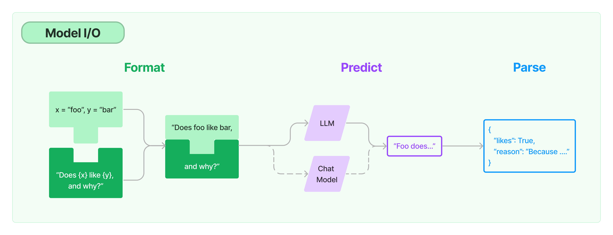

# 总体介绍
文档的这一部分涉及到LangChain中使用的不同类型的模型。在这一页，我们将从高层次上介绍这些模型类型，但我们对每种模型类型都有单独的页面。

#### LLMs

大型语言模型（LLM）是我们涵盖的第一种模型类型。这些模型接受一个文本字符串作为输入，并返回一个文本字符串作为输出。

#### 聊天模型

聊天模型是我们涵盖的第二种类型的模型。这些模型通常由一个语言模型支持，但它们的API更加结构化。具体来说，这些模型接受一个聊天信息的列表作为输入，并返回一个聊天信息。

#### 文本嵌入模型

我们涉及的第三类模型是文本嵌入模型。这些模型将文本作为输入，并返回一个浮点数列表。

**然后就介绍了个这啥都没了？**

然后发现bing搜索到的文档：

https://docs.langchain.com/docs/

和langchain官方github上的文档：

https://python.langchain.com/docs/

还不太一样。上面是bing搜到的文档，我们还是去官方文档看看。

# 官方文档总体介绍

任何语言模型应用的核心元素是......模型。LangChain为您提供了连接任何语言模型的构建模块。
- 提示： 模板化、动态选择和管理模型输入
- 语言模型： 通过通用接口调用语言模型
- 输出分析器： 从模型输出中提取信息



# 提示
对模型进行编程的新方法是通过提示语。一个提示指的是对模型的输入。这种输入通常是由多个组件构成的。LangChain提供了几个类和函数，使构建和处理提示信息变得容易。

- 提示模板： 对模型输入进行参数化处理
- 例子选择器： 动态地选择要包含在提示中的例子

### 提示模板
语言模型将文本作为输入 - 该文本通常被称为提示。通常，这不是简单的硬编码字符串，而是模板、一些例子和用户输入的组合。LangChain提供了几个类和函数，使构建和处理提示信息变得容易。

#### 什么是一个提示模板？
提示模板是指产生提示的可重复的方式。它包含一个文本字符串（"模板"），可以从终端用户那里接收一组参数并生成一个提示。

一个提示模板可以包含：
- 对语言模型的指示、
- 一组少量的例子，以帮助语言模型产生一个更好的反应、
- 一个对语言模型的问题。

这里有一个最简单的例子：
```python
from langchain import PromptTemplate


template = """/
You are a naming consultant for new companies.
What is a good name for a company that makes {product}?
"""

prompt = PromptTemplate.from_template(template)
prompt.format(product="colorful socks")

"""
    You are a naming consultant for new companies.
    What is a good name for a company that makes colorful socks?
"""
```

#### 创建一个提示模板
你可以使用PromptTemplate类创建简单的硬编码提示。提示模板可以接受任何数量的输入变量，并可以通过格式化来生成提示。
```python
from langchain import PromptTemplate

# An example prompt with no input variables
no_input_prompt = PromptTemplate(input_variables=[], template="Tell me a joke.")
no_input_prompt.format()
# -> "Tell me a joke."

# An example prompt with one input variable
one_input_prompt = PromptTemplate(input_variables=["adjective"], template="Tell me a {adjective} joke.")
one_input_prompt.format(adjective="funny")
# -> "Tell me a funny joke."

# An example prompt with multiple input variables
multiple_input_prompt = PromptTemplate(
    input_variables=["adjective", "content"], 
    template="Tell me a {adjective} joke about {content}."
)
multiple_input_prompt.format(adjective="funny", content="chickens")
# -> "Tell me a funny joke about chickens."

```
如果你不想手动指定输入变量，你也可以使用from_template类方法创建一个PromptTemplate。 langchain会根据传递的模板自动推断出输入变量。
```python
template = "Tell me a {adjective} joke about {content}."

prompt_template = PromptTemplate.from_template(template)
prompt_template.input_variables
# -> ['adjective', 'content']
prompt_template.format(adjective="funny", content="chickens")
# -> Tell me a funny joke about chickens.

```
你可以创建自定义提示模板，以任何你想要的方式格式化提示。欲了解更多信息，请参阅自定义提示模板:https://python.langchain.com/docs/modules/model_io/prompts/prompt_templates/custom_prompt_template.html。

### 聊天提示模板
聊天模型接受一个聊天信息列表作为输入，这个列表通常被称为提示。这些聊天信息与原始字符串（你会将其传入LLM模型）不同，每条信息都与一个角色相关。

例如，在OpenAI聊天完成API中，一条聊天信息可以与人工智能、人类或系统角色相关联。该模型应该更紧密地遵循系统聊天信息的指令。

LangChain提供了几个提示模板，使构建和使用提示的工作变得容易。我们鼓励你在查询聊天模型时使用这些与聊天相关的提示模板，而不是PromptTemplate，以充分挖掘底层聊天模型的潜力。
```python
from langchain.prompts import (
    ChatPromptTemplate,
    PromptTemplate,
    SystemMessagePromptTemplate,
    AIMessagePromptTemplate,
    HumanMessagePromptTemplate,
)
from langchain.schema import (
    AIMessage,
    HumanMessage,
    SystemMessage
)
```
要创建一个与角色相关的消息模板，你要使用MessagePromptTemplate。

为了方便，在模板上有一个from_template方法。如果你要使用这个模板，它将是这样的：
```python
template="You are a helpful assistant that translates {input_language} to {output_language}."
system_message_prompt = SystemMessagePromptTemplate.from_template(template)
human_template="{text}"
human_message_prompt = HumanMessagePromptTemplate.from_template(human_template)
```
如果你想更直接地构建MessagePromptTemplate，你可以在外面创建一个PromptTemplate，然后把它传进去，例如：
```python
prompt=PromptTemplate(
    template="You are a helpful assistant that translates {input_language} to {output_language}.",
    input_variables=["input_language", "output_language"],
)
system_message_prompt_2 = SystemMessagePromptTemplate(prompt=prompt)

assert system_message_prompt == system_message_prompt_2
```
之后，你可以从一个或多个MessagePromptTemplate建立一个ChatPromptTemplate。你可以使用ChatPromptTemplate的 format_prompt -- 它返回一个PromptValue，你可以将其转换为字符串或消息对象，这取决于你是否想将格式化的值作为输入到llm或聊天模型。
```python
chat_prompt = ChatPromptTemplate.from_messages([system_message_prompt, human_message_prompt])

# get a chat completion from the formatted messages
chat_prompt.format_prompt(input_language="English", output_language="French", text="I love programming.").to_messages()

"""
    [SystemMessage(content='You are a helpful assistant that translates English to French.', additional_kwargs={}),
     HumanMessage(content='I love programming.', additional_kwargs={})]
"""
```
## 连接到一个特征存储
特征存储是一个来自传统机器学习的概念，它确保输入模型的数据是最新的和相关的。关于这一点的更多信息，请看这里。

在考虑将LLM应用程序投入生产时，这个概念是极其相关的。为了使LLM应用程序个性化，你可能想把LLM与特定用户的最新信息结合起来。特征存储是保持数据新鲜的好方法，而LangChain提供了一种简单的方法来将这些数据与LLM结合起来。

在这个笔记本中，我们将展示如何将提示模板连接到特征存储。其基本思想是在提示模板中调用一个特征存储，以检索值，然后将其格式化到提示中。
### Feast
为了开始，我们将使用流行的开源功能存储框架Feast。

这假定你已经运行了README中关于入门的步骤。我们将在开始时的例子基础上，创建LLMChain，向特定的驱动程序写入关于其最新统计数据的说明。

### 加载feast存储
同样，这应该根据盛宴README中的说明进行设置。
```python
from feast import FeatureStore

# You may need to update the path depending on where you stored it
feast_repo_path = "../../../../../my_feature_repo/feature_repo/"
store = FeatureStore(repo_path=feast_repo_path)
```
### 提示
这里我们将设置一个自定义的FeastPromptTemplate。这个提示模板将接收一个司机ID，查找他们的统计资料，并将这些统计资料格式化为提示。

请注意，这个提示模板的输入只是driver_id，因为这是唯一一个用户定义的部分（所有其他变量都是在提示模板中查找的）。
```python
from langchain.prompts import PromptTemplate, StringPromptTemplate

template = """Given the driver's up to date stats, write them note relaying those stats to them.
If they have a conversation rate above .5, give them a compliment. Otherwise, make a silly joke about chickens at the end to make them feel better

Here are the drivers stats:
Conversation rate: {conv_rate}
Acceptance rate: {acc_rate}
Average Daily Trips: {avg_daily_trips}

Your response:"""
prompt = PromptTemplate.from_template(template)


class FeastPromptTemplate(StringPromptTemplate):
    def format(self, **kwargs) -> str:
        driver_id = kwargs.pop("driver_id")
        feature_vector = store.get_online_features(
            features=[
                "driver_hourly_stats:conv_rate",
                "driver_hourly_stats:acc_rate",
                "driver_hourly_stats:avg_daily_trips",
            ],
            entity_rows=[{"driver_id": driver_id}],
        ).to_dict()
        kwargs["conv_rate"] = feature_vector["conv_rate"][0]
        kwargs["acc_rate"] = feature_vector["acc_rate"][0]
        kwargs["avg_daily_trips"] = feature_vector["avg_daily_trips"][0]
        return prompt.format(**kwargs)

prompt_template = FeastPromptTemplate(input_variables=["driver_id"])

print(prompt_template.format(driver_id=1001))

    Given the driver's up to date stats, write them note relaying those stats to them.
    If they have a conversation rate above .5, give them a compliment. Otherwise, make a silly joke about chickens at the end to make them feel better
    
    Here are the drivers stats:
    Conversation rate: 0.4745151400566101
    Acceptance rate: 0.055561766028404236
    Average Daily Trips: 936
    
    Your response:
```
### 在链中进行使用
我们现在可以在一个链条中使用这个东西，成功地创建了一个链条，实现了由特征存储支持的个性化。
```python
from langchain.chat_models import ChatOpenAI
from langchain.chains import LLMChain

chain = LLMChain(llm=ChatOpenAI(), prompt=prompt_template)

chain.run(1001)

        "Hi there! I wanted to update you on your current stats. Your acceptance rate is 0.055561766028404236 and your average daily trips are 936. While your conversation rate is currently 0.4745151400566101, I have no doubt that with a little extra effort, you'll be able to exceed that .5 mark! Keep up the great work! And remember, even chickens can't always cross the road, but they still give it their best shot."
```

其余的两个：Tecton和Featureform 这里不作展开的，具体流程和上面类似。

## 通用的提示模板
假设我们想让LLM生成一个函数名称的英文解释。为了实现这一任务，我们将创建一个自定义的提示模板，将函数名称作为输入，并对提示模板进行格式化，以提供该函数的源代码。

### 为什么需要通用提示模板？
LangChain提供了一套默认的提示模板，可用于生成各种任务的提示。然而，可能在某些情况下，默认的提示模板并不能满足你的需求。例如，你可能想为你的语言模型创建一个带有特定动态指令的提示模板。在这种情况下，你可以创建一个自定义的提示模板。

在这里看一下当前的默认提示模板集：https://python.langchain.com/docs/modules/model_io/prompts/prompt_templates/。

### 创建一个通用提示模板
基本上有两种不同的提示模板--字符串提示模板和聊天提示模板。字符串提示模板提供字符串格式的简单提示，而聊天提示模板产生更多结构化的提示，可用于聊天API。

在本指南中，我们将使用字符串提示模板创建一个自定义提示。

要创建一个自定义字符串提示模板，有两个要求：

它有一个input_variables属性，暴露了提示模板所期望的输入变量。
它暴露了一个 format 方法，该方法接收与预期输入变量相对应的关键字参数，并返回格式化的提示。
我们将创建一个自定义的提示模板，将函数名称作为输入，并格式化提示以提供函数的源代码。为了实现这一点，我们首先创建一个函数，它将返回给定的函数的源代码。
```python
import inspect


def get_source_code(function_name):
    # Get the source code of the function
    return inspect.getsource(function_name)
```
接下来，我们将创建一个自定义的提示模板，将函数名称作为输入，并格式化提示模板以提供函数的源代码。
```python
from langchain.prompts import StringPromptTemplate
from pydantic import BaseModel, validator


class FunctionExplainerPromptTemplate(StringPromptTemplate, BaseModel):
    """A custom prompt template that takes in the function name as input, and formats the prompt template to provide the source code of the function."""

    @validator("input_variables")
    def validate_input_variables(cls, v):
        """Validate that the input variables are correct."""
        if len(v) != 1 or "function_name" not in v:
            raise ValueError("function_name must be the only input_variable.")
        return v

    def format(self, **kwargs) -> str:
        # Get the source code of the function
        source_code = get_source_code(kwargs["function_name"])

        # Generate the prompt to be sent to the language model
        prompt = f"""
        Given the function name and source code, generate an English language explanation of the function.
        Function Name: {kwargs["function_name"].__name__}
        Source Code:
        {source_code}
        Explanation:
        """
        return prompt

    def _prompt_type(self):
        return "function-explainer"
```
### 使用通用提示模板
```python
from langchain.prompts import StringPromptTemplate
from pydantic import BaseModel, validator


class FunctionExplainerPromptTemplate(StringPromptTemplate, BaseModel):
    """A custom prompt template that takes in the function name as input, and formats the prompt template to provide the source code of the function."""

    @validator("input_variables")
    def validate_input_variables(cls, v):
        """Validate that the input variables are correct."""
        if len(v) != 1 or "function_name" not in v:
            raise ValueError("function_name must be the only input_variable.")
        return v

    def format(self, **kwargs) -> str:
        # Get the source code of the function
        source_code = get_source_code(kwargs["function_name"])

        # Generate the prompt to be sent to the language model
        prompt = f"""
        Given the function name and source code, generate an English language explanation of the function.
        Function Name: {kwargs["function_name"].__name__}
        Source Code:
        {source_code}
        Explanation:
        """
        return prompt

    def _prompt_type(self):
        return "function-explainer"
```
## 少样本提示模板
在本教程中，我们将学习如何创建一个使用几个few-shot的提示模板。几个few-shot提示模板可以从一组例子中构建，也可以从一个例子选择器对象中构建。
### 使用案例
在本教程中，我们将配置几个带搜索的自问自答的例子。
### 创建一个样例集合
要想开始，请创建一个由几个few-shot实例组成的列表。每个例子应该是一个字典，键是输入变量，值是这些输入变量的值。
```python
from langchain.prompts.few_shot import FewShotPromptTemplate
from langchain.prompts.prompt import PromptTemplate

examples = [
  {
    "question": "Who lived longer, Muhammad Ali or Alan Turing?",
    "answer": 
"""
Are follow up questions needed here: Yes.
Follow up: How old was Muhammad Ali when he died?
Intermediate answer: Muhammad Ali was 74 years old when he died.
Follow up: How old was Alan Turing when he died?
Intermediate answer: Alan Turing was 41 years old when he died.
So the final answer is: Muhammad Ali
"""
  },
  {
    "question": "When was the founder of craigslist born?",
    "answer": 
"""
Are follow up questions needed here: Yes.
Follow up: Who was the founder of craigslist?
Intermediate answer: Craigslist was founded by Craig Newmark.
Follow up: When was Craig Newmark born?
Intermediate answer: Craig Newmark was born on December 6, 1952.
So the final answer is: December 6, 1952
"""
  },
  {
    "question": "Who was the maternal grandfather of George Washington?",
    "answer":
"""
Are follow up questions needed here: Yes.
Follow up: Who was the mother of George Washington?
Intermediate answer: The mother of George Washington was Mary Ball Washington.
Follow up: Who was the father of Mary Ball Washington?
Intermediate answer: The father of Mary Ball Washington was Joseph Ball.
So the final answer is: Joseph Ball
"""
  },
  {
    "question": "Are both the directors of Jaws and Casino Royale from the same country?",
    "answer":
"""
Are follow up questions needed here: Yes.
Follow up: Who is the director of Jaws?
Intermediate Answer: The director of Jaws is Steven Spielberg.
Follow up: Where is Steven Spielberg from?
Intermediate Answer: The United States.
Follow up: Who is the director of Casino Royale?
Intermediate Answer: The director of Casino Royale is Martin Campbell.
Follow up: Where is Martin Campbell from?
Intermediate Answer: New Zealand.
So the final answer is: No
"""
  }
]
```

### 为few shot 样例创建一个formatter
配置一个格式化器，该格式化器将把几个few shot的例子格式化为一个字符串。这个格式化器应该是一个PromptTemplate对象。
```python
example_prompt = PromptTemplate(input_variables=["question", "answer"], template="Question: {question}\n{answer}")

print(example_prompt.format(**examples[0]))


    Question: Who lived longer, Muhammad Ali or Alan Turing?
    
    Are follow up questions needed here: Yes.
    Follow up: How old was Muhammad Ali when he died?
    Intermediate answer: Muhammad Ali was 74 years old when he died.
    Follow up: How old was Alan Turing when he died?
    Intermediate answer: Alan Turing was 41 years old when he died.
    So the final answer is: Muhammad Ali
```

### 把实例和formatter传递给FewShotPromptTemplate
最后，创建一个FewShotPromptTemplate对象。这个对象接收了几个镜头的例子和几个few shot例子的格式化。
```python
prompt = FewShotPromptTemplate(
    examples=examples, 
    example_prompt=example_prompt, 
    suffix="Question: {input}", 
    input_variables=["input"]
)

print(prompt.format(input="Who was the father of Mary Ball Washington?"))

    Question: Who lived longer, Muhammad Ali or Alan Turing?
    
    Are follow up questions needed here: Yes.
    Follow up: How old was Muhammad Ali when he died?
    Intermediate answer: Muhammad Ali was 74 years old when he died.
    Follow up: How old was Alan Turing when he died?
    Intermediate answer: Alan Turing was 41 years old when he died.
    So the final answer is: Muhammad Ali
    
    
    Question: When was the founder of craigslist born?
    
    Are follow up questions needed here: Yes.
    Follow up: Who was the founder of craigslist?
    Intermediate answer: Craigslist was founded by Craig Newmark.
    Follow up: When was Craig Newmark born?
    Intermediate answer: Craig Newmark was born on December 6, 1952.
    So the final answer is: December 6, 1952
    
    
    Question: Who was the maternal grandfather of George Washington?
    
    Are follow up questions needed here: Yes.
    Follow up: Who was the mother of George Washington?
    Intermediate answer: The mother of George Washington was Mary Ball Washington.
    Follow up: Who was the father of Mary Ball Washington?
    Intermediate answer: The father of Mary Ball Washington was Joseph Ball.
    So the final answer is: Joseph Ball
    
    
    Question: Are both the directors of Jaws and Casino Royale from the same country?
    
    Are follow up questions needed here: Yes.
    Follow up: Who is the director of Jaws?
    Intermediate Answer: The director of Jaws is Steven Spielberg.
    Follow up: Where is Steven Spielberg from?
    Intermediate Answer: The United States.
    Follow up: Who is the director of Casino Royale?
    Intermediate Answer: The director of Casino Royale is Martin Campbell.
    Follow up: Where is Martin Campbell from?
    Intermediate Answer: New Zealand.
    So the final answer is: No
    
    
    Question: Who was the father of Mary Ball Washington?
```

### 使用样本选择器
#### 将例子送入ExampleSelector
我们将重新使用上一节中的例子集和格式化器。不过，我们将不把示例直接送入FewShotPromptTemplate对象，而是将其送入一个ExampleSelector对象。

在本教程中，我们将使用SemanticSimilarityExampleSelector类。这个类会根据它们与输入的相似性来选择一些few shot的例子。它使用一个嵌入模型来计算输入和几个few shot示例之间的相似性，以及使用一个矢量存储来执行最近邻搜索。
```python
from langchain.prompts.example_selector import SemanticSimilarityExampleSelector
from langchain.vectorstores import Chroma
from langchain.embeddings import OpenAIEmbeddings


example_selector = SemanticSimilarityExampleSelector.from_examples(
    # This is the list of examples available to select from.
    examples,
    # This is the embedding class used to produce embeddings which are used to measure semantic similarity.
    OpenAIEmbeddings(),
    # This is the VectorStore class that is used to store the embeddings and do a similarity search over.
    Chroma,
    # This is the number of examples to produce.
    k=1
)

# Select the most similar example to the input.
question = "Who was the father of Mary Ball Washington?"
selected_examples = example_selector.select_examples({"question": question})
print(f"Examples most similar to the input: {question}")
for example in selected_examples:
    print("\n")
    for k, v in example.items():
        print(f"{k}: {v}")
 Running Chroma using direct local API.
    Using DuckDB in-memory for database. Data will be transient.
    Examples most similar to the input: Who was the father of Mary Ball Washington?
    
    
    question: Who was the maternal grandfather of George Washington?
    answer: 
    Are follow up questions needed here: Yes.
    Follow up: Who was the mother of George Washington?
    Intermediate answer: The mother of George Washington was Mary Ball Washington.
    Follow up: Who was the father of Mary Ball Washington?
    Intermediate answer: The father of Mary Ball Washington was Joseph Ball.
    So the final answer is: Joseph Ball
```

#### 将示例选择器送入FewShotPromptTemplate中
最后，创建一个FewShotPromptTemplate对象。这个对象吸收了例子选择器和few shot实例的格式化。
```python
将示例选择器送入FewShotPromptTemplate中
prompt = FewShotPromptTemplate(
    example_selector=example_selector, 
    example_prompt=example_prompt, 
    suffix="Question: {input}", 
    input_variables=["input"]
)

print(prompt.format(input="Who was the father of Mary Ball Washington?"))

    Question: Who was the maternal grandfather of George Washington?
    
    Are follow up questions needed here: Yes.
    Follow up: Who was the mother of George Washington?
    Intermediate answer: The mother of George Washington was Mary Ball Washington.
    Follow up: Who was the father of Mary Ball Washington?
    Intermediate answer: The father of Mary Ball Washington was Joseph Ball.
    So the final answer is: Joseph Ball
    
    
    Question: Who was the father of Mary Ball Washington?
```

## 聊天模型的几个few shot实例
本手册涵盖了如何在聊天模型中使用few shot的例子。

对于如何最好地进行少数few shot的提示，似乎还没有形成坚实的共识。因此，我们还没有围绕这个问题固化任何抽象概念，而是使用现有的抽象概念。

### 人类/人工智能信息交替出现
第一种做few shot的方法依赖于使用交替的人类/ai信息。请看下面的一个例子。
```python
from langchain.chat_models import ChatOpenAI
from langchain import PromptTemplate, LLMChain
from langchain.prompts.chat import (
    ChatPromptTemplate,
    SystemMessagePromptTemplate,
    AIMessagePromptTemplate,
    HumanMessagePromptTemplate,
)
from langchain.schema import AIMessage, HumanMessage, SystemMessage

chat = ChatOpenAI(temperature=0)

template = "You are a helpful assistant that translates english to pirate."
system_message_prompt = SystemMessagePromptTemplate.from_template(template)
example_human = HumanMessagePromptTemplate.from_template("Hi")
example_ai = AIMessagePromptTemplate.from_template("Argh me mateys")
human_template = "{text}"
human_message_prompt = HumanMessagePromptTemplate.from_template(human_template)

chat_prompt = ChatPromptTemplate.from_messages(
    [system_message_prompt, example_human, example_ai, human_message_prompt]
)
chain = LLMChain(llm=chat, prompt=chat_prompt)
# get a chat completion from the formatted messages
chain.run("I love programming.")

    "I be lovin' programmin', me hearty!"
```
### 系统消息
OpenAI提供了一个可选的名称参数，他们也建议与系统消息一起使用，以做few shot的提示。下面是一个如何做到这一点的例子。
```python
template = "You are a helpful assistant that translates english to pirate."
system_message_prompt = SystemMessagePromptTemplate.from_template(template)
example_human = SystemMessagePromptTemplate.from_template(
    "Hi", additional_kwargs={"name": "example_user"}
)
example_ai = SystemMessagePromptTemplate.from_template(
    "Argh me mateys", additional_kwargs={"name": "example_assistant"}
)
human_template = "{text}"
human_message_prompt = HumanMessagePromptTemplate.from_template(human_template)

chat_prompt = ChatPromptTemplate.from_messages(
    [system_message_prompt, example_human, example_ai, human_message_prompt]
)
chain = LLMChain(llm=chat, prompt=chat_prompt)
# get a chat completion from the formatted messages
chain.run("I love programming.")

    "I be lovin' programmin', me hearty."
```
## 格式化的模板输出
格式化方法的输出可以是字符串、信息列表和ChatPromptValue。
### 作为字符串
```python
output = chat_prompt.format(input_language="English", output_language="French", text="I love programming.")
output


    'System: You are a helpful assistant that translates English to French.\nHuman: I love programming.'


# or alternatively
output_2 = chat_prompt.format_prompt(input_language="English", output_language="French", text="I love programming.").to_string()

assert output == output_2
```
#### 作为ChatPromptValue
```python
chat_prompt.format_prompt(input_language="English", output_language="French", text="I love programming.")

    ChatPromptValue(messages=[SystemMessage(content='You are a helpful assistant that translates English to French.', additional_kwargs={}), HumanMessage(content='I love programming.', additional_kwargs={})])
```

#### 作为消息对象列表
```python
chat_prompt.format_prompt(input_language="English", output_language="French", text="I love programming.").to_messages()


    [SystemMessage(content='You are a helpful assistant that translates English to French.', additional_kwargs={}),
     HumanMessage(content='I love programming.', additional_kwargs={})]
```

## 模板格式
默认情况下，PromptTemplate将把提供的模板视为Python f-string。你可以通过template_format参数指定其他模板格式：
```python
# Make sure jinja2 is installed before running this

jinja2_template = "Tell me a {{ adjective }} joke about {{ content }}"
prompt_template = PromptTemplate.from_template(template=jinja2_template, template_format="jinja2")

prompt_template.format(adjective="funny", content="chickens")
# -> Tell me a funny joke about chickens.
```
目前，PromptTemplate只支持jinja2和f-string模板格式。如果有任何其他的模板格式需要使用，请随时在Github页面上开一个问题。

## MessagePromptTemplate的类型
LangChain提供不同类型的MessagePromptTemplate。最常用的是AIMessagePromptTemplate、SystemMessagePromptTemplate和HumanMessagePromptTemplate，它们分别创建AI消息、系统消息和人类消息。

然而，在聊天模型支持使用任意角色的聊天消息的情况下，你可以使用ChatMessagePromptTemplate，它允许用户指定角色名称。
```python
from langchain.prompts import ChatMessagePromptTemplate

prompt = "May the {subject} be with you"

chat_message_prompt = ChatMessagePromptTemplate.from_template(role="Jedi", template=prompt)
chat_message_prompt.format(subject="force")


    ChatMessage(content='May the force be with you', additional_kwargs={}, role='Jedi')
```
LangChain还提供了MessagesPlaceholder，它可以让你完全控制格式化过程中要呈现的信息。当你不确定你的消息提示模板应该使用什么角色时，或者当你希望在格式化过程中插入一个消息列表时，这可能很有用。
```python
from langchain.prompts import MessagesPlaceholder

human_prompt = "Summarize our conversation so far in {word_count} words."
human_message_template = HumanMessagePromptTemplate.from_template(human_prompt)

chat_prompt = ChatPromptTemplate.from_messages([MessagesPlaceholder(variable_name="conversation"), human_message_template])


human_message = HumanMessage(content="What is the best way to learn programming?")
ai_message = AIMessage(content="""\
1. Choose a programming language: Decide on a programming language that you want to learn.

2. Start with the basics: Familiarize yourself with the basic programming concepts such as variables, data types and control structures.

3. Practice, practice, practice: The best way to learn programming is through hands-on experience\
""")

chat_prompt.format_prompt(conversation=[human_message, ai_message], word_count="10").to_messages()

    [HumanMessage(content='What is the best way to learn programming?', additional_kwargs={}),
     AIMessage(content='1. Choose a programming language: Decide on a programming language that you want to learn. \n\n2. Start with the basics: Familiarize yourself with the basic programming concepts such as variables, data types and control structures.\n\n3. Practice, practice, practice: The best way to learn programming is through hands-on experience', additional_kwargs={}),
     HumanMessage(content='Summarize our conversation so far in 10 words.', additional_kwargs={})]

```
## 部分提示模板
像其他方法一样，"部分 "提示模板是有意义的--例如，传入所需值的一个子集，以创建一个新的提示模板，只期望得到剩余的子集值。

LangChain以两种方式支持这种做法：

- 用字符串值进行部分格式化。
- 使用返回字符串值的函数进行部分格式化。

这两种不同的方式支持不同的用例。在下面的例子中，我们将介绍这两种用例的动机，以及如何在LangChain中做到这一点。

### 局部用字符串
想要局部提示模板的一个常见用例是，如果你在其他变量之前得到一些变量。例如，假设你有一个提示模板需要两个变量，foo和baz。如果你在链的早期得到foo的值，但后来得到了baz的值，那么等到你把两个变量都放在同一个地方再把它们传给提示模板就会很烦人。相反，你可以用foo值偏置提示模板，然后将被偏置的提示模板传递给它，并直接使用它。下面是一个这样做的例子：
```python
from langchain.prompts import PromptTemplate

prompt = PromptTemplate(template="{foo}{bar}", input_variables=["foo", "bar"])
partial_prompt = prompt.partial(foo="foo");
print(partial_prompt.format(bar="baz"))

    foobaz
```
我们也可以直接用参数化的变量来初始化提示符。
```python
prompt = PromptTemplate(template="{foo}{bar}", input_variables=["bar"], partial_variables={"foo": "foo"})
print(prompt.format(bar="baz"))
```
### 局部用函数
另一个常见的用途是与一个函数部分。这方面的用例是当你有一个你知道的变量，你总是想以一种普通的方式来获取。这方面的一个主要例子是日期或时间。想象一下，你有一个提示，你总是希望得到当前的日期。你不能在提示符中硬编码，而且将其与其他输入变量一起传递是有点烦人的。在这种情况下，能够用一个总是返回当前日期的函数对提示进行局部处理是非常方便的。
```python
from datetime import datetime

def _get_datetime():
    now = datetime.now()
    return now.strftime("%m/%d/%Y, %H:%M:%S")

prompt = PromptTemplate(
    template="Tell me a {adjective} joke about the day {date}", 
    input_variables=["adjective", "date"]
);
partial_prompt = prompt.partial(date=_get_datetime)
print(partial_prompt.format(adjective="funny"))

    Tell me a funny joke about the day 02/27/2023, 22:15:16
```
你也可以直接用参数化的变量初始化提示，这在这个工作流程中往往更有意义。
```python
prompt = PromptTemplate(
    template="Tell me a {adjective} joke about the day {date}", 
    input_variables=["adjective"],
    partial_variables={"date": _get_datetime}
);
print(prompt.format(adjective="funny"))

    Tell me a funny joke about the day 02/27/2023, 22:15:16
```

## 构成
本笔记本介绍了如何将多个提示语编排在一起。当你想重复使用部分提示语时，这可能很有用。这可以通过PipelinePrompt来实现。一个PipelinePrompt由两个主要部分组成：

- 最终提示： 这是被返回的最终提示
- 管线提示： 这是一个图元的列表，由一个字符串名称和一个提示模板组成。每个提示模板将被格式化，然后作为同名的变量传递给未来的提示模板。

```python
from langchain.prompts.pipeline import PipelinePromptTemplate
from langchain.prompts.prompt import PromptTemplate

full_template = """{introduction}

{example}

{start}"""
full_prompt = PromptTemplate.from_template(full_template)

introduction_template = """You are impersonating {person}."""
introduction_prompt = PromptTemplate.from_template(introduction_template)

example_template = """Here's an example of an interaction: 

Q: {example_q}
A: {example_a}"""
example_prompt = PromptTemplate.from_template(example_template)

start_template = """Now, do this for real!

Q: {input}
A:"""
start_prompt = PromptTemplate.from_template(start_template)

input_prompts = [
    ("introduction", introduction_prompt),
    ("example", example_prompt),
    ("start", start_prompt)
]
pipeline_prompt = PipelinePromptTemplate(final_prompt=full_prompt, pipeline_prompts=input_prompts)


pipeline_prompt.input_variables

    ['example_a', 'person', 'example_q', 'input']

print(pipeline_prompt.format(
    person="Elon Musk",
    example_q="What's your favorite car?",
    example_a="Telsa",
    input="What's your favorite social media site?"
))

    You are impersonating Elon Musk.
    Here's an example of an interaction: 
    
    Q: What's your favorite car?
    A: Telsa
    Now, do this for real!
    
    Q: What's your favorite social media site?
    A:
    
```

## 序列化
通常情况下，最好不要把提示信息作为python代码来存储，而是作为文件来存储。这可以使分享、存储和版本提示变得容易。本笔记本涵盖了如何在LangChain中做到这一点，走过了所有不同类型的提示语和不同的序列化选项。

在高层次上，以下设计原则被应用于序列化：

- 同时支持JSON和YAML。我们希望支持人类在磁盘上可读的序列化方法，YAML和JSON是其中最流行的两种方法。请注意，这一规则适用于提示语。对于其他资产，比如说例子，可能会支持不同的序列化方法。
- 我们支持在一个文件中指定所有内容，或者将不同的组件（模板、例子等）存储在不同的文件中并引用它们。对于某些情况，把所有东西都存储在文件中是最有意义的，但对于其他情况，最好是把一些资产分割开来（长的模板、大的例子、可重用的组件）。LangChain支持这两种情况。

还有一个单一的入口点可以从磁盘上加载提示信息，使其很容易加载任何类型的提示信息。

```python
# All prompts are loaded through the `load_prompt` function.
from langchain.prompts import load_prompt
```
### 提示模板
#### Loading from YAML
```python
cat simple_prompt.yaml

    _type: prompt
    input_variables:
        ["adjective", "content"]
    template: 
        Tell me a {adjective} joke about {content}.

prompt = load_prompt("simple_prompt.yaml")
print(prompt.format(adjective="funny", content="chickens"))

    Tell me a funny joke about chickens.
```
#### Loading from JSON
```python
cat simple_prompt.json

    {
        "_type": "prompt",
        "input_variables": ["adjective", "content"],
        "template": "Tell me a {adjective} joke about {content}."
    }

prompt = load_prompt("simple_prompt.json")
print(prompt.format(adjective="funny", content="chickens"))
```
#### Loading Template from a File
这显示了一个将模板存储在一个单独的文件中，然后在配置中引用它的例子。注意，键从template变成了template_path。
```python
cat simple_template.txt

    Tell me a {adjective} joke about {content}.

cat simple_prompt_with_template_file.json

    {
        "_type": "prompt",
        "input_variables": ["adjective", "content"],
        "template_path": "simple_template.txt"
    }

prompt = load_prompt("simple_prompt_with_template_file.json")
print(prompt.format(adjective="funny", content="chickens"))

    Tell me a funny joke about chickens.
```
### FewShotPromptTemplate
```python
cat examples.json

    [
        {"input": "happy", "output": "sad"},
        {"input": "tall", "output": "short"}
    ]
cat examples.yaml

    - input: happy
      output: sad
    - input: tall
      output: short
```
#### Loading from YAML
```python
cat few_shot_prompt.yaml

    _type: few_shot
    input_variables:
        ["adjective"]
    prefix: 
        Write antonyms for the following words.
    example_prompt:
        _type: prompt
        input_variables:
            ["input", "output"]
        template:
            "Input: {input}\nOutput: {output}"
    examples:
        examples.json
    suffix:
        "Input: {adjective}\nOutput:"

prompt = load_prompt("few_shot_prompt.yaml")
print(prompt.format(adjective="funny"))

    Write antonyms for the following words.
    
    Input: happy
    Output: sad
    
    Input: tall
    Output: short
    
    Input: funny
    Output:

The same would work if you loaded examples from the yaml file.

cat few_shot_prompt_yaml_examples.yaml

    _type: few_shot
    input_variables:
        ["adjective"]
    prefix: 
        Write antonyms for the following words.
    example_prompt:
        _type: prompt
        input_variables:
            ["input", "output"]
        template:
            "Input: {input}\nOutput: {output}"
    examples:
        examples.yaml
    suffix:
        "Input: {adjective}\nOutput:"

prompt = load_prompt("few_shot_prompt_yaml_examples.yaml")
print(prompt.format(adjective="funny"))

    Write antonyms for the following words.
    
    Input: happy
    Output: sad
    
    Input: tall
    Output: short
    
    Input: funny
    Output:
```
#### Loading from JSON
```python
cat few_shot_prompt.json

    {
        "_type": "few_shot",
        "input_variables": ["adjective"],
        "prefix": "Write antonyms for the following words.",
        "example_prompt": {
            "_type": "prompt",
            "input_variables": ["input", "output"],
            "template": "Input: {input}\nOutput: {output}"
        },
        "examples": "examples.json",
        "suffix": "Input: {adjective}\nOutput:"
    }   

prompt = load_prompt("few_shot_prompt.json")
print(prompt.format(adjective="funny"))

    Write antonyms for the following words.
    
    Input: happy
    Output: sad
    
    Input: tall
    Output: short
    
    Input: funny
    Output:
```
#### Examples in the Config
```python
cat few_shot_prompt_examples_in.json

    {
        "_type": "few_shot",
        "input_variables": ["adjective"],
        "prefix": "Write antonyms for the following words.",
        "example_prompt": {
            "_type": "prompt",
            "input_variables": ["input", "output"],
            "template": "Input: {input}\nOutput: {output}"
        },
        "examples": [
            {"input": "happy", "output": "sad"},
            {"input": "tall", "output": "short"}
        ],
        "suffix": "Input: {adjective}\nOutput:"
    }   

prompt = load_prompt("few_shot_prompt_examples_in.json")
print(prompt.format(adjective="funny"))

    Write antonyms for the following words.
    
    Input: happy
    Output: sad
    
    Input: tall
    Output: short
    
    Input: funny
    Output:
```
#### Example Prompt from a File
```python
cat example_prompt.json

    {
        "_type": "prompt",
        "input_variables": ["input", "output"],
        "template": "Input: {input}\nOutput: {output}" 
    }

cat few_shot_prompt_example_prompt.json

    {
        "_type": "few_shot",
        "input_variables": ["adjective"],
        "prefix": "Write antonyms for the following words.",
        "example_prompt_path": "example_prompt.json",
        "examples": "examples.json",
        "suffix": "Input: {adjective}\nOutput:"
    }   

prompt = load_prompt("few_shot_prompt_example_prompt.json")
print(prompt.format(adjective="funny"))

    Write antonyms for the following words.
    
    Input: happy
    Output: sad
    
    Input: tall
    Output: short
    
    Input: funny
    Output:
```
### PromptTempalte with OutputParser
```python
cat prompt_with_output_parser.json

    {
        "input_variables": [
            "question",
            "student_answer"
        ],
        "output_parser": {
            "regex": "(.*?)\\nScore: (.*)",
            "output_keys": [
                "answer",
                "score"
            ],
            "default_output_key": null,
            "_type": "regex_parser"
        },
        "partial_variables": {},
        "template": "Given the following question and student answer, provide a correct answer and score the student answer.\nQuestion: {question}\nStudent Answer: {student_answer}\nCorrect Answer:",
        "template_format": "f-string",
        "validate_template": true,
        "_type": "prompt"
    }


prompt = load_prompt("prompt_with_output_parser.json")

prompt.output_parser.parse(
    "George Washington was born in 1732 and died in 1799.\nScore: 1/2"
)

    {'answer': 'George Washington was born in 1732 and died in 1799.',
     'score': '1/2'}
```
## 验证模板
默认情况下，PromptTemplate会通过检查input_variables是否与模板中定义的变量匹配来验证模板字符串。你可以通过设置validate_template为False来禁用这一行为。
```python
template = "I am learning langchain because {reason}."

prompt_template = PromptTemplate(template=template,
                                 input_variables=["reason", "foo"]) # ValueError due to extra variables
prompt_template = PromptTemplate(template=template,
                                 input_variables=["reason", "foo"],
                                 validate_template=False) # No error
```

# 样本选择器
如果你有大量的例子，你可能需要选择哪些例子包括在提示中。例子选择器是负责这样做的类。

其基本接口定义如下：
```python
class BaseExampleSelector(ABC):
    """Interface for selecting examples to include in prompts."""

    @abstractmethod
    def select_examples(self, input_variables: Dict[str, str]) -> List[dict]:
        """Select which examples to use based on the inputs."""
```
它唯一需要公开的方法是一个select_examples方法。这个方法接收输入的变量，然后返回一个例子的列表。至于如何选择这些例子，则取决于每个具体的实现。让我们看一下下面的一些例子。

## 通用样本选择器
在本教程中，我们将创建一个自定义的例子选择器，从给定的例子列表中选择每一个备用的例子。

ExampleSelector必须实现两个方法：

- 一个add_example方法，接收一个例子并将其添加到ExampleSelector中。
- 一个select_examples方法，该方法接收输入变量（意为用户输入），并返回一个例子列表，以便在几个镜头提示中使用。
让我们来实现一个自定义的ExampleSelector，它只是随机选择两个例子。

{注} 在这里看看当前LangChain支持的例子选择器实现集：https://python.langchain.com/docs/modules/model_io/prompts/example_selectors/。

### 实现通用样本选择器
```python
from langchain.prompts.example_selector.base import BaseExampleSelector
from typing import Dict, List
import numpy as np


class CustomExampleSelector(BaseExampleSelector):
    
    def __init__(self, examples: List[Dict[str, str]]):
        self.examples = examples
    
    def add_example(self, example: Dict[str, str]) -> None:
        """Add new example to store for a key."""
        self.examples.append(example)

    def select_examples(self, input_variables: Dict[str, str]) -> List[dict]:
        """Select which examples to use based on the inputs."""
        return np.random.choice(self.examples, size=2, replace=False)

```
### 使用通用样本选择器
```python

examples = [
    {"foo": "1"},
    {"foo": "2"},
    {"foo": "3"}
]

# Initialize example selector.
example_selector = CustomExampleSelector(examples)


# Select examples
example_selector.select_examples({"foo": "foo"})
# -> array([{'foo': '2'}, {'foo': '3'}], dtype=object)

# Add new example to the set of examples
example_selector.add_example({"foo": "4"})
example_selector.examples
# -> [{'foo': '1'}, {'foo': '2'}, {'foo': '3'}, {'foo': '4'}]

# Select examples
example_selector.select_examples({"foo": "foo"})
# -> array([{'foo': '1'}, {'foo': '4'}], dtype=object)
```
## 通过长度选择
这个例子选择器根据长度来选择要使用的例子。当你担心构建一个超过上下文窗口长度的提示时，这很有用。对于长的输入，它将选择较少的例子，而对于短的输入，它将选择更多的例子。
```python
from langchain.prompts import PromptTemplate
from langchain.prompts import FewShotPromptTemplate
from langchain.prompts.example_selector import LengthBasedExampleSelector


# These are a lot of examples of a pretend task of creating antonyms.
examples = [
    {"input": "happy", "output": "sad"},
    {"input": "tall", "output": "short"},
    {"input": "energetic", "output": "lethargic"},
    {"input": "sunny", "output": "gloomy"},
    {"input": "windy", "output": "calm"},

example_prompt = PromptTemplate(
    input_variables=["input", "output"],
    template="Input: {input}\nOutput: {output}",
)
example_selector = LengthBasedExampleSelector(
    # These are the examples it has available to choose from.
    examples=examples, 
    # This is the PromptTemplate being used to format the examples.
    example_prompt=example_prompt, 
    # This is the maximum length that the formatted examples should be.
    # Length is measured by the get_text_length function below.
    max_length=25,
    # This is the function used to get the length of a string, which is used
    # to determine which examples to include. It is commented out because
    # it is provided as a default value if none is specified.
    # get_text_length: Callable[[str], int] = lambda x: len(re.split("\n| ", x))
)
dynamic_prompt = FewShotPromptTemplate(
    # We provide an ExampleSelector instead of examples.
    example_selector=example_selector,
    example_prompt=example_prompt,
    prefix="Give the antonym of every input",
    suffix="Input: {adjective}\nOutput:", 
    input_variables=["adjective"],
)

# An example with small input, so it selects all examples.
print(dynamic_prompt.format(adjective="big"))

    Give the antonym of every input
    
    Input: happy
    Output: sad
    
    Input: tall
    Output: short
    
    Input: energetic
    Output: lethargic
    
    Input: sunny
    Output: gloomy
    
    Input: windy
    Output: calm
    
    Input: big
    Output:

# An example with long input, so it selects only one example.
long_string = "big and huge and massive and large and gigantic and tall and much much much much much bigger than everything else"
print(dynamic_prompt.format(adjective=long_string))


    Give the antonym of every input
    
    Input: happy
    Output: sad
    
    Input: big and huge and massive and large and gigantic and tall and much much much much much bigger than everything else
    Output:


# You can add an example to an example selector as well.
new_example = {"input": "big", "output": "small"}
dynamic_prompt.example_selector.add_example(new_example)
print(dynamic_prompt.format(adjective="enthusiastic"))

    Give the antonym of every input
    
    Input: happy
    Output: sad
    
    Input: tall
    Output: short
    
    Input: energetic
    Output: lethargic
    
    Input: sunny
    Output: gloomy
    
    Input: windy
    Output: calm
    
    Input: big
    Output: small
    
    Input: enthusiastic
    Output:


```
## 按最大的边际相关性（MMR）进行选择
MaxMarginalRelevanceExampleSelector根据与输入最相似的例子的组合来选择例子，同时也对多样性进行优化。它通过找到与输入有最大余弦相似性的嵌入的例子，然后迭代添加它们，同时惩罚它们与已经选择的例子的接近程度。
```python
from langchain.prompts.example_selector import (
    MaxMarginalRelevanceExampleSelector,
    SemanticSimilarityExampleSelector,
)
from langchain.vectorstores import FAISS
from langchain.embeddings import OpenAIEmbeddings
from langchain.prompts import FewShotPromptTemplate, PromptTemplate

example_prompt = PromptTemplate(
    input_variables=["input", "output"],
    template="Input: {input}\nOutput: {output}",
)

# These are a lot of examples of a pretend task of creating antonyms.
examples = [
    {"input": "happy", "output": "sad"},
    {"input": "tall", "output": "short"},
    {"input": "energetic", "output": "lethargic"},
    {"input": "sunny", "output": "gloomy"},
    {"input": "windy", "output": "calm"},
]

example_selector = MaxMarginalRelevanceExampleSelector.from_examples(
    # This is the list of examples available to select from.
    examples,
    # This is the embedding class used to produce embeddings which are used to measure semantic similarity.
    OpenAIEmbeddings(),
    # This is the VectorStore class that is used to store the embeddings and do a similarity search over.
    FAISS,
    # This is the number of examples to produce.
    k=2,
)
mmr_prompt = FewShotPromptTemplate(
    # We provide an ExampleSelector instead of examples.
    example_selector=example_selector,
    example_prompt=example_prompt,
    prefix="Give the antonym of every input",
    suffix="Input: {adjective}\nOutput:",
    input_variables=["adjective"],
)


# Input is a feeling, so should select the happy/sad example as the first one
print(mmr_prompt.format(adjective="worried"))

    Give the antonym of every input
    
    Input: happy
    Output: sad
    
    Input: windy
    Output: calm
    
    Input: worried
    Output:

# Let's compare this to what we would just get if we went solely off of similarity,
# by using SemanticSimilarityExampleSelector instead of MaxMarginalRelevanceExampleSelector.
example_selector = SemanticSimilarityExampleSelector.from_examples(
    # This is the list of examples available to select from.
    examples,
    # This is the embedding class used to produce embeddings which are used to measure semantic similarity.
    OpenAIEmbeddings(),
    # This is the VectorStore class that is used to store the embeddings and do a similarity search over.
    FAISS,
    # This is the number of examples to produce.
    k=2,
)
similar_prompt = FewShotPromptTemplate(
    # We provide an ExampleSelector instead of examples.
    example_selector=example_selector,
    example_prompt=example_prompt,
    prefix="Give the antonym of every input",
    suffix="Input: {adjective}\nOutput:",
    input_variables=["adjective"],
)
print(similar_prompt.format(adjective="worried"))


    Give the antonym of every input
    
    Input: happy
    Output: sad
    
    Input: sunny
    Output: gloomy
    
    Input: worried
    Output:
```
## 通过n-gram重叠选择
NGramOverlapExampleSelector根据ngram重叠分数，根据哪些例子与输入最相似，来选择和排序例子。ngram重叠得分是一个介于0.0和1.0之间的浮点数，包括在内。

该选择器允许设置一个阈值分数。ngram重叠得分小于或等于阈值的例子被排除。默认情况下，阈值被设置为-1.0，所以不会排除任何例子，只是重新排序。将阈值设置为0.0将排除那些与输入的ngram没有重叠的例子。
```python
from langchain.prompts import PromptTemplate
from langchain.prompts.example_selector.ngram_overlap import NGramOverlapExampleSelector
from langchain.prompts import FewShotPromptTemplate, PromptTemplate

example_prompt = PromptTemplate(
    input_variables=["input", "output"],
    template="Input: {input}\nOutput: {output}",
)

# These are a lot of examples of a pretend task of creating antonyms.
examples = [
    {"input": "happy", "output": "sad"},
    {"input": "tall", "output": "short"},
    {"input": "energetic", "output": "lethargic"},
    {"input": "sunny", "output": "gloomy"},
    {"input": "windy", "output": "calm"},
]


# These are examples of a fictional translation task.
examples = [
    {"input": "See Spot run.", "output": "Ver correr a Spot."},
    {"input": "My dog barks.", "output": "Mi perro ladra."},
    {"input": "Spot can run.", "output": "Spot puede correr."},
]

example_prompt = PromptTemplate(
    input_variables=["input", "output"],
    template="Input: {input}\nOutput: {output}",
)
example_selector = NGramOverlapExampleSelector(
    # These are the examples it has available to choose from.
    examples=examples,
    # This is the PromptTemplate being used to format the examples.
    example_prompt=example_prompt,
    # This is the threshold, at which selector stops.
    # It is set to -1.0 by default.
    threshold=-1.0,
    # For negative threshold:
    # Selector sorts examples by ngram overlap score, and excludes none.
    # For threshold greater than 1.0:
    # Selector excludes all examples, and returns an empty list.
    # For threshold equal to 0.0:
    # Selector sorts examples by ngram overlap score,
    # and excludes those with no ngram overlap with input.
)
dynamic_prompt = FewShotPromptTemplate(
    # We provide an ExampleSelector instead of examples.
    example_selector=example_selector,
    example_prompt=example_prompt,
    prefix="Give the Spanish translation of every input",
    suffix="Input: {sentence}\nOutput:",
    input_variables=["sentence"],
)

# An example input with large ngram overlap with "Spot can run."
# and no overlap with "My dog barks."
print(dynamic_prompt.format(sentence="Spot can run fast."))

    Give the Spanish translation of every input
    
    Input: Spot can run.
    Output: Spot puede correr.
    
    Input: See Spot run.
    Output: Ver correr a Spot.
    
    Input: My dog barks.
    Output: Mi perro ladra.
    
    Input: Spot can run fast.
    Output:

# You can add examples to NGramOverlapExampleSelector as well.
new_example = {"input": "Spot plays fetch.", "output": "Spot juega a buscar."}

example_selector.add_example(new_example)
print(dynamic_prompt.format(sentence="Spot can run fast."))

    Give the Spanish translation of every input
    
    Input: Spot can run.
    Output: Spot puede correr.
    
    Input: See Spot run.
    Output: Ver correr a Spot.
    
    Input: Spot plays fetch.
    Output: Spot juega a buscar.
    
    Input: My dog barks.
    Output: Mi perro ladra.
    
    Input: Spot can run fast.
    Output:

# You can set a threshold at which examples are excluded.
# For example, setting threshold equal to 0.0
# excludes examples with no ngram overlaps with input.
# Since "My dog barks." has no ngram overlaps with "Spot can run fast."
# it is excluded.
example_selector.threshold = 0.0
print(dynamic_prompt.format(sentence="Spot can run fast."))

    Give the Spanish translation of every input
    
    Input: Spot can run.
    Output: Spot puede correr.
    
    Input: See Spot run.
    Output: Ver correr a Spot.
    
    Input: Spot plays fetch.
    Output: Spot juega a buscar.
    
    Input: Spot can run fast.
    Output:

# Setting small nonzero threshold
example_selector.threshold = 0.09
print(dynamic_prompt.format(sentence="Spot can play fetch."))

    Give the Spanish translation of every input
    
    Input: Spot can run.
    Output: Spot puede correr.
    
    Input: Spot plays fetch.
    Output: Spot juega a buscar.
    
    Input: Spot can play fetch.
    Output:

# Setting threshold greater than 1.0
example_selector.threshold = 1.0 + 1e-9
print(dynamic_prompt.format(sentence="Spot can play fetch."))

    Give the Spanish translation of every input
    
    Input: Spot can play fetch.
    Output:
```
## 通过相似度选择
```python
from langchain.prompts.example_selector import SemanticSimilarityExampleSelector
from langchain.vectorstores import Chroma
from langchain.embeddings import OpenAIEmbeddings
from langchain.prompts import FewShotPromptTemplate, PromptTemplate

example_prompt = PromptTemplate(
    input_variables=["input", "output"],
    template="Input: {input}\nOutput: {output}",
)

# These are a lot of examples of a pretend task of creating antonyms.
examples = [
    {"input": "happy", "output": "sad"},
    {"input": "tall", "output": "short"},
    {"input": "energetic", "output": "lethargic"},
    {"input": "sunny", "output": "gloomy"},
    {"input": "windy", "output": "calm"},
]

example_selector = SemanticSimilarityExampleSelector.from_examples(
    # This is the list of examples available to select from.
    examples, 
    # This is the embedding class used to produce embeddings which are used to measure semantic similarity.
    OpenAIEmbeddings(), 
    # This is the VectorStore class that is used to store the embeddings and do a similarity search over.
    Chroma, 
    # This is the number of examples to produce.
    k=1
)
similar_prompt = FewShotPromptTemplate(
    # We provide an ExampleSelector instead of examples.
    example_selector=example_selector,
    example_prompt=example_prompt,
    prefix="Give the antonym of every input",
    suffix="Input: {adjective}\nOutput:", 
    input_variables=["adjective"],
)


    Running Chroma using direct local API.
    Using DuckDB in-memory for database. Data will be transient.

# Input is a feeling, so should select the happy/sad example
print(similar_prompt.format(adjective="worried"))

    Give the antonym of every input
    
    Input: happy
    Output: sad
    
    Input: worried
    Output:

# Input is a measurement, so should select the tall/short example
print(similar_prompt.format(adjective="fat"))

    Give the antonym of every input
    
    Input: happy
    Output: sad
    
    Input: fat
    Output:

# You can add new examples to the SemanticSimilarityExampleSelector as well
similar_prompt.example_selector.add_example({"input": "enthusiastic", "output": "apathetic"})
print(similar_prompt.format(adjective="joyful"))


    Give the antonym of every input
    
    Input: happy
    Output: sad
    
    Input: joyful
    Output:
```
# 语言模型
这里只有两种，还有文本嵌入模型没有讲到。

LLMs和聊天模型有微妙但重要的区别。LangChain中的LLM指的是纯文本完成模型。它们所包含的API将一个字符串提示作为输入并输出一个字符串完成。OpenAI的GPT-3是作为LLM实现的。聊天模型通常由LLM支持，但专门为进行对话而进行调整。而且，至关重要的是，他们的提供者API暴露了一个与纯文本完成模型不同的接口。它们不接受单一的字符串，而是接受一个聊天信息的列表作为输入。通常这些信息都标有说话者（通常是 "系统"、"AI "和 "人类 "中的一个）。它们会返回一个（"AI"）聊天信息作为输出。GPT-4和Anthropic的Claude都是作为聊天模型实现的。

为了使LLM和聊天模型的交换成为可能，两者都实现了基础语言模型接口。这暴露了常见的方法 "predict "和 "pred messages"，前者接受一个字符串并返回一个字符串，后者接受消息并返回一个消息。如果你使用一个特定的模型，建议你使用该模型类的特定方法（例如，LLM的 "预测 "和聊天模型的 "预测消息"），但如果你正在创建一个应该与不同类型的模型一起工作的应用程序，共享接口会有帮助。

## LLMs
这里以openai为例。`pip install openai`
```python
export OPENAI_API_KEY="..."

from langchain.llms import OpenAI

llm = OpenAI(openai_api_key="...")
```
__call__: string in -> string out

使用LLM的最简单方法是可调用：传入一个字符串，得到一个字符串完成。

generate: batch calls, richer outputs

generate让你可以用一串字符串调用模型，得到比文本更完整的响应。这个完整的响应可以包括像多个顶级响应和其他LLM提供者的特定信息：
```python
llm_result = llm.generate(["Tell me a joke", "Tell me a poem"]*15)

len(llm_result.generations)

    30

llm_result.generations[0]

    [Generation(text='\n\nWhy did the chicken cross the road?\n\nTo get to the other side!'),
     Generation(text='\n\nWhy did the chicken cross the road?\n\nTo get to the other side.')]


llm_result.generations[-1]

    [Generation(text="\n\nWhat if love neverspeech\n\nWhat if love never ended\n\nWhat if love was only a feeling\n\nI'll never know this love\n\nIt's not a feeling\n\nBut it's what we have for each other\n\nWe just know that love is something strong\n\nAnd we can't help but be happy\n\nWe just feel what love is for us\n\nAnd we love each other with all our heart\n\nWe just don't know how\n\nHow it will go\n\nBut we know that love is something strong\n\nAnd we'll always have each other\n\nIn our lives."),
     Generation(text='\n\nOnce upon a time\n\nThere was a love so pure and true\n\nIt lasted for centuries\n\nAnd never became stale or dry\n\nIt was moving and alive\n\nAnd the heart of the love-ick\n\nIs still beating strong and true.')]


You can also access provider specific information that is returned. This information is NOT standardized across providers.

llm_result.llm_output

    {'token_usage': {'completion_tokens': 3903,
      'total_tokens': 4023,
      'prompt_tokens': 120}}
```
## Chat models
```python
from langchain.chat_models import ChatOpenAI

chat = ChatOpenAI()
```
__call__
Messages in -> message out

```python
from langchain.schema import (
    AIMessage,
    HumanMessage,
    SystemMessage
)

chat([HumanMessage(content="Translate this sentence from English to French: I love programming.")])

"""
    AIMessage(content="J'aime programmer.", additional_kwargs={})
"""

messages = [
    SystemMessage(content="You are a helpful assistant that translates English to French."),
    HumanMessage(content="I love programming.")
]
chat(messages)

"""
    AIMessage(content="J'aime programmer.", additional_kwargs={})
"""
```
generate
Batch calls, richer outputs

```python
batch_messages = [
    [
        SystemMessage(content="You are a helpful assistant that translates English to French."),
        HumanMessage(content="I love programming.")
    ],
    [
        SystemMessage(content="You are a helpful assistant that translates English to French."),
        HumanMessage(content="I love artificial intelligence.")
    ],
]
result = chat.generate(batch_messages)
result

"""
    LLMResult(generations=[[ChatGeneration(text="J'aime programmer.", generation_info=None, message=AIMessage(content="J'aime programmer.", additional_kwargs={}))], [ChatGeneration(text="J'aime l'intelligence artificielle.", generation_info=None, message=AIMessage(content="J'aime l'intelligence artificielle.", additional_kwargs={}))]], llm_output={'token_usage': {'prompt_tokens': 57, 'completion_tokens': 20, 'total_tokens': 77}})
"""
```

具体支持什么模型，不同模型是怎么使用的还是得去看文档：https://python.langchain.com/docs/modules/model_io/models/

# 解析输出
语言模型输出文本。但很多时候，你可能希望得到更多的结构化信息，而不仅仅是文本。这就是输出分析器的作用。

输出解析器是帮助结构化语言模型响应的类。有两个主要的方法是输出解析器必须实现的：

- "获取格式说明"： 一个方法，它返回一个字符串，包含语言模型的输出应该如何被格式化的指示。
- "解析"： 该方法接收一个字符串（假定是来自语言模型的响应）并将其解析为某种结构。

然后是一个可选的：

- "带提示的解析"： 一种方法，它接收一个字符串（假定是来自语言模型的响应）和一个提示（假定是产生这种响应的提示），并将其解析为一些结构。提示主要是在OutputParser想要重试或以某种方式修复输出的情况下提供的，并且需要从提示中获得信息来这样做。

```python
from langchain.prompts import PromptTemplate, ChatPromptTemplate, HumanMessagePromptTemplate
from langchain.llms import OpenAI
from langchain.chat_models import ChatOpenAI

from langchain.output_parsers import PydanticOutputParser
from pydantic import BaseModel, Field, validator
from typing import List


model_name = 'text-davinci-003'
temperature = 0.0
model = OpenAI(model_name=model_name, temperature=temperature)

# Define your desired data structure.
class Joke(BaseModel):
    setup: str = Field(description="question to set up a joke")
    punchline: str = Field(description="answer to resolve the joke")
    
    # You can add custom validation logic easily with Pydantic.
    @validator('setup')
    def question_ends_with_question_mark(cls, field):
        if field[-1] != '?':
            raise ValueError("Badly formed question!")
        return field

# Set up a parser + inject instructions into the prompt template.
parser = PydanticOutputParser(pydantic_object=Joke)

prompt = PromptTemplate(
    template="Answer the user query.\n{format_instructions}\n{query}\n",
    input_variables=["query"],
    partial_variables={"format_instructions": parser.get_format_instructions()}
)

# And a query intented to prompt a language model to populate the data structure.
joke_query = "Tell me a joke."
_input = prompt.format_prompt(query=joke_query)

output = model(_input.to_string())

parser.parse(output)

    Joke(setup='Why did the chicken cross the road?', punchline='To get to the other side!')


```

具体返回需要解析成什么类型的就不展开了。可以去看文档：https://python.langchain.com/docs/modules/model_io/output_parsers/

# 总结
虽然名字是模型组件，但是大多数是我们了解了怎么去使用prompt，了解了怎么使用样本选择器，模型反而了解得少，等真正要使用到什么模型后再去查就行了。往往像这种知识太多了，知道有这么个东西，用的时候再来查就好了。而且，需要在真正的实际例子中使用才能把这些掌握。