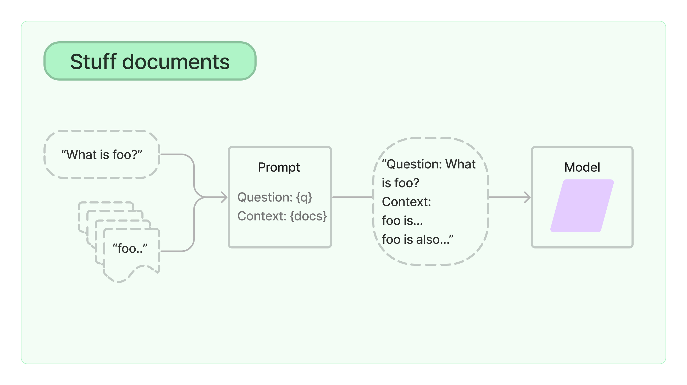
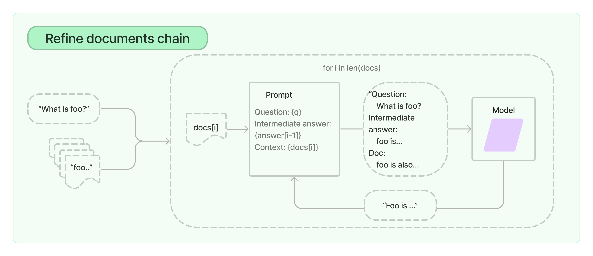
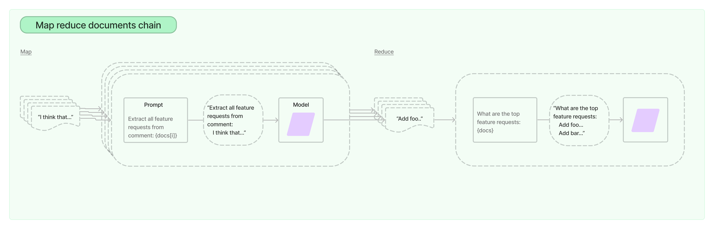
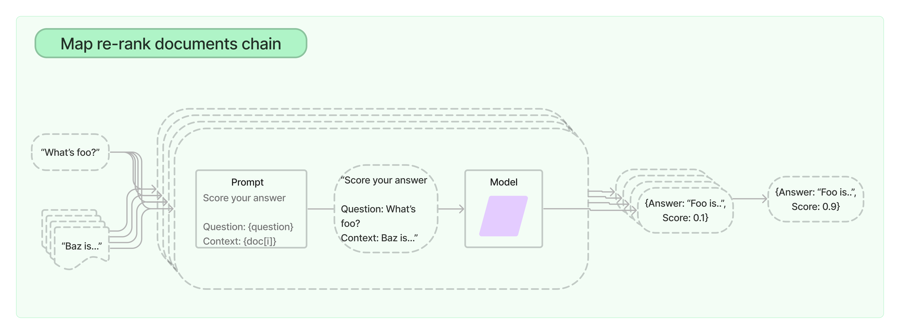

# 总体介绍
对于简单的应用来说，孤立地使用LLM是没有问题的，但更复杂的应用需要将LLM串联起来--要么相互串联，要么与其他组件串联。

LangChain为这种 "链式 "应用提供了Chain接口。我们非常笼统地将链定义为对组件的调用序列，其中可以包括其他链。基本接口很简单：
```python
class Chain(BaseModel, ABC):
    """Base interface that all chains should implement."""

    memory: BaseMemory
    callbacks: Callbacks

    def __call__(
        self,
        inputs: Any,
        return_only_outputs: bool = False,
        callbacks: Callbacks = None,
    ) -> Dict[str, Any]:
        ...
```
这种将组件组成一个链的想法简单而强大。它极大地简化了复杂应用程序的实现，并使之更加模块化，这反过来又使调试、维护和改进你的应用程序变得更加容易。

欲了解更多细节，请查看：
- 如何使用不同的链功能的演练：https://python.langchain.com/docs/modules/chains/how_to/
- 熟悉核心构件链的基础知识：https://python.langchain.com/docs/modules/chains/foundational/
- 文档，了解如何将文档纳入链中：https://python.langchain.com/docs/modules/chains/document/
- 最受欢迎的链，用于最常见的用例：https://python.langchain.com/docs/modules/chains/popular/
- 额外的，可以看到一些更高级的链和集成，你可以使用开箱即用的链。:https://python.langchain.com/docs/modules/chains/additional/

## 为什么我们需要链
链允许我们将多个组件结合在一起，创建一个单一的、连贯的应用程序。例如，我们可以创建一个链，接受用户输入，用PromptTemplate格式化，然后将格式化的响应传递给LLM。我们可以通过将多个链组合在一起，或将链与其他组件组合在一起，建立更复杂的链。

看一个简单使用的例子：

LLMChain是最基本的构建块链。它接受一个提示模板，用用户输入的格式化它，并从LLM返回响应。

要使用LLMChain，首先要创建一个提示模板。
```python
from langchain.llms import OpenAI
from langchain.prompts import PromptTemplate

llm = OpenAI(temperature=0.9)
prompt = PromptTemplate(
    input_variables=["product"],
    template="What is a good name for a company that makes {product}?",
)
```
我们现在可以创建一个非常简单的链，它将接受用户的输入，用它来格式化提示，然后将其发送到LLM。
```python
from langchain.chains import LLMChain
chain = LLMChain(llm=llm, prompt=prompt)

# Run the chain only specifying the input variable.
print(chain.run("colorful socks"))

    Colorful Toes Co.
```
如果有多个变量，你可以用一个字典一次输入它们。
```python
prompt = PromptTemplate(
    input_variables=["company", "product"],
    template="What is a good name for {company} that makes {product}?",
)
chain = LLMChain(llm=llm, prompt=prompt)
print(chain.run({
    'company': "ABC Startup",
    'product': "colorful socks"
    }))

    Socktopia Colourful Creations.
```
你也可以在LLMChain中使用一个聊天模型：
```python
from langchain.chat_models import ChatOpenAI
from langchain.prompts.chat import (
    ChatPromptTemplate,
    HumanMessagePromptTemplate,
)
human_message_prompt = HumanMessagePromptTemplate(
        prompt=PromptTemplate(
            template="What is a good name for a company that makes {product}?",
            input_variables=["product"],
        )
    )
chat_prompt_template = ChatPromptTemplate.from_messages([human_message_prompt])
chat = ChatOpenAI(temperature=0.9)
chain = LLMChain(llm=chat, prompt=chat_prompt_template)
print(chain.run("colorful socks"))

    Rainbow Socks Co.
```

# 怎么使用链
## 异步API
LangChain通过利用asyncio库为Chains提供异步支持。

目前LLMChain（通过arun、apredict、acall）和LLMMathChain（通过arun和acall）、ChatVectorDBChain和QA链都支持异步方法。对其他链的异步支持在路线图上。

```python
import asyncio
import time

from langchain.llms import OpenAI
from langchain.prompts import PromptTemplate
from langchain.chains import LLMChain


def generate_serially():
    llm = OpenAI(temperature=0.9)
    prompt = PromptTemplate(
        input_variables=["product"],
        template="What is a good name for a company that makes {product}?",
    )
    chain = LLMChain(llm=llm, prompt=prompt)
    for _ in range(5):
        resp = chain.run(product="toothpaste")
        print(resp)


async def async_generate(chain):
    resp = await chain.arun(product="toothpaste")
    print(resp)


async def generate_concurrently():
    llm = OpenAI(temperature=0.9)
    prompt = PromptTemplate(
        input_variables=["product"],
        template="What is a good name for a company that makes {product}?",
    )
    chain = LLMChain(llm=llm, prompt=prompt)
    tasks = [async_generate(chain) for _ in range(5)]
    await asyncio.gather(*tasks)


s = time.perf_counter()
# If running this outside of Jupyter, use asyncio.run(generate_concurrently())
await generate_concurrently()
elapsed = time.perf_counter() - s
print("\033[1m" + f"Concurrent executed in {elapsed:0.2f} seconds." + "\033[0m")

s = time.perf_counter()
generate_serially()
elapsed = time.perf_counter() - s
print("\033[1m" + f"Serial executed in {elapsed:0.2f} seconds." + "\033[0m")
```

## 不同的调用方法
所有继承自Chain的类都提供了一些运行连锁逻辑的方法。最直接的一种是使用__call__：
```python
chat = ChatOpenAI(temperature=0)
prompt_template = "Tell me a {adjective} joke"
llm_chain = LLMChain(llm=chat, prompt=PromptTemplate.from_template(prompt_template))

llm_chain(inputs={"adjective": "corny"})

    {'adjective': 'corny',
     'text': 'Why did the tomato turn red? Because it saw the salad dressing!'}
```
默认情况下，__call__同时返回输入和输出的键值。你可以通过设置 return_only_outputs 为 True，将其配置为只返回输出键值。
```python
llm_chain("corny", return_only_outputs=True)

    {'text': 'Why did the tomato turn red? Because it saw the salad dressing!'}
  
```
如果Chain只输出一个输出键（即它的output_keys中只有一个元素），你可以使用run方法。注意，run会输出一个字符串而不是一个字典。
```python
# llm_chain only has one output key, so we can use run
llm_chain.output_keys

    ['text']

llm_chain.run({"adjective": "corny"})

    'Why did the tomato turn red? Because it saw the salad dressing!'
```
在有一个输入键的情况下，你可以直接输入字符串，而不必指定输入映射。
```python
# These two are equivalent
llm_chain.run({"adjective": "corny"})
llm_chain.run("corny")

# These two are also equivalent
llm_chain("corny")
llm_chain({"adjective": "corny"})

    {'adjective': 'corny',
     'text': 'Why did the tomato turn red? Because it saw the salad dressing!'}
```
提示： 你可以通过运行方法轻松地将链对象作为工具集成到你的Agent中。请看这里的一个例子。https://python.langchain.com/docs/modules/agents/tools/how_to/custom_tools.html

## 通用chain
要实现你自己的自定义链，你可以对Chain进行子类化，并实现以下方法：
```python
from __future__ import annotations

from typing import Any, Dict, List, Optional

from pydantic import Extra

from langchain.base_language import BaseLanguageModel
from langchain.callbacks.manager import (
    AsyncCallbackManagerForChainRun,
    CallbackManagerForChainRun,
)
from langchain.chains.base import Chain
from langchain.prompts.base import BasePromptTemplate


class MyCustomChain(Chain):
    """
    An example of a custom chain.
    """

    prompt: BasePromptTemplate
    """Prompt object to use."""
    llm: BaseLanguageModel
    output_key: str = "text"  #: :meta private:

    class Config:
        """Configuration for this pydantic object."""

        extra = Extra.forbid
        arbitrary_types_allowed = True

    @property
    def input_keys(self) -> List[str]:
        """Will be whatever keys the prompt expects.

        :meta private:
        """
        return self.prompt.input_variables

    @property
    def output_keys(self) -> List[str]:
        """Will always return text key.

        :meta private:
        """
        return [self.output_key]

    def _call(
        self,
        inputs: Dict[str, Any],
        run_manager: Optional[CallbackManagerForChainRun] = None,
    ) -> Dict[str, str]:
        # Your custom chain logic goes here
        # This is just an example that mimics LLMChain
        prompt_value = self.prompt.format_prompt(**inputs)

        # Whenever you call a language model, or another chain, you should pass
        # a callback manager to it. This allows the inner run to be tracked by
        # any callbacks that are registered on the outer run.
        # You can always obtain a callback manager for this by calling
        # `run_manager.get_child()` as shown below.
        response = self.llm.generate_prompt(
            [prompt_value], callbacks=run_manager.get_child() if run_manager else None
        )

        # If you want to log something about this run, you can do so by calling
        # methods on the `run_manager`, as shown below. This will trigger any
        # callbacks that are registered for that event.
        if run_manager:
            run_manager.on_text("Log something about this run")

        return {self.output_key: response.generations[0][0].text}

    async def _acall(
        self,
        inputs: Dict[str, Any],
        run_manager: Optional[AsyncCallbackManagerForChainRun] = None,
    ) -> Dict[str, str]:
        # Your custom chain logic goes here
        # This is just an example that mimics LLMChain
        prompt_value = self.prompt.format_prompt(**inputs)

        # Whenever you call a language model, or another chain, you should pass
        # a callback manager to it. This allows the inner run to be tracked by
        # any callbacks that are registered on the outer run.
        # You can always obtain a callback manager for this by calling
        # `run_manager.get_child()` as shown below.
        response = await self.llm.agenerate_prompt(
            [prompt_value], callbacks=run_manager.get_child() if run_manager else None
        )

        # If you want to log something about this run, you can do so by calling
        # methods on the `run_manager`, as shown below. This will trigger any
        # callbacks that are registered for that event.
        if run_manager:
            await run_manager.on_text("Log something about this run")

        return {self.output_key: response.generations[0][0].text}

    @property
    def _chain_type(self) -> str:
        return "my_custom_chain"

from langchain.callbacks.stdout import StdOutCallbackHandler
from langchain.chat_models.openai import ChatOpenAI
from langchain.prompts.prompt import PromptTemplate


chain = MyCustomChain(
    prompt=PromptTemplate.from_template("tell us a joke about {topic}"),
    llm=ChatOpenAI(),
)

chain.run({"topic": "callbacks"}, callbacks=[StdOutCallbackHandler()])

    
    
    > Entering new MyCustomChain chain...
    Log something about this run
    > Finished chain.


    'Why did the callback function feel lonely? Because it was always waiting for someone to call it back!'

```

## Debugging chains
由于大多数Chain对象涉及到大量的输入提示预处理和LLM输出后处理，因此仅从输出中调试Chain对象是很难的。

将verbose设置为True将打印出Chain对象运行时的一些内部状态。
```python
conversation = ConversationChain(
    llm=chat,
    memory=ConversationBufferMemory(),
    verbose=True
)
conversation.run("What is ChatGPT?")

    > Entering new ConversationChain chain...
    Prompt after formatting:
    The following is a friendly conversation between a human and an AI. The AI is talkative and provides lots of specific details from its context. If the AI does not know the answer to a question, it truthfully says it does not know.

    Current conversation:

    Human: What is ChatGPT?
    AI:

    > Finished chain.

    'ChatGPT is an AI language model developed by OpenAI. It is based on the GPT-3 architecture and is capable of generating human-like responses to text prompts. ChatGPT has been trained on a massive amount of text data and can understand and respond to a wide range of topics. It is often used for chatbots, virtual assistants, and other conversational AI applications.'


```

## 从LangChainHub加载
```python
from langchain.chains import load_chain

chain = load_chain("lc://chains/llm-math/chain.json")

chain.run("whats 2 raised to .12")

    
    
    > Entering new LLMMathChain chain...
    whats 2 raised to .12
    Answer: 1.0791812460476249
    > Finished chain.


    'Answer: 1.0791812460476249'
```
有时，链会要求额外的参数，而这些参数并没有和链一起被序列化。例如，一个在矢量数据库上做问题回答的链将需要一个矢量数据库。
```python
from langchain.embeddings.openai import OpenAIEmbeddings
from langchain.vectorstores import Chroma
from langchain.text_splitter import CharacterTextSplitter
from langchain import OpenAI, VectorDBQA

from langchain.document_loaders import TextLoader

loader = TextLoader("../../state_of_the_union.txt")
documents = loader.load()
text_splitter = CharacterTextSplitter(chunk_size=1000, chunk_overlap=0)
texts = text_splitter.split_documents(documents)

embeddings = OpenAIEmbeddings()
vectorstore = Chroma.from_documents(texts, embeddings)

    Running Chroma using direct local API.
    Using DuckDB in-memory for database. Data will be transient.

chain = load_chain("lc://chains/vector-db-qa/stuff/chain.json", vectorstore=vectorstore)


query = "What did the president say about Ketanji Brown Jackson"
chain.run(query)

    " The president said that Ketanji Brown Jackson is a Circuit Court of Appeals Judge, one of the nation's top legal minds, a former top litigator in private practice, a former federal public defender, has received a broad range of support from the Fraternal Order of Police to former judges appointed by Democrats and Republicans, and will continue Justice Breyer's legacy of excellence."

```
## Adding memory (state)
链可以用一个Memory对象来初始化，它将在对链的调用中持续保存数据。这使得链是有状态的。
```python
from langchain.chains import ConversationChain
from langchain.memory import ConversationBufferMemory

conversation = ConversationChain(
    llm=chat,
    memory=ConversationBufferMemory()
)

conversation.run("Answer briefly. What are the first 3 colors of a rainbow?")
# -> The first three colors of a rainbow are red, orange, and yellow.
conversation.run("And the next 4?")
# -> The next four colors of a rainbow are green, blue, indigo, and violet.

    'The next four colors of a rainbow are green, blue, indigo, and violet.'
```
从本质上讲，BaseMemory定义了一个langchain如何存储内存的接口。它允许通过load_memory_variables方法读取存储数据，并通过save_context方法存储新数据。你可以在 "内存 "部分了解更多信息。

## 序列化
这个笔记本涵盖了如何将链序列化到磁盘和从磁盘序列化。我们使用的序列化格式是json或yaml。目前，只有一些链支持这种类型的序列化。我们将随着时间的推移增加支持的链的数量。
### 将一个链保存到磁盘
首先，我们来看看如何将一个链保存到磁盘。这可以通过.save方法来完成，并指定一个带有json或yaml扩展名的文件路径。
```python
from langchain import PromptTemplate, OpenAI, LLMChain

template = """Question: {question}

Answer: Let's think step by step."""
prompt = PromptTemplate(template=template, input_variables=["question"])
llm_chain = LLMChain(prompt=prompt, llm=OpenAI(temperature=0), verbose=True)

llm_chain.save("llm_chain.json")

cat llm_chain.json

    {
        "memory": null,
        "verbose": true,
        "prompt": {
            "input_variables": [
                "question"
            ],
            "output_parser": null,
            "template": "Question: {question}\n\nAnswer: Let's think step by step.",
            "template_format": "f-string"
        },
        "llm": {
            "model_name": "text-davinci-003",
            "temperature": 0.0,
            "max_tokens": 256,
            "top_p": 1,
            "frequency_penalty": 0,
            "presence_penalty": 0,
            "n": 1,
            "best_of": 1,
            "request_timeout": null,
            "logit_bias": {},
            "_type": "openai"
        },
        "output_key": "text",
        "_type": "llm_chain"
    }
```
### 从磁盘加载一个链
```python
from langchain.chains import load_chain

chain = load_chain("llm_chain.json")

chain.run("whats 2 + 2")

    
    
    > Entering new LLMChain chain...
    Prompt after formatting:
    Question: whats 2 + 2
    
    Answer: Let's think step by step.
    
    > Finished chain.


    ' 2 + 2 = 4'
```

### 分开保存组件
在上面的例子中，我们可以看到提示信息和llm配置信息与整个链条保存在同一个json中。另外，我们也可以把它们拆开，单独保存。这对于使保存的组件更加模块化通常是有用的。为了做到这一点，我们只需要指定llm_path而不是llm组件，以及prompt_path而不是prompt组件。
```python
llm_chain.prompt.save("prompt.json")

cat prompt.json

    {
        "input_variables": [
            "question"
        ],
        "output_parser": null,
        "template": "Question: {question}\n\nAnswer: Let's think step by step.",
        "template_format": "f-string"
    }

llm_chain.llm.save("llm.json")

cat llm.json

    {
        "model_name": "text-davinci-003",
        "temperature": 0.0,
        "max_tokens": 256,
        "top_p": 1,
        "frequency_penalty": 0,
        "presence_penalty": 0,
        "n": 1,
        "best_of": 1,
        "request_timeout": null,
        "logit_bias": {},
        "_type": "openai"
    }

config = {
    "memory": None,
    "verbose": True,
    "prompt_path": "prompt.json",
    "llm_path": "llm.json",
    "output_key": "text",
    "_type": "llm_chain",
}
import json

with open("llm_chain_separate.json", "w") as f:
    json.dump(config, f, indent=2)

cat llm_chain_separate.json

    {
      "memory": null,
      "verbose": true,
      "prompt_path": "prompt.json",
      "llm_path": "llm.json",
      "output_key": "text",
      "_type": "llm_chain"
    }
    
chain = load_chain("llm_chain_separate.json")

chain.run("whats 2 + 2")

    
    
    > Entering new LLMChain chain...
    Prompt after formatting:
    Question: whats 2 + 2
    
    Answer: Let's think step by step.
    
    > Finished chain.


    ' 2 + 2 = 4'
```
# 基础
## LLM
LLMChain是一个简单的链，围绕语言模型增加了一些功能。它在整个LangChain中被广泛使用，包括在其他链和代理中。

一个LLMChain由一个PromptTemplate和一个语言模型（LLM或聊天模型）组成。它使用所提供的输入键值（如果有的话，还有内存键值）来格式化提示模板，将格式化的字符串传递给LLM并返回LLM的输出。
```python

from langchain import PromptTemplate, OpenAI, LLMChain

prompt_template = "What is a good name for a company that makes {product}?"

llm = OpenAI(temperature=0)
llm_chain = LLMChain(
    llm=llm,
    prompt=PromptTemplate.from_template(prompt_template)
)
llm_chain("colorful socks")

    {'product': 'colorful socks', 'text': '\n\nSocktastic!'}
```

### 运行LLM链的其他方式
除了所有链对象共享的__call__和run方法外，LLMChain还提供了一些调用链逻辑的方法：
- 应用允许你针对一个输入列表运行链：
```python
input_list = [
    {"product": "socks"},
    {"product": "computer"},
    {"product": "shoes"}
]

llm_chain.apply(input_list)

    [{'text': '\n\nSocktastic!'},
     {'text': '\n\nTechCore Solutions.'},
     {'text': '\n\nFootwear Factory.'}]
```
- generate与apply类似，只是它返回一个LLMResult而不是字符串。LLMResult通常包含有用的生成，如令牌使用和完成原因。
```python
llm_chain.generate(input_list)

    LLMResult(generations=[[Generation(text='\n\nSocktastic!', generation_info={'finish_reason': 'stop', 'logprobs': None})], [Generation(text='\n\nTechCore Solutions.', generation_info={'finish_reason': 'stop', 'logprobs': None})], [Generation(text='\n\nFootwear Factory.', generation_info={'finish_reason': 'stop', 'logprobs': None})]], llm_output={'token_usage': {'prompt_tokens': 36, 'total_tokens': 55, 'completion_tokens': 19}, 'model_name': 'text-davinci-003'})


```
- predict与run方法类似，只是输入键被指定为关键字参数，而不是Python dict。
```python
# Single input example
llm_chain.predict(product="colorful socks")

    '\n\nSocktastic!'

# Multiple inputs example

template = """Tell me a {adjective} joke about {subject}."""
prompt = PromptTemplate(template=template, input_variables=["adjective", "subject"])
llm_chain = LLMChain(prompt=prompt, llm=OpenAI(temperature=0))

llm_chain.predict(adjective="sad", subject="ducks")

    '\n\nQ: What did the duck say when his friend died?\nA: Quack, quack, goodbye.'


```

### 解析输出
默认情况下，即使底层提示对象有输出解析器，LLMChain也不会对输出进行解析。如果你想在LLM的输出上应用该输出解析器，请使用predict_and_parse而不是predict，使用apply_and_parse而不是apply。

使用predict：
```python
from langchain.output_parsers import CommaSeparatedListOutputParser

output_parser = CommaSeparatedListOutputParser()
template = """List all the colors in a rainbow"""
prompt = PromptTemplate(template=template, input_variables=[], output_parser=output_parser)
llm_chain = LLMChain(prompt=prompt, llm=llm)

llm_chain.predict()


    '\n\nRed, orange, yellow, green, blue, indigo, violet'
```
使用predict_and_parser:
```python
llm_chain.predict_and_parse()

    ['Red', 'orange', 'yellow', 'green', 'blue', 'indigo', 'violet']
```

### 从字符串进行初始化
我们也可以直接从一个字符串模板中构建一个LLMChain。
```python
template = """Tell me a {adjective} joke about {subject}."""
llm_chain = LLMChain.from_string(llm=llm, template=template)

llm_chain.predict(adjective="sad", subject="ducks")

    '\n\nQ: What did the duck say when his friend died?\nA: Quack, quack, goodbye.'
```

## 路由器
本笔记本演示了如何使用RouterChain范式来创建一个链，为给定的输入动态地选择下一个链来使用。

Router链由两个部分组成：
- RouterChain本身（负责选择要调用的下一条链）
- destination_chains: 路由器链可以路由到的链

在本笔记本中，我们将重点介绍不同类型的路由链。我们将展示这些路由链在MultiPromptChain中的应用，以创建一个回答问题的链，选择与给定问题最相关的提示，然后使用该提示回答问题。

```python
from langchain.chains.router import MultiPromptChain
from langchain.llms import OpenAI
from langchain.chains import ConversationChain
from langchain.chains.llm import LLMChain
from langchain.prompts import PromptTemplate

physics_template = """You are a very smart physics professor. \
You are great at answering questions about physics in a concise and easy to understand manner. \
When you don't know the answer to a question you admit that you don't know.

Here is a question:
{input}"""


math_template = """You are a very good mathematician. You are great at answering math questions. \
You are so good because you are able to break down hard problems into their component parts, \
answer the component parts, and then put them together to answer the broader question.

Here is a question:
{input}"""

prompt_infos = [
    {
        "name": "physics",
        "description": "Good for answering questions about physics",
        "prompt_template": physics_template,
    },
    {
        "name": "math",
        "description": "Good for answering math questions",
        "prompt_template": math_template,
    },
]

llm = OpenAI()

destination_chains = {}
for p_info in prompt_infos:
    name = p_info["name"]
    prompt_template = p_info["prompt_template"]
    prompt = PromptTemplate(template=prompt_template, input_variables=["input"])
    chain = LLMChain(llm=llm, prompt=prompt)
    destination_chains[name] = chain
default_chain = ConversationChain(llm=llm, output_key="text")

```

### LLMRouterChain
这条链使用LLM来决定如何进行路由。
```python
from langchain.chains.router.llm_router import LLMRouterChain, RouterOutputParser
from langchain.chains.router.multi_prompt_prompt import MULTI_PROMPT_ROUTER_TEMPLATE

destinations = [f"{p['name']}: {p['description']}" for p in prompt_infos]
destinations_str = "\n".join(destinations)
router_template = MULTI_PROMPT_ROUTER_TEMPLATE.format(destinations=destinations_str)
router_prompt = PromptTemplate(
    template=router_template,
    input_variables=["input"],
    output_parser=RouterOutputParser(),
)
router_chain = LLMRouterChain.from_llm(llm, router_prompt)

chain = MultiPromptChain(
    router_chain=router_chain,
    destination_chains=destination_chains,
    default_chain=default_chain,
    verbose=True,
)

print(chain.run("What is black body radiation?"))

    
    
    > Entering new MultiPromptChain chain...
    physics: {'input': 'What is black body radiation?'}
    > Finished chain.
    
    
    Black body radiation is the term used to describe the electromagnetic radiation emitted by a “black body”—an object that absorbs all radiation incident upon it. A black body is an idealized physical body that absorbs all incident electromagnetic radiation, regardless of frequency or angle of incidence. It does not reflect, emit or transmit energy. This type of radiation is the result of the thermal motion of the body's atoms and molecules, and it is emitted at all wavelengths. The spectrum of radiation emitted is described by Planck's law and is known as the black body spectrum.


print(
    chain.run(
        "What is the first prime number greater than 40 such that one plus the prime number is divisible by 3"
    )
)


    
    
    > Entering new MultiPromptChain chain...
    math: {'input': 'What is the first prime number greater than 40 such that one plus the prime number is divisible by 3'}
    > Finished chain.
    ?
    
    The answer is 43. One plus 43 is 44 which is divisible by 3.


print(chain.run("What is the name of the type of cloud that rins"))

    
    
    > Entering new MultiPromptChain chain...
    None: {'input': 'What is the name of the type of cloud that rains?'}
    > Finished chain.
     The type of cloud that rains is called a cumulonimbus cloud. It is a tall and dense cloud that is often accompanied by thunder and lightning.

```

### EmbeddingRouterChain
EmbeddingRouterChain使用嵌入和相似性在目的地链之间进行路由。
```python
from langchain.chains.router.embedding_router import EmbeddingRouterChain
from langchain.embeddings import CohereEmbeddings
from langchain.vectorstores import Chroma

names_and_descriptions = [
    ("physics", ["for questions about physics"]),
    ("math", ["for questions about math"]),
]

router_chain = EmbeddingRouterChain.from_names_and_descriptions(
    names_and_descriptions, Chroma, CohereEmbeddings(), routing_keys=["input"]
)

    Using embedded DuckDB without persistence: data will be transient

chain = MultiPromptChain(
    router_chain=router_chain,
    destination_chains=destination_chains,
    default_chain=default_chain,
    verbose=True,
)

print(chain.run("What is black body radiation?"))

    
    
    > Entering new MultiPromptChain chain...
    physics: {'input': 'What is black body radiation?'}
    > Finished chain.
    
    
    Black body radiation is the emission of energy from an idealized physical body (known as a black body) that is in thermal equilibrium with its environment. It is emitted in a characteristic pattern of frequencies known as a black-body spectrum, which depends only on the temperature of the body. The study of black body radiation is an important part of astrophysics and atmospheric physics, as the thermal radiation emitted by stars and planets can often be approximated as black body radiation.


print(
    chain.run(
        "What is the first prime number greater than 40 such that one plus the prime number is divisible by 3"
    )
)


    
    
    > Entering new MultiPromptChain chain...
    math: {'input': 'What is the first prime number greater than 40 such that one plus the prime number is divisible by 3'}
    > Finished chain.
    ?
    
    Answer: The first prime number greater than 40 such that one plus the prime number is divisible by 3 is 43.

```

## 连续
调用语言模型后的下一步是对语言模型进行一系列的调用。当你想把一个调用的输出作为另一个调用的输入时，这就特别有用。

在这个笔记本中，我们将通过一些例子来说明如何做到这一点，使用顺序链。顺序链允许你连接多个链，并将它们组成管道，执行一些特定的场景。有两种类型的顺序链：

- SimpleSequentialChain： 顺序链的最简单形式，每个步骤都有一个单一的输入/输出，一个步骤的输出是下一个步骤的输入。
- 顺序链（SequentialChain）： 顺序链的一种更普遍的形式，允许有多个输入/输出。

```python
from langchain.llms import OpenAI
from langchain.chains import LLMChain
from langchain.prompts import PromptTemplate

# This is an LLMChain to write a synopsis given a title of a play.
llm = OpenAI(temperature=.7)
template = """You are a playwright. Given the title of play, it is your job to write a synopsis for that title.

Title: {title}
Playwright: This is a synopsis for the above play:"""
prompt_template = PromptTemplate(input_variables=["title"], template=template)
synopsis_chain = LLMChain(llm=llm, prompt=prompt_template)


# This is an LLMChain to write a review of a play given a synopsis.
llm = OpenAI(temperature=.7)
template = """You are a play critic from the New York Times. Given the synopsis of play, it is your job to write a review for that play.

Play Synopsis:
{synopsis}
Review from a New York Times play critic of the above play:"""
prompt_template = PromptTemplate(input_variables=["synopsis"], template=template)
review_chain = LLMChain(llm=llm, prompt=prompt_template)


# This is the overall chain where we run these two chains in sequence.
from langchain.chains import SimpleSequentialChain
overall_chain = SimpleSequentialChain(chains=[synopsis_chain, review_chain], verbose=True)


review = overall_chain.run("Tragedy at sunset on the beach")

    
    
    > Entering new SimpleSequentialChain chain...
    
    
    Tragedy at Sunset on the Beach is a story of a young couple, Jack and Sarah, who are in love and looking forward to their future together. On the night of their anniversary, they decide to take a walk on the beach at sunset. As they are walking, they come across a mysterious figure, who tells them that their love will be tested in the near future. 
    
    The figure then tells the couple that the sun will soon set, and with it, a tragedy will strike. If Jack and Sarah can stay together and pass the test, they will be granted everlasting love. However, if they fail, their love will be lost forever.
    
    The play follows the couple as they struggle to stay together and battle the forces that threaten to tear them apart. Despite the tragedy that awaits them, they remain devoted to one another and fight to keep their love alive. In the end, the couple must decide whether to take a chance on their future together or succumb to the tragedy of the sunset.
    
    
    Tragedy at Sunset on the Beach is an emotionally gripping story of love, hope, and sacrifice. Through the story of Jack and Sarah, the audience is taken on a journey of self-discovery and the power of love to overcome even the greatest of obstacles. 
    
    The play's talented cast brings the characters to life, allowing us to feel the depths of their emotion and the intensity of their struggle. With its compelling story and captivating performances, this play is sure to draw in audiences and leave them on the edge of their seats. 
    
    The play's setting of the beach at sunset adds a touch of poignancy and romanticism to the story, while the mysterious figure serves to keep the audience enthralled. Overall, Tragedy at Sunset on the Beach is an engaging and thought-provoking play that is sure to leave audiences feeling inspired and hopeful.
    
    > Finished chain.


print(review)

    
    
    Tragedy at Sunset on the Beach is an emotionally gripping story of love, hope, and sacrifice. Through the story of Jack and Sarah, the audience is taken on a journey of self-discovery and the power of love to overcome even the greatest of obstacles. 
    
    The play's talented cast brings the characters to life, allowing us to feel the depths of their emotion and the intensity of their struggle. With its compelling story and captivating performances, this play is sure to draw in audiences and leave them on the edge of their seats. 
    
    The play's setting of the beach at sunset adds a touch of poignancy and romanticism to the story, while the mysterious figure serves to keep the audience enthralled. Overall, Tragedy at Sunset on the Beach is an engaging and thought-provoking play that is sure to leave audiences feeling inspired and hopeful.


```

### Sequential Chain
当然，并不是所有的顺序链都像传递一个字符串作为参数，在链的所有步骤中得到一个字符串作为输出那样简单。在接下来的例子中，我们将尝试更复杂的链，涉及多个输入，也有多个最终输出。

特别重要的是我们如何命名输入/输出变量名。在上面的例子中，我们不必考虑这个问题，因为我们只是把一个链的输出直接作为输入传给下一个链，但在这里我们必须担心这个问题，因为我们有多个输入。
```python
# This is an LLMChain to write a synopsis given a title of a play and the era it is set in.
llm = OpenAI(temperature=.7)
template = """You are a playwright. Given the title of play and the era it is set in, it is your job to write a synopsis for that title.

Title: {title}
Era: {era}
Playwright: This is a synopsis for the above play:"""
prompt_template = PromptTemplate(input_variables=["title", "era"], template=template)
synopsis_chain = LLMChain(llm=llm, prompt=prompt_template, output_key="synopsis")


# This is an LLMChain to write a review of a play given a synopsis.
llm = OpenAI(temperature=.7)
template = """You are a play critic from the New York Times. Given the synopsis of play, it is your job to write a review for that play.

Play Synopsis:
{synopsis}
Review from a New York Times play critic of the above play:"""
prompt_template = PromptTemplate(input_variables=["synopsis"], template=template)
review_chain = LLMChain(llm=llm, prompt=prompt_template, output_key="review")


# This is the overall chain where we run these two chains in sequence.
from langchain.chains import SequentialChain
overall_chain = SequentialChain(
    chains=[synopsis_chain, review_chain],
    input_variables=["era", "title"],
    # Here we return multiple variables
    output_variables=["synopsis", "review"],
    verbose=True)

overall_chain({"title":"Tragedy at sunset on the beach", "era": "Victorian England"})

    
    
    > Entering new SequentialChain chain...
    
    > Finished chain.


    {'title': 'Tragedy at sunset on the beach',
     'era': 'Victorian England',
     'synopsis': "\n\nThe play follows the story of John, a young man from a wealthy Victorian family, who dreams of a better life for himself. He soon meets a beautiful young woman named Mary, who shares his dream. The two fall in love and decide to elope and start a new life together.\n\nOn their journey, they make their way to a beach at sunset, where they plan to exchange their vows of love. Unbeknownst to them, their plans are overheard by John's father, who has been tracking them. He follows them to the beach and, in a fit of rage, confronts them. \n\nA physical altercation ensues, and in the struggle, John's father accidentally stabs Mary in the chest with his sword. The two are left in shock and disbelief as Mary dies in John's arms, her last words being a declaration of her love for him.\n\nThe tragedy of the play comes to a head when John, broken and with no hope of a future, chooses to take his own life by jumping off the cliffs into the sea below. \n\nThe play is a powerful story of love, hope, and loss set against the backdrop of 19th century England.",
     'review': "\n\nThe latest production from playwright X is a powerful and heartbreaking story of love and loss set against the backdrop of 19th century England. The play follows John, a young man from a wealthy Victorian family, and Mary, a beautiful young woman with whom he falls in love. The two decide to elope and start a new life together, and the audience is taken on a journey of hope and optimism for the future.\n\nUnfortunately, their dreams are cut short when John's father discovers them and in a fit of rage, fatally stabs Mary. The tragedy of the play is further compounded when John, broken and without hope, takes his own life. The storyline is not only realistic, but also emotionally compelling, drawing the audience in from start to finish.\n\nThe acting was also commendable, with the actors delivering believable and nuanced performances. The playwright and director have successfully crafted a timeless tale of love and loss that will resonate with audiences for years to come. Highly recommended."}

```

# Memory in Sequential Chains
有时你可能想传递一些上下文，在链的每一步或链的后面部分使用，但维护和链在一起的输入/输出变量会很快变得混乱。使用SimpleMemory是一个方便的方法来做管理和清理你的链。

例如，使用之前的剧作家序列链，假设你想包括一些关于戏剧的日期、时间和地点的上下文，并使用生成的剧情简介和评论，创建一些社交媒体的帖子文本。你可以把这些新的上下文变量作为input_variables来添加，或者我们可以在链上添加一个SimpleMemory来管理这个上下文：
```python
from langchain.chains import SequentialChain
from langchain.memory import SimpleMemory

llm = OpenAI(temperature=.7)
template = """You are a social media manager for a theater company.  Given the title of play, the era it is set in, the date,time and location, the synopsis of the play, and the review of the play, it is your job to write a social media post for that play.

Here is some context about the time and location of the play:
Date and Time: {time}
Location: {location}

Play Synopsis:
{synopsis}
Review from a New York Times play critic of the above play:
{review}

Social Media Post:
"""
prompt_template = PromptTemplate(input_variables=["synopsis", "review", "time", "location"], template=template)
social_chain = LLMChain(llm=llm, prompt=prompt_template, output_key="social_post_text")

overall_chain = SequentialChain(
    memory=SimpleMemory(memories={"time": "December 25th, 8pm PST", "location": "Theater in the Park"}),
    chains=[synopsis_chain, review_chain, social_chain],
    input_variables=["era", "title"],
    # Here we return multiple variables
    output_variables=["social_post_text"],
    verbose=True)

overall_chain({"title":"Tragedy at sunset on the beach", "era": "Victorian England"})


    
    
    > Entering new SequentialChain chain...
    
    > Finished chain.


    {'title': 'Tragedy at sunset on the beach',
     'era': 'Victorian England',
     'time': 'December 25th, 8pm PST',
     'location': 'Theater in the Park',
     'social_post_text': "\nSpend your Christmas night with us at Theater in the Park and experience the heartbreaking story of love and loss that is 'A Walk on the Beach'. Set in Victorian England, this romantic tragedy follows the story of Frances and Edward, a young couple whose love is tragically cut short. Don't miss this emotional and thought-provoking production that is sure to leave you in tears. #AWalkOnTheBeach #LoveAndLoss #TheaterInThePark #VictorianEngland"}


```
## 变换
这个笔记本展示了使用一个通用的转换链。

作为一个例子，我们将创建一个假的转换，接收一个超长的文本，将文本过滤成只有前三段，然后将其传递给LLMChain来总结这些。

```python
from langchain.chains import TransformChain, LLMChain, SimpleSequentialChain
from langchain.llms import OpenAI
from langchain.prompts import PromptTemplate

with open("../../state_of_the_union.txt") as f:
    state_of_the_union = f.read()

def transform_func(inputs: dict) -> dict:
    text = inputs["text"]
    shortened_text = "\n\n".join(text.split("\n\n")[:3])
    return {"output_text": shortened_text}


transform_chain = TransformChain(
    input_variables=["text"], output_variables=["output_text"], transform=transform_func
)


template = """Summarize this text:

{output_text}

Summary:"""
prompt = PromptTemplate(input_variables=["output_text"], template=template)
llm_chain = LLMChain(llm=OpenAI(), prompt=prompt)

sequential_chain = SimpleSequentialChain(chains=[transform_chain, llm_chain])

sequential_chain.run(state_of_the_union)

    ' The speaker addresses the nation, noting that while last year they were kept apart due to COVID-19, this year they are together again. They are reminded that regardless of their political affiliations, they are all Americans.'

```
# Documents
## Stuff
stuff文件链（"stuff "是指 "to stuff "或 "to fill"）是最直接的文件链。它接收一个文件列表，将它们全部插入一个提示，并将该提示传递给一个LLM。

这条链非常适合于文件数量较少且大多数调用只传递几个文件的应用。




## refine
完善文档链通过循环输入文档和迭代更新其答案来构建一个响应。对于每个文档，它将所有非文档输入、当前文档和最新的中间答案传递给LLM链，以获得一个新的答案。

由于Refine链每次只向LLM传递一个文档，所以它很适合于需要分析更多文档的任务，而这些文档在模型的上下文中并不适合。显而易见的是，这条链会比Stuff文档链等调用更多的LLM。也有一些任务是很难迭代完成的。例如，当文档之间经常相互参照，或者当一个任务需要许多文档的详细信息时，Refine链的表现就很差。




## Map reduce
map reduce文档链首先对每个文档单独应用LLM链（map步骤），将链的输出视为一个新的文档。然后，它将所有的新文档传递给一个单独的组合文档链，以获得一个单一的输出（Reduce步骤）。它可以选择首先压缩或折叠映射的文档，以确保它们适合于组合文档链（它通常会将它们传递给LLM）。如果有必要的话，这个压缩步骤会递归进行。



## Map re-rank
map re-rank文件链对每个文件进行初始提示，不仅试图完成一项任务，而且对其答案的确定程度进行评分。得分最高的回答会被返回。



# 流行
## API chains
APIChain使使用LLM与API进行交互以检索相关信息。通过提供一个与所提供的API文档相关的问题来构建链。
#### OpenMeteo Example
```python
from langchain.chains.api import open_meteo_docs
chain_new = APIChain.from_llm_and_api_docs(llm, open_meteo_docs.OPEN_METEO_DOCS, verbose=True)


chain_new.run('What is the weather like right now in Munich, Germany in degrees Fahrenheit?')


    > Entering new APIChain chain...
    https://api.open-meteo.com/v1/forecast?latitude=48.1351&longitude=11.5820&temperature_unit=fahrenheit&current_weather=true
    {"latitude":48.14,"longitude":11.58,"generationtime_ms":0.33104419708251953,"utc_offset_seconds":0,"timezone":"GMT","timezone_abbreviation":"GMT","elevation":521.0,"current_weather":{"temperature":33.4,"windspeed":6.8,"winddirection":198.0,"weathercode":2,"time":"2023-01-16T01:00"}}

    > Finished chain.


    ' The current temperature in Munich, Germany is 33.4 degrees Fahrenheit with a windspeed of 6.8 km/h and a wind direction of 198 degrees. The weathercode is 2.'


```
## 检索QA
这个例子展示了通过索引回答问题的情况。
```python
from langchain.chains import RetrievalQA
from langchain.document_loaders import TextLoader
from langchain.embeddings.openai import OpenAIEmbeddings
from langchain.llms import OpenAI
from langchain.text_splitter import CharacterTextSplitter
from langchain.vectorstores import Chroma

loader = TextLoader("../../state_of_the_union.txt")
documents = loader.load()
text_splitter = CharacterTextSplitter(chunk_size=1000, chunk_overlap=0)
texts = text_splitter.split_documents(documents)

embeddings = OpenAIEmbeddings()
docsearch = Chroma.from_documents(texts, embeddings)

qa = RetrievalQA.from_chain_type(llm=OpenAI(), chain_type="stuff", retriever=docsearch.as_retriever())


query = "What did the president say about Ketanji Brown Jackson"
qa.run(query)

    " The president said that she is one of the nation's top legal minds, a former top litigator in private practice, a former federal public defender, and from a family of public school educators and police officers. He also said that she is a consensus builder and has received a broad range of support, from the Fraternal Order of Police to former judges appointed by Democrats and Republicans."

```
### 链的类型
你可以很容易地指定不同的链类型，以便在RetrievalQA链中加载和使用。关于这些类型的详细介绍，请参见本笔记本。

有两种方法来加载不同的链类型。首先，你可以在from_chain_type方法中指定链类型参数。这允许你传入你想使用的链类型的名称。例如，在下面我们将链类型改为map_reduce。
```python
qa = RetrievalQA.from_chain_type(llm=OpenAI(), chain_type="map_reduce", retriever=docsearch.as_retriever())


query = "What did the president say about Ketanji Brown Jackson"
qa.run(query)

    " The president said that Judge Ketanji Brown Jackson is one of our nation's top legal minds, a former top litigator in private practice and a former federal public defender, from a family of public school educators and police officers, a consensus builder and has received a broad range of support from the Fraternal Order of Police to former judges appointed by Democrats and Republicans."

```
上述方法允许你真正简单地改变链_类型，但它没有为该链类型的参数提供大量的灵活性。如果你想控制这些参数，你可以直接加载链（就像你在这个笔记本中做的那样），然后用combined_documents_chain参数将其直接传递给RetrievalQA链。比如说
```python
from langchain.chains.question_answering import load_qa_chain
qa_chain = load_qa_chain(OpenAI(temperature=0), chain_type="stuff")
qa = RetrievalQA(combine_documents_chain=qa_chain, retriever=docsearch.as_retriever())

query = "What did the president say about Ketanji Brown Jackson"
qa.run(query)

    " The president said that Ketanji Brown Jackson is one of the nation's top legal minds, a former top litigator in private practice, a former federal public defender, and from a family of public school educators and police officers. He also said that she is a consensus builder and has received a broad range of support from the Fraternal Order of Police to former judges appointed by Democrats and Republicans."


```
### 通用的提示
你可以传入自定义的提示语来做问题的回答。这些提示与你可以传入基本问题回答链的提示相同。
```python
from langchain.prompts import PromptTemplate
prompt_template = """Use the following pieces of context to answer the question at the end. If you don't know the answer, just say that you don't know, don't try to make up an answer.

{context}

Question: {question}
Answer in Italian:"""
PROMPT = PromptTemplate(
    template=prompt_template, input_variables=["context", "question"]
)


chain_type_kwargs = {"prompt": PROMPT}
qa = RetrievalQA.from_chain_type(llm=OpenAI(), chain_type="stuff", retriever=docsearch.as_retriever(), chain_type_kwargs=chain_type_kwargs)


query = "What did the president say about Ketanji Brown Jackson"
qa.run(query)

    " Il presidente ha detto che Ketanji Brown Jackson è una delle menti legali più importanti del paese, che continuerà l'eccellenza di Justice Breyer e che ha ricevuto un ampio sostegno, da Fraternal Order of Police a ex giudici nominati da democratici e repubblicani."


```
### 返回源文档
此外，我们可以通过在构建链时指定一个可选的参数来返回用于回答问题的源文件。
```python
qa = RetrievalQA.from_chain_type(llm=OpenAI(), chain_type="stuff", retriever=docsearch.as_retriever(), return_source_documents=True)


query = "What did the president say about Ketanji Brown Jackson"
result = qa({"query": query})

result["result"]

    " The president said that Ketanji Brown Jackson is one of the nation's top legal minds, a former top litigator in private practice and a former federal public defender from a family of public school educators and police officers, and that she has received a broad range of support from the Fraternal Order of Police to former judges appointed by Democrats and Republicans."


result["source_documents"]

    [Document(page_content='Tonight. I call on the Senate to: Pass the Freedom to Vote Act. Pass the John Lewis Voting Rights Act. And while you’re at it, pass the Disclose Act so Americans can know who is funding our elections. \n\nTonight, I’d like to honor someone who has dedicated his life to serve this country: Justice Stephen Breyer—an Army veteran, Constitutional scholar, and retiring Justice of the United States Supreme Court. Justice Breyer, thank you for your service. \n\nOne of the most serious constitutional responsibilities a President has is nominating someone to serve on the United States Supreme Court. \n\nAnd I did that 4 days ago, when I nominated Circuit Court of Appeals Judge Ketanji Brown Jackson. One of our nation’s top legal minds, who will continue Justice Breyer’s legacy of excellence.', lookup_str='', metadata={'source': '../../state_of_the_union.txt'}, lookup_index=0),
     Document(page_content='A former top litigator in private practice. A former federal public defender. And from a family of public school educators and police officers. A consensus builder. Since she’s been nominated, she’s received a broad range of support—from the Fraternal Order of Police to former judges appointed by Democrats and Republicans. \n\nAnd if we are to advance liberty and justice, we need to secure the Border and fix the immigration system. \n\nWe can do both. At our border, we’ve installed new technology like cutting-edge scanners to better detect drug smuggling.  \n\nWe’ve set up joint patrols with Mexico and Guatemala to catch more human traffickers.  \n\nWe’re putting in place dedicated immigration judges so families fleeing persecution and violence can have their cases heard faster. \n\nWe’re securing commitments and supporting partners in South and Central America to host more refugees and secure their own borders.', lookup_str='', metadata={'source': '../../state_of_the_union.txt'}, lookup_index=0),
     Document(page_content='And for our LGBTQ+ Americans, let’s finally get the bipartisan Equality Act to my desk. The onslaught of state laws targeting transgender Americans and their families is wrong. \n\nAs I said last year, especially to our younger transgender Americans, I will always have your back as your President, so you can be yourself and reach your God-given potential. \n\nWhile it often appears that we never agree, that isn’t true. I signed 80 bipartisan bills into law last year. From preventing government shutdowns to protecting Asian-Americans from still-too-common hate crimes to reforming military justice. \n\nAnd soon, we’ll strengthen the Violence Against Women Act that I first wrote three decades ago. It is important for us to show the nation that we can come together and do big things. \n\nSo tonight I’m offering a Unity Agenda for the Nation. Four big things we can do together.  \n\nFirst, beat the opioid epidemic.', lookup_str='', metadata={'source': '../../state_of_the_union.txt'}, lookup_index=0),
     Document(page_content='Tonight, I’m announcing a crackdown on these companies overcharging American businesses and consumers. \n\nAnd as Wall Street firms take over more nursing homes, quality in those homes has gone down and costs have gone up.  \n\nThat ends on my watch. \n\nMedicare is going to set higher standards for nursing homes and make sure your loved ones get the care they deserve and expect. \n\nWe’ll also cut costs and keep the economy going strong by giving workers a fair shot, provide more training and apprenticeships, hire them based on their skills not degrees. \n\nLet’s pass the Paycheck Fairness Act and paid leave.  \n\nRaise the minimum wage to $15 an hour and extend the Child Tax Credit, so no one has to raise a family in poverty. \n\nLet’s increase Pell Grants and increase our historic support of HBCUs, and invest in what Jill—our First Lady who teaches full-time—calls America’s best-kept secret: community colleges.', lookup_str='', metadata={'source': '../../state_of_the_union.txt'}, lookup_index=0)]


```
另外，如果我们的文档有一个 "源 "元数据键，我们可以使用RetrievalQAW withSourceChain来引用我们的来源：
```python
docsearch = Chroma.from_texts(texts, embeddings, metadatas=[{"source": f"{i}-pl"} for i in range(len(texts))])


from langchain.chains import RetrievalQAWithSourcesChain
from langchain import OpenAI

chain = RetrievalQAWithSourcesChain.from_chain_type(OpenAI(temperature=0), chain_type="stuff", retriever=docsearch.as_retriever())


chain({"question": "What did the president say about Justice Breyer"}, return_only_outputs=True)


    {'answer': ' The president honored Justice Breyer for his service and mentioned his legacy of excellence.\n',
     'sources': '31-pl'}
```
## 对话检索QA
ConversationalRetrievalQA链建立在RetrievalQAChain的基础上，提供一个聊天历史组件。

它首先将聊天历史（明确传入或从提供的内存中检索）和问题合并成一个独立的问题，然后从检索器中查找相关文档，最后将这些文档和问题传递给问题回答链以返回响应。

要创建一个，你将需要一个检索器。在下面的例子中，我们将从一个矢量存储中创建一个，它可以从嵌入中创建。
```python
from langchain.embeddings.openai import OpenAIEmbeddings
from langchain.vectorstores import Chroma
from langchain.text_splitter import CharacterTextSplitter
from langchain.llms import OpenAI
from langchain.chains import ConversationalRetrievalChain

from langchain.document_loaders import TextLoader
loader = TextLoader("../../state_of_the_union.txt")
documents = loader.load()

# loaders = [....]
# docs = []
# for loader in loaders:
#     docs.extend(loader.load())

text_splitter = CharacterTextSplitter(chunk_size=1000, chunk_overlap=0)
documents = text_splitter.split_documents(documents)

embeddings = OpenAIEmbeddings()
vectorstore = Chroma.from_documents(documents, embeddings)

    Using embedded DuckDB without persistence: data will be transient
    
from langchain.memory import ConversationBufferMemory
memory = ConversationBufferMemory(memory_key="chat_history", return_messages=True)

qa = ConversationalRetrievalChain.from_llm(OpenAI(temperature=0), vectorstore.as_retriever(), memory=memory)

query = "What did the president say about Ketanji Brown Jackson"
result = qa({"question": query})

 " The president said that Ketanji Brown Jackson is one of the nation's top legal minds, a former top litigator in private practice, a former federal public defender, and from a family of public school educators and police officers. He also said that she is a consensus builder and has received a broad range of support from the Fraternal Order of Police to former judges appointed by Democrats and Republicans."


query = "Did he mention who she suceeded"
result = qa({"question": query})

result['answer']

    ' Ketanji Brown Jackson succeeded Justice Stephen Breyer on the United States Supreme Court.'

```
### 传入对话历史
在上面的例子中，我们使用了一个Memory对象来跟踪聊天历史。我们也可以直接显式地传入它。为了做到这一点，我们需要初始化一个没有任何内存对象的链。

`qa = ConversationalRetrievalChain.from_llm(OpenAI(temperature=0), vectorstore.as_retriever())`

下面是一个在没有聊天记录的情况下提出问题的例子
```python
chat_history = []
query = "What did the president say about Ketanji Brown Jackson"
result = qa({"question": query, "chat_history": chat_history})

result["answer"]

    " The president said that Ketanji Brown Jackson is one of the nation's top legal minds, a former top litigator in private practice, a former federal public defender, and from a family of public school educators and police officers. He also said that she is a consensus builder and has received a broad range of support from the Fraternal Order of Police to former judges appointed by Democrats and Republicans."

```
下面是一个用一些聊天记录提问的例子:
```python
chat_history = [(query, result["answer"])]
query = "Did he mention who she suceeded"
result = qa({"question": query, "chat_history": chat_history})

result['answer']

    ' Ketanji Brown Jackson succeeded Justice Stephen Breyer on the United States Supreme Court.'

```
### 使用不同的模式来凝练问题
这个链条有两个步骤。首先，它将当前问题和聊天历史浓缩为一个独立的问题。这对于创建一个用于检索的独立向量是必要的。之后，它进行检索，然后使用单独模型的检索增强生成来回答问题。LangChain的声明性的部分力量在于，你可以很容易地为每个调用使用一个单独的语言模型。这对于使用一个更便宜、更快速的模型来完成浓缩问题的简单任务，然后使用一个更昂贵的模型来回答问题，是很有用的。下面是一个这样做的例子。
```python
from langchain.chat_models import ChatOpenAI

qa = ConversationalRetrievalChain.from_llm(
    ChatOpenAI(temperature=0, model="gpt-4"),
    vectorstore.as_retriever(),
    condense_question_llm = ChatOpenAI(temperature=0, model='gpt-3.5-turbo'),
)

chat_history = []
query = "What did the president say about Ketanji Brown Jackson"
result = qa({"question": query, "chat_history": chat_history})

chat_history = [(query, result["answer"])]
query = "Did he mention who she suceeded"
result = qa({"question": query, "chat_history": chat_history})
```
### 返回源文档
你也可以轻松地从ConversationalRetrievalChain返回源文件。当你想检查返回的文件时，这很有用。
```python
qa = ConversationalRetrievalChain.from_llm(OpenAI(temperature=0), vectorstore.as_retriever(), return_source_documents=True)


chat_history = []
query = "What did the president say about Ketanji Brown Jackson"
result = qa({"question": query, "chat_history": chat_history})

result['source_documents'][0]

    Document(page_content='Tonight. I call on the Senate to: Pass the Freedom to Vote Act. Pass the John Lewis Voting Rights Act. And while you’re at it, pass the Disclose Act so Americans can know who is funding our elections. \n\nTonight, I’d like to honor someone who has dedicated his life to serve this country: Justice Stephen Breyer—an Army veteran, Constitutional scholar, and retiring Justice of the United States Supreme Court. Justice Breyer, thank you for your service. \n\nOne of the most serious constitutional responsibilities a President has is nominating someone to serve on the United States Supreme Court. \n\nAnd I did that 4 days ago, when I nominated Circuit Court of Appeals Judge Ketanji Brown Jackson. One of our nation’s top legal minds, who will continue Justice Breyer’s legacy of excellence.', metadata={'source': '../../state_of_the_union.txt'})

```
### ConversationalRetrievalChain with search_distance
如果你使用的是支持通过搜索距离进行过滤的矢量存储，你可以添加一个阈值参数。
```python
vectordbkwargs = {"search_distance": 0.9}

qa = ConversationalRetrievalChain.from_llm(OpenAI(temperature=0), vectorstore.as_retriever(), return_source_documents=True)
chat_history = []
query = "What did the president say about Ketanji Brown Jackson"
result = qa({"question": query, "chat_history": chat_history, "vectordbkwargs": vectordbkwargs})

```
### ConversationalRetrievalChain with map_reduce
我们还可以使用不同类型的组合文件链与ConversationalRetrievalChain链。
```python
from langchain.chains import LLMChain
from langchain.chains.question_answering import load_qa_chain
from langchain.chains.conversational_retrieval.prompts import CONDENSE_QUESTION_PROMPT

llm = OpenAI(temperature=0)
question_generator = LLMChain(llm=llm, prompt=CONDENSE_QUESTION_PROMPT)
doc_chain = load_qa_chain(llm, chain_type="map_reduce")

chain = ConversationalRetrievalChain(
    retriever=vectorstore.as_retriever(),
    question_generator=question_generator,
    combine_docs_chain=doc_chain,
)

chat_history = []
query = "What did the president say about Ketanji Brown Jackson"
result = chain({"question": query, "chat_history": chat_history})

result['answer']

    " The president said that Ketanji Brown Jackson is one of the nation's top legal minds, a former top litigator in private practice, a former federal public defender, from a family of public school educators and police officers, a consensus builder, and has received a broad range of support from the Fraternal Order of Police to former judges appointed by Democrats and Republicans."

```
### ConversationalRetrievalChain with Question Answering with sources
你也可以用这个链子来回答有来源的问题。
```python
from langchain.chains.qa_with_sources import load_qa_with_sources_chain

llm = OpenAI(temperature=0)
question_generator = LLMChain(llm=llm, prompt=CONDENSE_QUESTION_PROMPT)
doc_chain = load_qa_with_sources_chain(llm, chain_type="map_reduce")

chain = ConversationalRetrievalChain(
    retriever=vectorstore.as_retriever(),
    question_generator=question_generator,
    combine_docs_chain=doc_chain,
)

chat_history = []
query = "What did the president say about Ketanji Brown Jackson"
result = chain({"question": query, "chat_history": chat_history})

result['answer']

    " The president said that Ketanji Brown Jackson is one of the nation's top legal minds, a former top litigator in private practice, a former federal public defender, from a family of public school educators and police officers, a consensus builder, and has received a broad range of support from the Fraternal Order of Police to former judges appointed by Democrats and Republicans. \nSOURCES: ../../state_of_the_union.txt"

```
### ConversationalRetrievalChain with streaming to stdout
在这个例子中，链的输出将被流向stdout的token，逐个token。
```python
from langchain.chains.llm import LLMChain
from langchain.callbacks.streaming_stdout import StreamingStdOutCallbackHandler
from langchain.chains.conversational_retrieval.prompts import CONDENSE_QUESTION_PROMPT, QA_PROMPT
from langchain.chains.question_answering import load_qa_chain

# Construct a ConversationalRetrievalChain with a streaming llm for combine docs
# and a separate, non-streaming llm for question generation
llm = OpenAI(temperature=0)
streaming_llm = OpenAI(streaming=True, callbacks=[StreamingStdOutCallbackHandler()], temperature=0)

question_generator = LLMChain(llm=llm, prompt=CONDENSE_QUESTION_PROMPT)
doc_chain = load_qa_chain(streaming_llm, chain_type="stuff", prompt=QA_PROMPT)

qa = ConversationalRetrievalChain(
    retriever=vectorstore.as_retriever(), combine_docs_chain=doc_chain, question_generator=question_generator)


chat_history = []
query = "What did the president say about Ketanji Brown Jackson"
result = qa({"question": query, "chat_history": chat_history})

     The president said that Ketanji Brown Jackson is one of the nation's top legal minds, a former top litigator in private practice, a former federal public defender, and from a family of public school educators and police officers. He also said that she is a consensus builder and has received a broad range of support from the Fraternal Order of Police to former judges appointed by Democrats and Republicans.


chat_history = [(query, result["answer"])]
query = "Did he mention who she suceeded"
result = qa({"question": query, "chat_history": chat_history})

     Ketanji Brown Jackson succeeded Justice Stephen Breyer on the United States Supreme Court.

```
### get_chat_history Function
你还可以指定一个get_chat_history函数，它可以用来格式化chat_history字符串。
```python
def get_chat_history(inputs) -> str:
    res = []
    for human, ai in inputs:
        res.append(f"Human:{human}\nAI:{ai}")
    return "\n".join(res)
qa = ConversationalRetrievalChain.from_llm(OpenAI(temperature=0), vectorstore.as_retriever(), get_chat_history=get_chat_history)


chat_history = []
query = "What did the president say about Ketanji Brown Jackson"
result = qa({"question": query, "chat_history": chat_history})

result['answer']

    " The president said that Ketanji Brown Jackson is one of the nation's top legal minds, a former top litigator in private practice, a former federal public defender, and from a family of public school educators and police officers. He also said that she is a consensus builder and has received a broad range of support from the Fraternal Order of Police to former judges appointed by Democrats and Republicans."

```
## SQL
这个略过了。

## 摘要
总结链可以用来总结多个文档。一种方法是输入多个较小的文档，在它们被分成几块后，用MapReduceDocumentsChain对它们进行操作。你也可以选择用StuffDocumentsChain或RefineDocumentsChain来做总结。
### 准备数据
首先，我们准备数据。在这个例子中，我们从一个长的文件中创建了多个文件，但这些文件可以以任何方式获取（这个笔记本的重点是强调在你获取文件之后要做什么）。
```python
from langchain import OpenAI, PromptTemplate, LLMChain
from langchain.text_splitter import CharacterTextSplitter
from langchain.chains.mapreduce import MapReduceChain
from langchain.prompts import PromptTemplate

llm = OpenAI(temperature=0)

text_splitter = CharacterTextSplitter()

with open("../../state_of_the_union.txt") as f:
    state_of_the_union = f.read()
texts = text_splitter.split_text(state_of_the_union)

from langchain.docstore.document import Document

docs = [Document(page_content=t) for t in texts[:3]]
```

### 快速开始
如果你只是想尽快开始，这是推荐的方式：
```python
from langchain.chains.summarize import load_summarize_chain

chain = load_summarize_chain(llm, chain_type="map_reduce")
chain.run(docs)

    ' In response to Russian aggression in Ukraine, the United States and its allies are taking action to hold Putin accountable, including economic sanctions, asset seizures, and military assistance. The US is also providing economic and humanitarian aid to Ukraine, and has passed the American Rescue Plan and the Bipartisan Infrastructure Law to help struggling families and create jobs. The US remains unified and determined to protect Ukraine and the free world.'

```
如果你想对正在发生的事情有更多的控制和了解，请看以下信息。
### The stuff Chain
这一部分展示了使用stuff链做总结的结果。
```python
chain = load_summarize_chain(llm, chain_type="stuff")

chain.run(docs)

    ' In his speech, President Biden addressed the crisis in Ukraine, the American Rescue Plan, and the Bipartisan Infrastructure Law. He discussed the need to invest in America, educate Americans, and build the economy from the bottom up. He also announced the release of 60 million barrels of oil from reserves around the world, and the creation of a dedicated task force to go after the crimes of Russian oligarchs. He concluded by emphasizing the need to Buy American and use taxpayer dollars to rebuild America.'

```
#### Custom Prompts
你也可以使用你自己的提示语与这个链条。在这个例子中，我们将用意大利语回答。
```python
prompt_template = """Write a concise summary of the following:


{text}


CONCISE SUMMARY IN ITALIAN:"""
PROMPT = PromptTemplate(template=prompt_template, input_variables=["text"])
chain = load_summarize_chain(llm, chain_type="stuff", prompt=PROMPT)
chain.run(docs)

    "\n\nIn questa serata, il Presidente degli Stati Uniti ha annunciato una serie di misure per affrontare la crisi in Ucraina, causata dall'aggressione di Putin. Ha anche annunciato l'invio di aiuti economici, militari e umanitari all'Ucraina. Ha anche annunciato che gli Stati Uniti e i loro alleati stanno imponendo sanzioni economiche a Putin e stanno rilasciando 60 milioni di barili di petrolio dalle riserve di tutto il mondo. Inoltre, ha annunciato che il Dipartimento di Giustizia degli Stati Uniti sta creando una task force dedicata ai crimini degli oligarchi russi. Il Presidente ha anche annunciato l'approvazione della legge bipartitica sull'infrastruttura, che prevede investimenti per la ricostruzione dell'America. Questo porterà a creare posti"

```
### The map_reduce Chain
```python
chain = load_summarize_chain(llm, chain_type="map_reduce")

chain.run(docs)

    " In response to Russia's aggression in Ukraine, the United States and its allies have imposed economic sanctions and are taking other measures to hold Putin accountable. The US is also providing economic and military assistance to Ukraine, protecting NATO countries, and releasing oil from its Strategic Petroleum Reserve. President Biden and Vice President Harris have passed legislation to help struggling families and rebuild America's infrastructure."

```
我们还可以返回map_reduce链的中间步骤，如果我们想检查它们的话。这是通过return_map_steps变量实现的。
```python
chain = load_summarize_chain(OpenAI(temperature=0), chain_type="map_reduce", return_intermediate_steps=True)


chain({"input_documents": docs}, return_only_outputs=True)

    {'map_steps': [" In response to Russia's aggression in Ukraine, the United States has united with other freedom-loving nations to impose economic sanctions and hold Putin accountable. The U.S. Department of Justice is also assembling a task force to go after the crimes of Russian oligarchs and seize their ill-gotten gains.",
      ' The United States and its European allies are taking action to punish Russia for its invasion of Ukraine, including seizing assets, closing off airspace, and providing economic and military assistance to Ukraine. The US is also mobilizing forces to protect NATO countries and has released 30 million barrels of oil from its Strategic Petroleum Reserve to help blunt gas prices. The world is uniting in support of Ukraine and democracy, and the US stands with its Ukrainian-American citizens.',
      " President Biden and Vice President Harris ran for office with a new economic vision for America, and have since passed the American Rescue Plan and the Bipartisan Infrastructure Law to help struggling families and rebuild America's infrastructure. This includes creating jobs, modernizing roads, airports, ports, and waterways, replacing lead pipes, providing affordable high-speed internet, and investing in American products to support American jobs."],
     'output_text': " In response to Russia's aggression in Ukraine, the United States and its allies have imposed economic sanctions and are taking other measures to hold Putin accountable. The US is also providing economic and military assistance to Ukraine, protecting NATO countries, and passing legislation to help struggling families and rebuild America's infrastructure. The world is uniting in support of Ukraine and democracy, and the US stands with its Ukrainian-American citizens."}

```
你也可以使用你自己的提示语与这个链条。在这个例子中，我们将用意大利语回答。
```python
prompt_template = """Write a concise summary of the following:


{text}


CONCISE SUMMARY IN ITALIAN:"""
PROMPT = PromptTemplate(template=prompt_template, input_variables=["text"])
chain = load_summarize_chain(OpenAI(temperature=0), chain_type="map_reduce", return_intermediate_steps=True, map_prompt=PROMPT, combine_prompt=PROMPT)
chain({"input_documents": docs}, return_only_outputs=True)


    {'intermediate_steps': ["\n\nQuesta sera, ci incontriamo come democratici, repubblicani e indipendenti, ma soprattutto come americani. La Russia di Putin ha cercato di scuotere le fondamenta del mondo libero, ma ha sottovalutato la forza della gente ucraina. Gli Stati Uniti e i loro alleati stanno ora imponendo sanzioni economiche a Putin e stanno tagliando l'accesso della Russia alla tecnologia. Il Dipartimento di Giustizia degli Stati Uniti sta anche creando una task force dedicata per andare dopo i crimini degli oligarchi russi.",
      "\n\nStiamo unendo le nostre forze con quelle dei nostri alleati europei per sequestrare yacht, appartamenti di lusso e jet privati di Putin. Abbiamo chiuso lo spazio aereo americano ai voli russi e stiamo fornendo più di un miliardo di dollari in assistenza all'Ucraina. Abbiamo anche mobilitato le nostre forze terrestri, aeree e navali per proteggere i paesi della NATO. Abbiamo anche rilasciato 60 milioni di barili di petrolio dalle riserve di tutto il mondo, di cui 30 milioni dalla nostra riserva strategica di petrolio. Stiamo affrontando una prova reale e ci vorrà del tempo, ma alla fine Putin non riuscirà a spegnere l'amore dei popoli per la libertà.",
      "\n\nIl Presidente Biden ha lottato per passare l'American Rescue Plan per aiutare le persone che soffrivano a causa della pandemia. Il piano ha fornito sollievo economico immediato a milioni di americani, ha aiutato a mettere cibo sulla loro tavola, a mantenere un tetto sopra le loro teste e a ridurre il costo dell'assicurazione sanitaria. Il piano ha anche creato più di 6,5 milioni di nuovi posti di lavoro, il più alto numero di posti di lavoro creati in un anno nella storia degli Stati Uniti. Il Presidente Biden ha anche firmato la legge bipartitica sull'infrastruttura, la più ampia iniziativa di ricostruzione della storia degli Stati Uniti. Il piano prevede di modernizzare le strade, gli aeroporti, i porti e le vie navigabili in"],
     'output_text': "\n\nIl Presidente Biden sta lavorando per aiutare le persone che soffrono a causa della pandemia attraverso l'American Rescue Plan e la legge bipartitica sull'infrastruttura. Gli Stati Uniti e i loro alleati stanno anche imponendo sanzioni economiche a Putin e tagliando l'accesso della Russia alla tecnologia. Stanno anche sequestrando yacht, appartamenti di lusso e jet privati di Putin e fornendo più di un miliardo di dollari in assistenza all'Ucraina. Alla fine, Putin non riuscirà a spegnere l'amore dei popoli per la libertà."}

```
### The custom MapReduceChain
#### Multi input prompt
你也可以使用多输入的提示。在这个例子中，我们将使用一个MapReduce链来回答关于我们代码的具体问题。
```python
from langchain.chains.combine_documents.map_reduce import MapReduceDocumentsChain
from langchain.chains.combine_documents.stuff import StuffDocumentsChain

map_template_string = """Give the following python code information, generate a description that explains what the code does and also mention the time complexity.
Code:
{code}

Return the the description in the following format:
name of the function: description of the function
"""


reduce_template_string = """Given the following python function names and descriptions, answer the following question
{code_description}
Question: {question}
Answer:
"""

MAP_PROMPT = PromptTemplate(input_variables=["code"], template=map_template_string)
REDUCE_PROMPT = PromptTemplate(input_variables=["code_description", "question"], template=reduce_template_string)

llm = OpenAI()

map_llm_chain = LLMChain(llm=llm, prompt=MAP_PROMPT)
reduce_llm_chain = LLMChain(llm=llm, prompt=REDUCE_PROMPT)

generative_result_reduce_chain = StuffDocumentsChain(
    llm_chain=reduce_llm_chain,
    document_variable_name="code_description",
)

combine_documents = MapReduceDocumentsChain(
    llm_chain=map_llm_chain,
    combine_document_chain=generative_result_reduce_chain,
    document_variable_name="code",
)

map_reduce = MapReduceChain(
    combine_documents_chain=combine_documents,
    text_splitter=CharacterTextSplitter(separator="\n##\n", chunk_size=100, chunk_overlap=0),
)

code = """
def bubblesort(list):
   for iter_num in range(len(list)-1,0,-1):
      for idx in range(iter_num):
         if list[idx]>list[idx+1]:
            temp = list[idx]
            list[idx] = list[idx+1]
            list[idx+1] = temp
    return list
##
def insertion_sort(InputList):
   for i in range(1, len(InputList)):
      j = i-1
      nxt_element = InputList[i]
   while (InputList[j] > nxt_element) and (j >= 0):
      InputList[j+1] = InputList[j]
      j=j-1
   InputList[j+1] = nxt_element
   return InputList
##
def shellSort(input_list):
   gap = len(input_list) // 2
   while gap > 0:
      for i in range(gap, len(input_list)):
         temp = input_list[i]
         j = i
   while j >= gap and input_list[j - gap] > temp:
      input_list[j] = input_list[j - gap]
      j = j-gap
      input_list[j] = temp
   gap = gap//2
   return input_list

"""

map_reduce.run(input_text=code, question="Which function has a better time complexity?")


    Created a chunk of size 247, which is longer than the specified 100
    Created a chunk of size 267, which is longer than the specified 100


    'shellSort has a better time complexity than both bubblesort and insertion_sort, as it has a time complexity of O(n^2), while the other two have a time complexity of O(n^2).'

```
### The refine Chain
```python
chain = load_summarize_chain(llm, chain_type="refine")

chain.run(docs)

    "\n\nIn response to Russia's aggression in Ukraine, the United States has united with other freedom-loving nations to impose economic sanctions and hold Putin accountable. The U.S. Department of Justice is also assembling a task force to go after the crimes of Russian oligarchs and seize their ill-gotten gains. We are joining with our European allies to find and seize the assets of Russian oligarchs, including yachts, luxury apartments, and private jets. The U.S. is also closing off American airspace to all Russian flights, further isolating Russia and adding an additional squeeze on their economy. The U.S. and its allies are providing support to the Ukrainians in their fight for freedom, including military, economic, and humanitarian assistance. The U.S. is also mobilizing ground forces, air squadrons, and ship deployments to protect NATO countries. The U.S. and its allies are also releasing 60 million barrels of oil from reserves around the world, with the U.S. contributing 30 million barrels from its own Strategic Petroleum Reserve. In addition, the U.S. has passed the American Rescue Plan to provide immediate economic relief for tens of millions of Americans, and the Bipartisan Infrastructure Law to rebuild America and create jobs. This investment will"

```
#### Intermediate Steps
我们还可以返回精炼链的中间步骤，如果我们想检查它们的话。这可以通过return_refine_steps变量来实现。
```python
chain = load_summarize_chain(OpenAI(temperature=0), chain_type="refine", return_intermediate_steps=True)

chain({"input_documents": docs}, return_only_outputs=True)


    {'refine_steps': [" In response to Russia's aggression in Ukraine, the United States has united with other freedom-loving nations to impose economic sanctions and hold Putin accountable. The U.S. Department of Justice is also assembling a task force to go after the crimes of Russian oligarchs and seize their ill-gotten gains.",
      "\n\nIn response to Russia's aggression in Ukraine, the United States has united with other freedom-loving nations to impose economic sanctions and hold Putin accountable. The U.S. Department of Justice is also assembling a task force to go after the crimes of Russian oligarchs and seize their ill-gotten gains. We are joining with our European allies to find and seize the assets of Russian oligarchs, including yachts, luxury apartments, and private jets. The U.S. is also closing off American airspace to all Russian flights, further isolating Russia and adding an additional squeeze on their economy. The U.S. and its allies are providing support to the Ukrainians in their fight for freedom, including military, economic, and humanitarian assistance. The U.S. is also mobilizing ground forces, air squadrons, and ship deployments to protect NATO countries. The U.S. and its allies are also releasing 60 million barrels of oil from reserves around the world, with the U.S. contributing 30 million barrels from its own Strategic Petroleum Reserve. Putin's war on Ukraine has left Russia weaker and the rest of the world stronger, with the world uniting in support of democracy and peace.",
      "\n\nIn response to Russia's aggression in Ukraine, the United States has united with other freedom-loving nations to impose economic sanctions and hold Putin accountable. The U.S. Department of Justice is also assembling a task force to go after the crimes of Russian oligarchs and seize their ill-gotten gains. We are joining with our European allies to find and seize the assets of Russian oligarchs, including yachts, luxury apartments, and private jets. The U.S. is also closing off American airspace to all Russian flights, further isolating Russia and adding an additional squeeze on their economy. The U.S. and its allies are providing support to the Ukrainians in their fight for freedom, including military, economic, and humanitarian assistance. The U.S. is also mobilizing ground forces, air squadrons, and ship deployments to protect NATO countries. The U.S. and its allies are also releasing 60 million barrels of oil from reserves around the world, with the U.S. contributing 30 million barrels from its own Strategic Petroleum Reserve. In addition, the U.S. has passed the American Rescue Plan to provide immediate economic relief for tens of millions of Americans, and the Bipartisan Infrastructure Law to rebuild America and create jobs. This includes investing"],
     'output_text': "\n\nIn response to Russia's aggression in Ukraine, the United States has united with other freedom-loving nations to impose economic sanctions and hold Putin accountable. The U.S. Department of Justice is also assembling a task force to go after the crimes of Russian oligarchs and seize their ill-gotten gains. We are joining with our European allies to find and seize the assets of Russian oligarchs, including yachts, luxury apartments, and private jets. The U.S. is also closing off American airspace to all Russian flights, further isolating Russia and adding an additional squeeze on their economy. The U.S. and its allies are providing support to the Ukrainians in their fight for freedom, including military, economic, and humanitarian assistance. The U.S. is also mobilizing ground forces, air squadrons, and ship deployments to protect NATO countries. The U.S. and its allies are also releasing 60 million barrels of oil from reserves around the world, with the U.S. contributing 30 million barrels from its own Strategic Petroleum Reserve. In addition, the U.S. has passed the American Rescue Plan to provide immediate economic relief for tens of millions of Americans, and the Bipartisan Infrastructure Law to rebuild America and create jobs. This includes investing"}

```
#### Custom Prompts
你也可以使用你自己的提示语与这个链条。在这个例子中，我们将用意大利语回答。
```python
prompt_template = """Write a concise summary of the following:


{text}


CONCISE SUMMARY IN ITALIAN:"""
PROMPT = PromptTemplate(template=prompt_template, input_variables=["text"])
refine_template = (
    "Your job is to produce a final summary\n"
    "We have provided an existing summary up to a certain point: {existing_answer}\n"
    "We have the opportunity to refine the existing summary"
    "(only if needed) with some more context below.\n"
    "------------\n"
    "{text}\n"
    "------------\n"
    "Given the new context, refine the original summary in Italian"
    "If the context isn't useful, return the original summary."
)
refine_prompt = PromptTemplate(
    input_variables=["existing_answer", "text"],
    template=refine_template,
)
chain = load_summarize_chain(OpenAI(temperature=0), chain_type="refine", return_intermediate_steps=True, question_prompt=PROMPT, refine_prompt=refine_prompt)
chain({"input_documents": docs}, return_only_outputs=True)

    {'intermediate_steps': ["\n\nQuesta sera, ci incontriamo come democratici, repubblicani e indipendenti, ma soprattutto come americani. La Russia di Putin ha cercato di scuotere le fondamenta del mondo libero, ma ha sottovalutato la forza della gente ucraina. Insieme ai nostri alleati, stiamo imponendo sanzioni economiche, tagliando l'accesso della Russia alla tecnologia e bloccando i suoi più grandi istituti bancari dal sistema finanziario internazionale. Il Dipartimento di Giustizia degli Stati Uniti sta anche assemblando una task force dedicata per andare dopo i crimini degli oligarchi russi.",
      "\n\nQuesta sera, ci incontriamo come democratici, repubblicani e indipendenti, ma soprattutto come americani. La Russia di Putin ha cercato di scuotere le fondamenta del mondo libero, ma ha sottovalutato la forza della gente ucraina. Insieme ai nostri alleati, stiamo imponendo sanzioni economiche, tagliando l'accesso della Russia alla tecnologia, bloccando i suoi più grandi istituti bancari dal sistema finanziario internazionale e chiudendo lo spazio aereo americano a tutti i voli russi. Il Dipartimento di Giustizia degli Stati Uniti sta anche assemblando una task force dedicata per andare dopo i crimini degli oligarchi russi. Stiamo fornendo più di un miliardo di dollari in assistenza diretta all'Ucraina e fornendo assistenza militare,",
      "\n\nQuesta sera, ci incontriamo come democratici, repubblicani e indipendenti, ma soprattutto come americani. La Russia di Putin ha cercato di scuotere le fondamenta del mondo libero, ma ha sottovalutato la forza della gente ucraina. Insieme ai nostri alleati, stiamo imponendo sanzioni economiche, tagliando l'accesso della Russia alla tecnologia, bloccando i suoi più grandi istituti bancari dal sistema finanziario internazionale e chiudendo lo spazio aereo americano a tutti i voli russi. Il Dipartimento di Giustizia degli Stati Uniti sta anche assemblando una task force dedicata per andare dopo i crimini degli oligarchi russi. Stiamo fornendo più di un miliardo di dollari in assistenza diretta all'Ucraina e fornendo assistenza militare."],
     'output_text': "\n\nQuesta sera, ci incontriamo come democratici, repubblicani e indipendenti, ma soprattutto come americani. La Russia di Putin ha cercato di scuotere le fondamenta del mondo libero, ma ha sottovalutato la forza della gente ucraina. Insieme ai nostri alleati, stiamo imponendo sanzioni economiche, tagliando l'accesso della Russia alla tecnologia, bloccando i suoi più grandi istituti bancari dal sistema finanziario internazionale e chiudendo lo spazio aereo americano a tutti i voli russi. Il Dipartimento di Giustizia degli Stati Uniti sta anche assemblando una task force dedicata per andare dopo i crimini degli oligarchi russi. Stiamo fornendo più di un miliardo di dollari in assistenza diretta all'Ucraina e fornendo assistenza militare."}
```
# 另外的
这里包含了各种链，可先了解下，真正用哪个再来看。https://python.langchain.com/docs/modules/chains/additional/

# 总结
到此为止，你已经了解了什么是链，并用一些基本的例子加深了你对它的了解。我们可以通过组合不同的链，来完成各种各种的需求。当然，其中还涉及到其它组件相关的一些知识，包括数据的加载和切割，提示的构建等。我们要将目前已经所学到的结合起来，也不用死记硬背，用到什么了解什么。