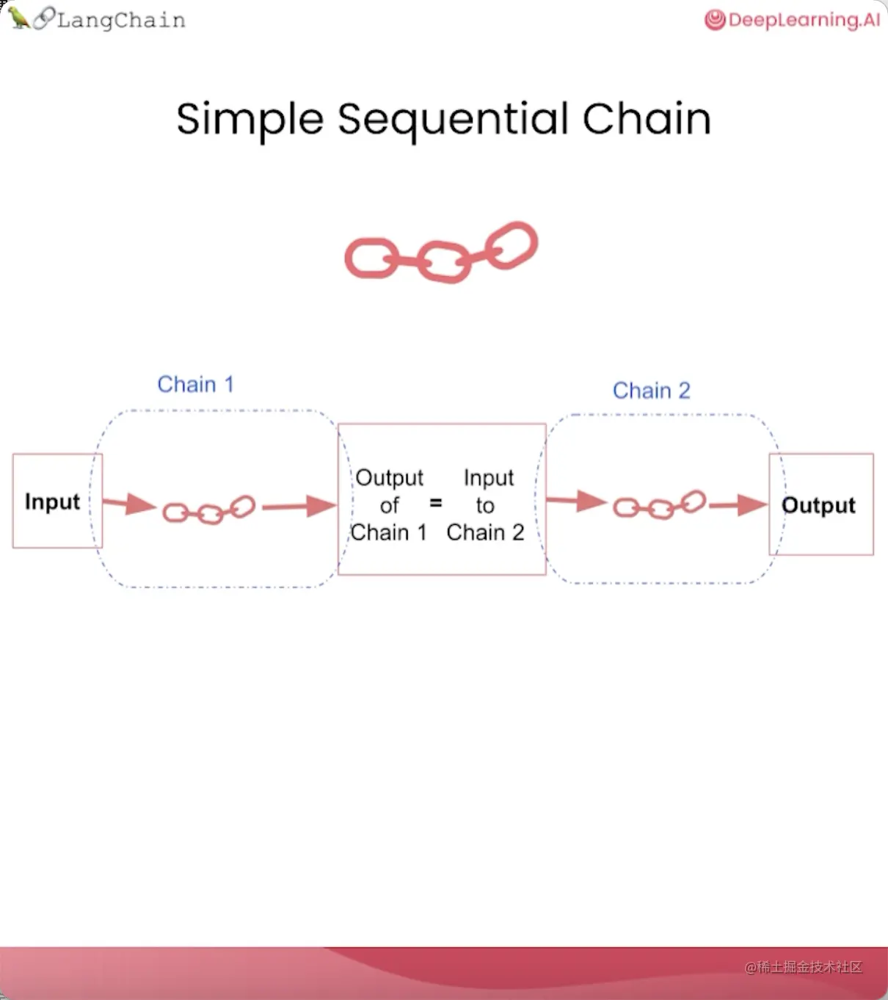
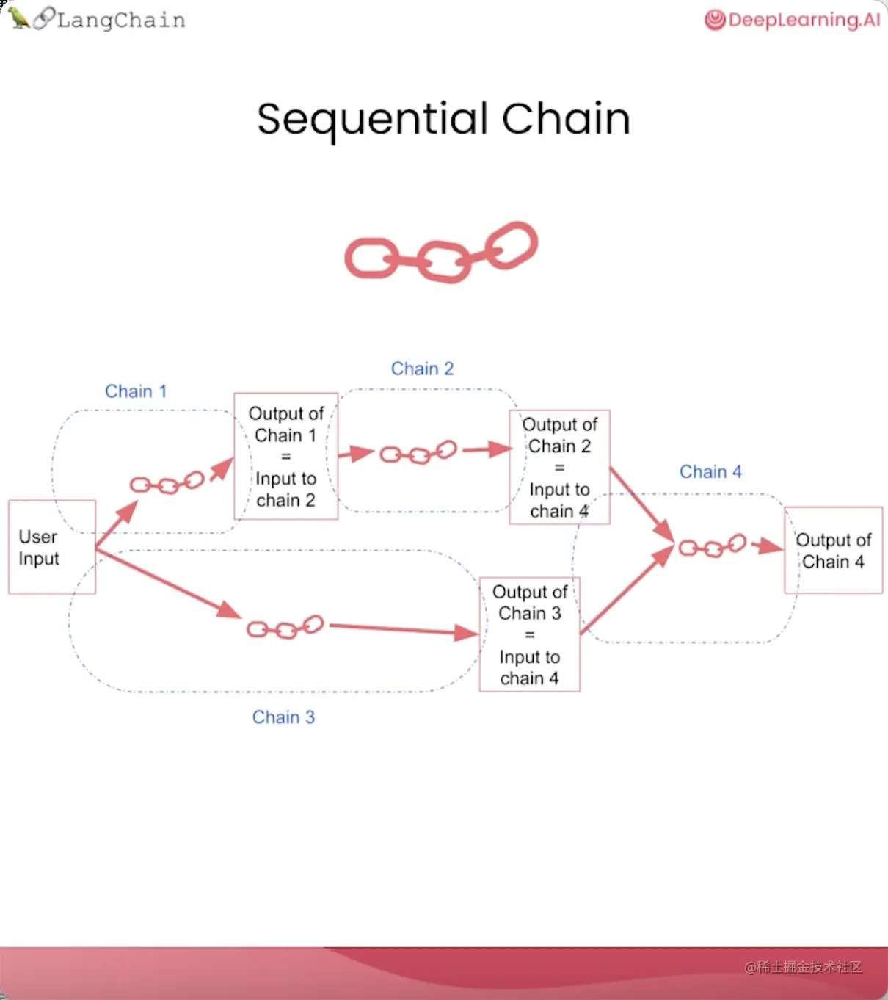

**链（Chain）是LangChain中最关键的构建模块**。

除了将 LLM 与提示结合在一起，还可以通过组合多个链，对文本或其他数据执行一系列的操作。

LangChain提供了多种可用的链类型：

| 类型                                | 场景                               |
| ----------------------------------- | ---------------------------------- |
| LLM链（LLMChain）                   | 将LLM和提示结合在一起              |
| 简单顺序链（SimpleSequentialChain） | 只需要一个输入并且只返回一个输出   |
| 常规顺序链（SequentialChain）       | 有多个输入或多个输出               |
| 路由链（RouterChain）               | 根据输入的具体内容路由到不同的子链 |

# LLMChain

```python
import openai
openai_api_key = ""

# 导入ChatOpenAI，这是LangChain对ChatGPT API访问的抽象
from langchain.chat_models import ChatOpenAI
# 要控制 LLM 生成文本的随机性和创造性，请使用 temperature = 0.0
# 用一个比较高的temperature值以获得一些更有意思的结果
llm = ChatOpenAI(model_name="gpt-3.5-turbo",
          openai_api_key=openai_api_key,
          temperature=0.9)

from langchain.chat_models import ChatOpenAI
from langchain.prompts import ChatPromptTemplate
from langchain.chains import LLMChain


# 接收一个名为“product”的变量，要求LLM生成描述生产该产品的公司的最佳名称
prompt = ChatPromptTemplate.from_template(
    "What is the best name to describe \
    a company that makes {product}?"
)

chain = LLMChain(llm=llm, prompt=prompt)
product = "Queen Size Sheet Set"
print(chain.run(product))

```

# SimpleSequentialChain



当我们的子链只需要一个输入并且只返回一个输出时，简单顺序链很有效。

```python
import openai
openai_api_key = ""

# 导入ChatOpenAI，这是LangChain对ChatGPT API访问的抽象
from langchain.chat_models import ChatOpenAI
# 要控制 LLM 生成文本的随机性和创造性，请使用 temperature = 0.0
# 用一个比较高的temperature值以获得一些更有意思的结果
llm = ChatOpenAI(model_name="gpt-3.5-turbo",
          openai_api_key=openai_api_key,
          temperature=0.9)

from langchain.chat_models import ChatOpenAI
from langchain.prompts import ChatPromptTemplate
from langchain.chains import LLMChain, SimpleSequentialChain


# 接收一个名为“product”的变量，要求LLM生成描述生产该产品的公司的最佳名称
first_prompt = ChatPromptTemplate.from_template(
    "What is the best name to describe \
    a company that makes {product}?"
)

# 第一个链
chain_one = LLMChain(llm=llm, prompt=first_prompt)

# 提示模板2：获取公司名称，然后输出该公司的 20 字描述
second_prompt = ChatPromptTemplate.from_template(
    "Write a 20 words description for the following \
    company:{company_name}"
)
# 第二个链
chain_two = LLMChain(llm=llm, prompt=second_prompt)

# 第一个链的输出将传递到第二个链
overall_simple_chain = SimpleSequentialChain(chains=[chain_one, chain_two],
                    verbose=True)

product = "Queen Size Sheet Set"
print(overall_simple_chain.run(product))

"""


> Entering new  chain...
Royal Comfort Linens
Royal Comfort Linens is a premium bedding company offering luxurious and comfortable linens for a restful and stylish sleep experience.

> Finished chain.
Royal Comfort Linens is a premium bedding company offering luxurious and comfortable linens for a restful and stylish sleep experience.
"""

```

可以看到，它首先输出公司名称，然后将其传递到第二条链，并给出该公司可能的业务描述。

# SequentialChain



常规顺序链中的任何一个步骤，都可以接收来自上游的多个输入变量，特别当你有复杂的下游链需要和多个上游链组合时，这会非常有用。

让这些变量名称准确排列非常重要，因为有很多不同的输入和输出。如果你遇到任何问题，请检查它们排列顺序是否正确。

```python
from langchain.chat_models import ChatOpenAI
from langchain.prompts import ChatPromptTemplate
from langchain.chains import LLMChain, SimpleSequentialChain, SequentialChain


# 第一条链，将评论翻译成英语。
first_prompt = ChatPromptTemplate.from_template(
    "Translate the following review to english:"
    "\n\n{Review}"
)
chain_one = LLMChain(llm=llm, prompt=first_prompt, 
                     output_key="English_Review"
                    )
           
# 第二条链，用一句话总结该评论       
second_prompt = ChatPromptTemplate.from_template(
    "Can you summarize the following review in 1 sentence:"
    "\n\n{English_Review}"
)
chain_two = LLMChain(llm=llm, prompt=second_prompt, 
                     output_key="summary"
                    )

# 第三条链，检测原始评论的语言
third_prompt = ChatPromptTemplate.from_template(
    "What language is the following review:\n\n{Review}"
)
chain_three = LLMChain(llm=llm, prompt=third_prompt,
                       output_key="language"
                      )

# 第四条链，接收第二条链的摘要内容("summary"变量)，以及第三条链的语言类别("language"变量)，要求后续回复摘要内容时使用指定语言。
fourth_prompt = ChatPromptTemplate.from_template(
    "Write a follow up response to the following "
    "summary in the specified language:"
    "\n\nSummary: {summary}\n\nLanguage: {language}"
)
chain_four = LLMChain(llm=llm, prompt=fourth_prompt,
                      output_key="followup_message"
                     )

overall_chain = SequentialChain(
    chains=[chain_one, chain_two, chain_three, chain_four],
    input_variables=["Review"],
    output_variables=["English_Review", "summary","followup_message"],
    verbose=True
)

review= "Je trouve le goût médiocre. La mousse ne tient pas, c'est bizarre. J'achète les mêmes dans le commerce et le goût est bien meilleur...\nVieux lot ou contrefaçon !?"

print(overall_chain(review))

```

注意，第四条链的输入为第二、三条链的输入。

由于openai限制了一分钟调用的数目，因此这里暂时跑不通。

# RouterChain


如果你有多个子链，且每个子链专门负责处理某种特定类型的输入，这种情况就可以使用路由链。

**路由链会根据输入的具体内容路由到不同的子链**。

它会首先判断该使用哪个子链，然后将输入传递到相应的子链。

```python
# 第一个提示，适合回答物理问题
physics_template = """You are a very smart physics professor. \
You are great at answering questions about physics in a concise\
and easy to understand manner. \
When you don't know the answer to a question you admit\
that you don't know.

Here is a question:
{input}"""

# 第二个提示，适合回答数学问题
math_template = """You are a very good mathematician. \
You are great at answering math questions. \
You are so good because you are able to break down \
hard problems into their component parts, 
answer the component parts, and then put them together\
to answer the broader question.

Here is a question:
{input}"""

# 第三个提示，适合回答历史问题
history_template = """You are a very good historian. \
You have an excellent knowledge of and understanding of people,\
events and contexts from a range of historical periods. \
You have the ability to think, reflect, debate, discuss and \
evaluate the past. You have a respect for historical evidence\
and the ability to make use of it to support your explanations \
and judgements.

Here is a question:
{input}"""

# 第四个提示,适合回答计算机科学问题。
computerscience_template = """ You are a successful computer scientist.\
You have a passion for creativity, collaboration,\
forward-thinking, confidence, strong problem-solving capabilities,\
understanding of theories and algorithms, and excellent communication \
skills. You are great at answering coding questions. \
You are so good because you know how to solve a problem by \
describing the solution in imperative steps \
that a machine can easily interpret and you know how to \
choose a solution that has a good balance between \
time complexity and space complexity. 

Here is a question:
{input}"""


prompt_infos = [
    {
        "name": "physics", 
        "description": "Good for answering questions about physics", 
        "prompt_template": physics_template
    },
    {
        "name": "math", 
        "description": "Good for answering math questions", 
        "prompt_template": math_template
    },
    {
        "name": "History", 
        "description": "Good for answering history questions", 
        "prompt_template": history_template
    },
    {
        "name": "computer science", 
        "description": "Good for answering computer science questions", 
        "prompt_template": computerscience_template
    }
]

```

MultiPromptChain是一种特定类型的链，用于在多个不同提示模板之间进行路由。

LLMRouterChain会借助语言模型的帮助，让语言模型根据上面提供的名称和描述等信息，判断如何路由。

RouterOutputParser将LLM输出解析成一个字典，根据字典内容确定下游使用哪条链，以及链的输入应该是什么。

```python
from langchain.chains.router import MultiPromptChain
from langchain.chains.router.llm_router import LLMRouterChain,RouterOutputParser
from langchain.prompts import PromptTemplate

llm = ChatOpenAI(temperature=0)

# 路由链会根据输入内容调用这些目标链的其中一个。
destination_chains = {}
for p_info in prompt_infos:
    name = p_info["name"]
    prompt_template = p_info["prompt_template"]
    prompt = ChatPromptTemplate.from_template(template=prompt_template)
    chain = LLMChain(llm=llm, prompt=prompt)
    destination_chains[name] = chain  
    
destinations = [f"{p['name']}: {p['description']}" for p in prompt_infos]
destinations_str = "\n".join(destinations)

# 默认链是在路由找不到合适的子链调用时，用来备用的一条链路。
default_prompt = ChatPromptTemplate.from_template("{input}")
default_chain = LLMChain(llm=llm, prompt=default_prompt)

# LLM 会根据提示词的内容在不同链之间路由。
MULTI_PROMPT_ROUTER_TEMPLATE = """Given a raw text input to a \
language model select the model prompt best suited for the input. \
You will be given the names of the available prompts and a \
description of what the prompt is best suited for. \
You may also revise the original input if you think that revising\
it will ultimately lead to a better response from the language model.

<< FORMATTING >>
Return a markdown code snippet with a JSON object formatted to look like:
\```json
{{{{
    "destination": string \ name of the prompt to use or "DEFAULT"
    "next_inputs": string \ a potentially modified version of the original input
}}}}
\```

REMEMBER: "destination" MUST be one of the candidate prompt \
names specified below OR it can be "DEFAULT" if the input is not\
well suited for any of the candidate prompts.
REMEMBER: "next_inputs" can just be the original input \
if you don't think any modifications are needed.

<< CANDIDATE PROMPTS >>
{destinations}

<< INPUT >>
{{input}}

<< OUTPUT (remember to include the ```json)>>"""

# 组合语言模型、路由提示模板，构成路由链
router_template = MULTI_PROMPT_ROUTER_TEMPLATE.format(
    destinations=destinations_str
)
router_prompt = PromptTemplate(
    template=router_template,
    input_variables=["input"],
    output_parser=RouterOutputParser(),
)

router_chain = LLMRouterChain.from_llm(llm, router_prompt)

# 组合路由链、目标链和默认链，创建整条链
chain = MultiPromptChain(router_chain=router_chain, 
                         destination_chains=destination_chains, 
                         default_chain=default_chain, verbose=True
                        )
# 提问不同类型的问题
# 物理问题
chain.run("What is black body radiation?")

"""
> Entering new MultiPromptChain chain...
physics: {'input': 'What is black body radiation?'}
> Finished chain.
"Black body radiation refers to the electromagnetic radiation emitted by a perfect black body, which is an object that absorbs all radiation that falls on it and emits radiation at all wavelengths. The radiation emitted by a black body depends only on its temperature and follows a specific distribution known as Planck's law. This type of radiation is important in understanding the behavior of stars, as well as in the development of technologies such as incandescent light bulbs and infrared cameras."

"""

# 数学问题
chain.run("what is 2 + 2")

"""
> Entering new MultiPromptChain chain...
math: {'input': 'what is 2 + 2'}
> Finished chain.
'As an AI language model, I can answer this question easily. The answer to 2 + 2 is 4.'

"""

# 生物问题，无匹配，走默认链
chain.run("Why does every cell in our body contain DNA?")

"""
> Entering new MultiPromptChain chain...
None: {'input': 'Why does every cell in our body contain DNA?'}
> Finished chain.
'Every cell in our body contains DNA because DNA carries the genetic information that determines the characteristics and functions of each cell. DNA contains the instructions for the synthesis of proteins, which are essential for the structure and function of cells. Additionally, DNA is responsible for the transmission of genetic information from one generation to the next. Therefore, every cell in our body needs DNA to carry out its specific functions and to maintain the integrity of the organism as a whole.'

"""
```

# 参考

> https://juejin.cn/post/7248599585735114789#heading-25