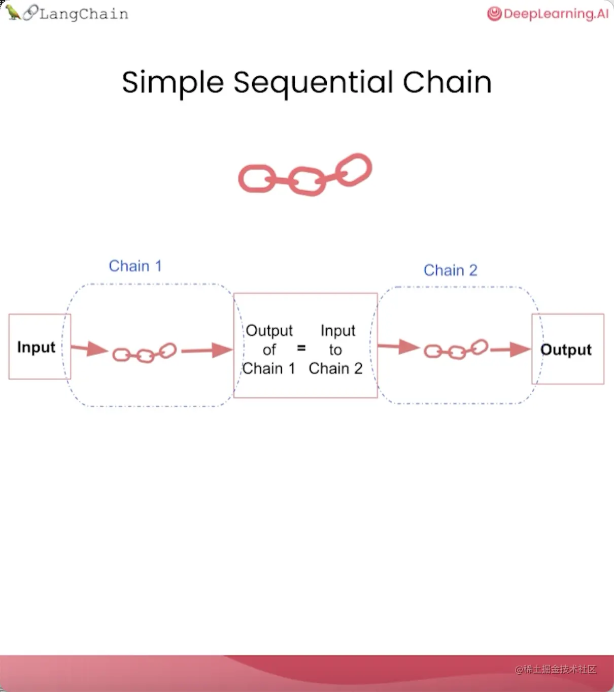
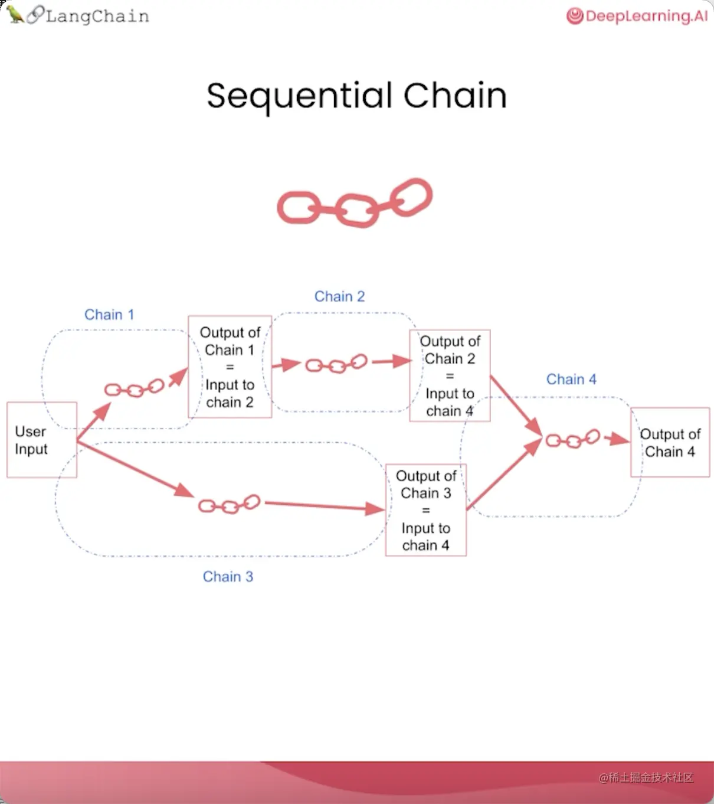

**链（Chain）是LangChain中最关键的构建模块**。

除了将 LLM 与提示结合在一起，还可以通过组合多个链，对文本或其他数据执行一系列的操作。

LangChain提供了多种可用的链类型：

| 类型                                | 场景                               |
| ----------------------------------- | ---------------------------------- |
| LLM链（LLMChain）                   | 将LLM和提示结合在一起              |
| 简单顺序链（SimpleSequentialChain） | 只需要一个输入并且只返回一个输出   |
| 常规顺序链（SequentialChain）       | 有多个输入或多个输出               |
| 路由链（RouterChain）               | 根据输入的具体内容路由到不同的子链 |

# LLMChain

```python
import openai
openai_api_key = ""

# 导入ChatOpenAI，这是LangChain对ChatGPT API访问的抽象
from langchain.chat_models import ChatOpenAI
# 要控制 LLM 生成文本的随机性和创造性，请使用 temperature = 0.0
# 用一个比较高的temperature值以获得一些更有意思的结果
llm = ChatOpenAI(model_name="gpt-3.5-turbo",
          openai_api_key=openai_api_key,
          temperature=0.9)

from langchain.chat_models import ChatOpenAI
from langchain.prompts import ChatPromptTemplate
from langchain.chains import LLMChain


# 接收一个名为“product”的变量，要求LLM生成描述生产该产品的公司的最佳名称
prompt = ChatPromptTemplate.from_template(
    "What is the best name to describe \
    a company that makes {product}?"
)

chain = LLMChain(llm=llm, prompt=prompt)
product = "Queen Size Sheet Set"
print(chain.run(product))

```

# SimpleSequentialChain



当我们的子链只需要一个输入并且只返回一个输出时，简单顺序链很有效。

```python
import openai
openai_api_key = ""

# 导入ChatOpenAI，这是LangChain对ChatGPT API访问的抽象
from langchain.chat_models import ChatOpenAI
# 要控制 LLM 生成文本的随机性和创造性，请使用 temperature = 0.0
# 用一个比较高的temperature值以获得一些更有意思的结果
llm = ChatOpenAI(model_name="gpt-3.5-turbo",
          openai_api_key=openai_api_key,
          temperature=0.9)

from langchain.chat_models import ChatOpenAI
from langchain.prompts import ChatPromptTemplate
from langchain.chains import LLMChain, SimpleSequentialChain


# 接收一个名为“product”的变量，要求LLM生成描述生产该产品的公司的最佳名称
first_prompt = ChatPromptTemplate.from_template(
    "What is the best name to describe \
    a company that makes {product}?"
)

# 第一个链
chain_one = LLMChain(llm=llm, prompt=first_prompt)

# 提示模板2：获取公司名称，然后输出该公司的 20 字描述
second_prompt = ChatPromptTemplate.from_template(
    "Write a 20 words description for the following \
    company:{company_name}"
)
# 第二个链
chain_two = LLMChain(llm=llm, prompt=second_prompt)

# 第一个链的输出将传递到第二个链
overall_simple_chain = SimpleSequentialChain(chains=[chain_one, chain_two],
                    verbose=True)

product = "Queen Size Sheet Set"
print(overall_simple_chain.run(product))

"""


> Entering new  chain...
Royal Comfort Linens
Royal Comfort Linens is a premium bedding company offering luxurious and comfortable linens for a restful and stylish sleep experience.

> Finished chain.
Royal Comfort Linens is a premium bedding company offering luxurious and comfortable linens for a restful and stylish sleep experience.
"""

```

可以看到，它首先输出公司名称，然后将其传递到第二条链，并给出该公司可能的业务描述。

# SequentialChain



# 参考

> https://juejin.cn/post/7248599585735114789#heading-25